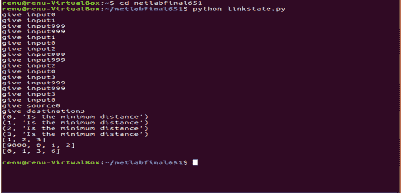
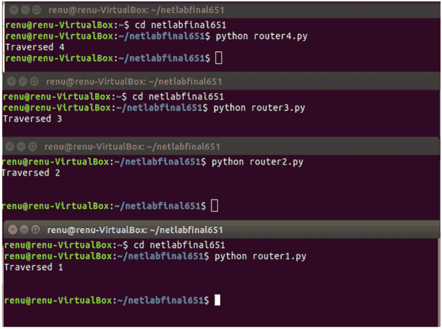

# 路由终端之间的最短路径问题–Python 中的实现

> 原文:[https://www . geesforgeks . org/最短路径-终端间路由问题-python 中的实现/](https://www.geeksforgeeks.org/shortest-path-problem-between-routing-terminals-implementation-in-python/)

著名的[迪克斯特拉算法](https://www.geeksforgeeks.org/dijkstras-shortest-path-algorithm-greedy-algo-7/)可以用于各种环境中——包括作为一种手段来寻找两台路由器之间的最短路由，也称为 [**链路状态路由**](https://www.geeksforgeeks.org/unicast-routing-link-state-routing/) 。本文解释了 Dijkstra 算法的模拟，其中节点(路由器)是终端。
一旦计算出两个节点(终端)之间的最短路径，最短路径本身就会作为消息按顺序发送到其路径上的每个终端，直到到达目的终端。每当消息遍历一个节点时，它的终端显示遍历结果。通过这种方式，既可以看到也可以模拟消息通过最短的计算路线。

运行以下代码的过程如下:

> *   Execute driver code
> *   Run the router codes router1.py, router2.py, etc. before providing any input to the driver code. In a separate terminal/lug.
> *   Now provide input to the driver code in the form of matrix G, where any entry `G[i, j]` is the distance from node I to node J, and the matrix must be symmetrical. If i=j, then the distance between `D[i, j]=0` as a node and itself is considered to be zero. If there is no direct connection between two nodes, then `D[i, j]=999` (equivalent to infinity).
> *   Specify the source node and destination node, with nodes ranging from 0 to 3, representing terminals 1 to 4 respectively.

这个实现指定了四个节点，但是这可以很容易地扩展到 N 个节点，N 个终端和端口号分别代表在它们上面运行的进程。

考虑以下四节点网络的示例，其中指定了它们之间的距离，节点从左到右编号为 0 到 3:


端子之间的距离

对于该网络，如上所述，具有条目 G[i，j]的矩阵 G 将是:

```py
[[0, 1, 999, 999],
 [1, 0, 2, 999],
 [999, 2, 0, 3],
 [999, 999, 3, 0]]

```

这个矩阵必须输入到驱动程序代码中。Dijkstra 算法用于寻找源和目的地之间的最短路径。包含剩余路径的列表会在通往最终目的地的途中发送到每个节点。

下面指定了 Python 中的实现。

```py
# Driver Code for implementing Dijkstra's algorithm
import socket
import sys
import pickle

S = set() 
G =[] # adjacency matrix

# give input matrix
for i in range(4): 
    listo =[0, 0, 0, 0]

    for j in range(4):
        listo[j]= int(input("give input"))
    G.append(listo)

source = int(input("give source")) 
destination = int(input("give destination")) 
Q =[] # empty queue

for i in range(4):
    Q.append(i)

d =[0, 0, 0, 0] # initialize d values
pi =[0, 0, 0, 0] # initialize pi values

for i in range(4):
    if(i == source):
        d[i]= 0
    else:
        d[i]= 999
for i in range(4):
    pi[i]= 9000
S.add(source)

# While items still exist in Q
while (len(Q)!= 0): 

    # Find the minimum distance x from
    # source of all nodes in Q
    x = min(d[q] for q in Q) 
    u = 0
    for q in Q:
        if(d[q]== x):

            # Find the node u in Q with minimum 
            # distance x from source 
            u = q 

    print(u, "Is the minimum distance")
    Q.remove(u) # removed the minimum vertex
    S.add(u)
    adj =[]
    for y in range(4):

        # find adjacent vertices to minimum vertex
        if(y != u and G[u][y]!= 999):     
            adj.append(y)

     # For each adjacent vertex, perform the update
     # of distance and pi vectors        
    for v in adj:        
        if(d[v]>(d[u]+G[u][v])):
            d[v]= d[u]+G[u][v] 
            pi[v]= u # update adjacents distance and pi
route =[]
x = destination

# If destination is source, then pi[x]= 9000. 
if(pi[x]== 9000): 
    print(source)
else:

    # Find the path from destination to source
    while(pi[x]!= 9000): 
        route.append(x)
        x = pi[x]
    route.reverse() 

print(route) # Display the route
print(pi) # Display the path vector
print(d) # Display the distance of each node from source

'''We will now send the calculated minimal route to the terminal 
# representing 'source'. From the source terminal, the 'route' list 
# will be sent to the next hop en route to the final destination. 

# At each intermediate terminal, the router removes its own identity 
 from the list and sends the rest of the route to the next router. 
 This continues until the final router is reached.'''

sendingroute = pickle.dumps(route)
sockets =[8895, 8896, 8897, 8898]
sock = socket.socket(socket.AF_INET, socket.SOCK_STREAM) 
sock.connect((socket.gethostname(), sockets)) 

try:

    # try sendall if it doesn't work. 
    sock.send(sendingroute) 
finally:
    print("")
sock.close()
```

```py
# Code for Router 1
import socket
import sys
import pickle

for i in range(1) :
    sock = socket.socket(socket.AF_INET, socket.SOCK_STREAM)
    sock.bind((socket.gethostname(), 8895))
    sock.listen(1)
    connection, client_address = sock.accept()
    route =[]
    sockets =[8895, 8896, 8897, 8898]

    while 1:
        try:
            route = pickle.loads(connection.recv(1024))
    except EOFError:
        break      
        finally:
            break
    print("Traversed 1") 
    socknext = socket.socket(socket.AF_INET, socket.SOCK_STREAM)

    if(len(route)>0):
        x = route[0]
        route.remove(x)
        dataroute = pickle.dumps(route)
        socknext.connect((socket.gethostname(), sockets[x]))
        try:
            socknext.send(dataroute) # try sendall
            data = socknext.recv(16)
            print(data)
       finally:
               print("")
        socknext.close()
```

```py
# Code for Router 2
import socket
import sys
import pickle

for i in range(1) :

    sock = socket.socket(socket.AF_INET, socket.SOCK_STREAM)
    sock.bind((socket.gethostname(), 8896))
    sock.listen(1)
    connection, client_address = sock.accept()
    route =[]
    sockets =[8895, 8896, 8897, 8898]

    while 1:
        try:
            route = pickle.loads(connection.recv(1024))
    except EOFError:
        break      
        finally:
            break
    print("Traversed 2")

    socknext = socket.socket(socket.AF_INET, socket.SOCK_STREAM)

    if(len(route)>0):

    x = route[0]
        route.remove(x)
        dataroute = pickle.dumps(route)
        socknext.connect((socket.gethostname(), sockets[x]))
        try:
            socknext.send(dataroute) # try sendall
            data = socknext.recv(16)
            print(data)
       finally:
               print("")
        socknext.close()
```

```py
# Code for Router 3
import socket
import sys
import pickle

for i in range(1) :
    sock = socket.socket(socket.AF_INET, socket.SOCK_STREAM)
    sock.bind((socket.gethostname(), 8897))
    sock.listen(1)
    connection, client_address = sock.accept()

    route =[]
    sockets =[8895, 8896, 8897, 8898]
    while 1:
        try:
            route = pickle.loads(connection.recv(1024))
    except EOFError:
        break      
        finally:
            break
    print("Traversed 3")
    socknext = socket.socket(socket.AF_INET, socket.SOCK_STREAM)

    if(len(route)>0):
    x = route[0]
        route.remove(x)
        dataroute = pickle.dumps(route)
        socknext.connect((socket.gethostname(), sockets[x]))
        try:
            socknext.send(dataroute) # try sendall
            data = socknext.recv(16)
            print(data)
       finally:
               print("")
        socknext.close()
```

```py
# Code for Router 4
import socket
import sys
import pickle

for i in range(1) :
    sock = socket.socket(socket.AF_INET, socket.SOCK_STREAM)
    sock.bind((socket.gethostname(), 8898))
    sock.listen(1)
    connection, client_address = sock.accept()
    route =[]
    sockets =[8895, 8896, 8897, 8898]

    while 1:
        try:
            route = pickle.loads(connection.recv(1024))
    except EOFError:
        break      
        finally:
            break

    print("Traversed 4")
    socknext = socket.socket(socket.AF_INET, socket.SOCK_STREAM)

    if(len(route)>0):
    x = route[0]
        route.remove(x)
        dataroute = pickle.dumps(route)
        socknext.connect((socket.gethostname(), sockets[x]))
        try:
            socknext.send(dataroute) # try sendall
            data = socknext.recv(16)
            print(data)
       finally:
               print("")
        socknext.close()
```



迪克斯特拉输出

终端输出–



终端输出