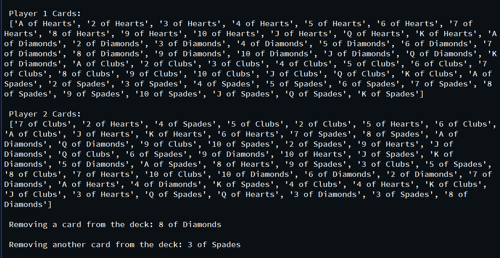

# 用 Python 中的 OOPS 洗牌一副牌

> 原文:[https://www . geesforgeks . org/shuffle-一副 python 中的 oops 牌/](https://www.geeksforgeeks.org/shuffle-a-deck-of-card-with-oops-in-python/)

**先决条件:** [Python 类和对象](https://www.geeksforgeeks.org/python-classes-and-objects/)

给定一副牌，任务是在两个玩家之间分配。

**进场:**

*   要洗牌，我们需要使用*洗牌*模块。
*   导入所需的模块
*   声明一个名为*的类卡片*，其中将有变量*套件*和*值*，现在我们将把它们声明为全局变量，而不是使用 *self.suites* 和 *self.values* 。
*   声明一个类*副牌*，它将有一个名为*我的卡套*的空列表，并且*套件*和*值*将被附加到*我的卡套*列表。
*   声明一个类*洗牌卡*以及一个名为*洗牌()*的方法，该方法将检查卡的数量，然后洗牌。
*   为了移除一些卡片，我们将在*洗牌卡*类中创建一个 *popCard()* 方法。

**以下是基于上述方法的完整程序:**

## 蟒蛇 3

```py
# Import required modules
from random import shuffle

# Define a class to create
# all type of cards
class Cards:
    global suites, values
    suites = ['Hearts', 'Diamonds', 'Clubs', 'Spades']
    values = ['A', '2', '3', '4', '5', '6', '7', '8', '9', '10', 'J', 'Q', 'K']

    def __init__(self):
        pass

# Define a class to categorize each card
class Deck(Cards):
    def __init__(self):
        Cards.__init__(self)
        self.mycardset = []
        for n in suites:
            for c in values:
                self.mycardset.append((c)+" "+"of"+" "+n)

    # Method to remove a card from the deck
    def popCard(self):
        if len(self.mycardset) == 0:
            return "NO CARDS CAN BE POPPED FURTHER"
        else:
            cardpopped = self.mycardset.pop()
            print("Card removed is", cardpopped)

# Define a class gto shuffle the deck of cards
class ShuffleCards(Deck):

    # Constructor
    def __init__(self):
        Deck.__init__(self)

    # Method to shuffle cards
    def shuffle(self):
        if len(self.mycardset) < 52:
            print("cannot shuffle the cards")
        else:
            shuffle(self.mycardset)
            return self.mycardset

    # Method to remove a card from the deck
    def popCard(self):
        if len(self.mycardset) == 0:
            return "NO CARDS CAN BE POPPED FURTHER"
        else:
            cardpopped = self.mycardset.pop()
            return (cardpopped)

# Driver Code
# Creating objects
objCards = Cards()
objDeck = Deck()

# Player 1
player1Cards = objDeck.mycardset
print('\n Player 1 Cards: \n', player1Cards)

# Creating object
objShuffleCards = ShuffleCards()

# Player 2
player2Cards = objShuffleCards.shuffle()
print('\n Player 2 Cards: \n', player2Cards)

# Remove some cards
print('\n Removing a card from the deck:', objShuffleCards.popCard())
print('\n Removing another card from the deck:', objShuffleCards.popCard())
```

**输出:**

