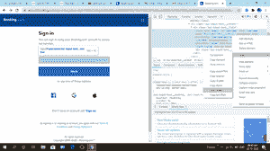
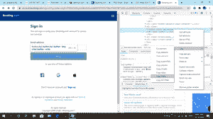
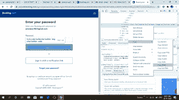

# 使用 Python 中的硒在 Booking.com 签名

> 原文:[https://www . geesforgeks . org/登录-预订-com-使用-python 中的硒/](https://www.geeksforgeeks.org/sign-in-booking-com-using-selenium-in-python/)

在本文中，我们将学习一个简单的如何通过硒登录[*【booking.com】*](https://www.booking.com/)。Selenium 是一个免费工具，可以在不同的浏览器上自动试用。

**要求:**

*   需要安装 *chromedriver* 并设置路径。[点击此处](https://sites.google.com/a/chromium.org/chromedriver/downloads)下载。
*   [Selenium](https://www.geeksforgeeks.org/selenium-python-tutorial/) 是通过程序控制网页浏览器和执行浏览器自动化的强大工具。它适用于所有浏览器，在所有主要操作系统上工作，其脚本是用各种语言编写的，即[【Python】](https://www.geeksforgeeks.org/python-programming-language/)[【Java】](https://www.geeksforgeeks.org/java/)[c#](https://www.geeksforgeeks.org/csharp-programming-language/)等，我们将使用 Python。

**以下是步骤:**

*   首先去[booking.com](https://www.booking.com/)网站。
*   然后通过紧急 *ctrl + shift + i* 或进入浏览器设置并手动点击调查细节来点击调查元素。
*   然后导航到填写电子邮件的框，然后复制 *x_path。*



*   然后导航下一步按钮，复制 *x_path* 。



*   然后浏览密码，然后复制 *x_path* 。


*   然后导航登录按钮，然后复制 *x_path* 。



**下面是实现:**

## 蟒蛇 3

```
# import required modules
from selenium import webdriver
from selenium.webdriver.common.keys import Keys
import time

# create instance of Chrome webdriver
driver = webdriver.Chrome()
driver.get("https://account.booking.com/sign-in?op_token=EgVvYXV0aCLdAgoUdk8xS2Jsazd4WDl0VW4yY3BaTFMSCWF1dGhvcml6ZRo1aHR0cHM6Ly9zZWN1cmUuYm9va2luZy5jb20vbG9naW4uaHRtbD9vcD1vYXV0aF9yZXR1cm4q_AFVcm9CSnFTUk5fY0p6TzJ2d0VuTzdycl92NzBncExyTEZ1TDc0Z2RlNlB2Tnc5T1FscEFISEI5MlpWVGZpNFd1eWplaDE0dm50S0Q5aHBXM3ladWdpLXY0SEZoLVFhRDdSbGk5dkRzSmN0MmE4ZXNpZEU1VHo0WkRyTDB3M3Y5Um9UNEU3dUh1SzMxZXNfTmM3Q2l4NWtNUkxpRFk0cnhEVVBaRXo5enJXV2psdVBnNHBpUlBNaUh4LUJzRTNSWVA1Z19WVWRSSHdOQTVzcWhGVGkzSDlET013dUJFWHY4dThsQjE4Z3BfdUJJLUtGaDQxSUgzcGYxWGx1TkVCBGNvZGUqFgiOyBIwwaf46Ii8JDoAQgBYgd3j_AU")

# find the element where we have to
# enter the xpath
# fill the  email
driver.find_element_by_xpath('//*[@id="username"]').send_keys('xxxxxx.com')

# click on next button
driver.find_element_by_xpath(
    '//*[@id="root"]/div/div[2]/div[1]/div/div/div/div/div/div/form/div[3]/button/span').click()

# find the element where we have to
# enter the xpath
# fill the password
driver.find_element_by_xpath('//*[@id="password"]').send_keys('Praxxxxx')

# find the element Sign in
# request using xpath
# clicking on that element
driver.find_element_by_xpath(
    '//*[@id="root"]/div/div[2]/div[1]/div/div/div/div/div/div/form/button/span').click()
```

**输出:**

<video class="wp-video-shortcode" id="video-510447-1" width="640" height="360" preload="metadata" controls=""><source type="video/mp4" src="https://media.geeksforgeeks.org/wp-content/uploads/20201106210555/MyVideo_1.mp4?_=1">[https://media.geeksforgeeks.org/wp-content/uploads/20201106210555/MyVideo_1.mp4](https://media.geeksforgeeks.org/wp-content/uploads/20201106210555/MyVideo_1.mp4)</video>