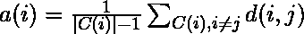
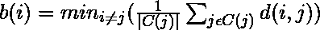
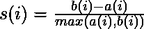
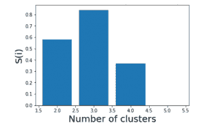

# 轮廓算法确定 k 的最优值

> 原文:[https://www . geesforgeks . org/skill-算法确定最佳 k 值/](https://www.geeksforgeeks.org/silhouette-algorithm-to-determine-the-optimal-value-of-k/)

无监督学习算法的基本步骤之一是确定数据可能被划分成的聚类的数量。轮廓算法是为无监督学习技术确定最佳聚类数的众多算法之一。

在剪影算法中，我们假设数据已经通过聚类技术(典型地 [K-Means 聚类技术](https://www.geeksforgeeks.org/k-means-clustering-introduction/))被聚类成 K 个聚类。然后，对于每个数据点，我们定义如下

c(I)-分配给第 I 个数据点的群集

| C(I)|–群集中分配给第 I 个数据点的数据点的数量

a(I)–它衡量了 ith 数据点分配给其集群的情况

b(I)–它被定义为与不是它的簇的最近簇的平均相异度

轮廓系数 s(i)由下式给出

我们确定每个 k 值的平均轮廓，并且对于具有最大值 s(i) 的**的 k 值，被认为是无监督学习算法的最佳聚类数。**

让我们考虑以下数据

| **序列号** | **X1** | **X2** |
| --- | --- | --- |
| 1. | -7.36 | Six point three seven |
| 2. | Three point zero eight | -6.78 |
| 3. | Five point zero three | -8.31 |
| 4. | -1.93 | -0.92 |
| 5. | -8.86 | Six point six |

我们现在从 2 到 5 迭代 k 的值。我们假设不存在可以将所有数据点最佳地聚集成一个簇的实际数据。

我们为 k 的每个值构造了以下表格:-

**k = 2**

| **序列号** | **a(i)** | **b(i)** | **s(i)** |
| --- | --- | --- | --- |
| 1. | Five point three one | Fourteen point one | Zero point six two |
| 2. | Two point four seven | Thirteen point one five | Zero point eight one |
| 3. | Two point four seven | Fourteen point nine seven | Zero point eight four |
| 4. | Nine point six six | Eight point nine three | -0.076 |
| 5. | Five point eight eight | Nineteen point one six | Zero point six nine |

**s(I)平均值= 0.58**

**k = 3**

| **序列号** | **a(i)** | **b(i)** | **s(i)** |
| --- | --- | --- | --- |
| 1. | One point five two | Nine point zero nine | Zero point eight three |
| 2. | Two point four seven | Seven point seven one | Zero point six eight |
| 3. | Two point four seven | Ten point one five | Zero point seven six |
| 4. | Zero | Seven point seven one | one |
| 5. | One point five two | Seventeen point nine three | Zero point nine two |

**s(I)平均值= 0.84**

**k = 4**

| **序列号** | **a(i)** | **b(i)** | **s(i)** |
| --- | --- | --- | --- |
| 1. | One point five two | Nine point zero nine | Zero point eight three |
| 2. | 无限的；无边的 | Two point four seven | Zero |
| 3. | 无限的；无边的 | Two point four seven | Zero |
| 4. | 无限的；无边的 | Seven point seven one | Zero |
| 5. | One point five two | Ten point two three | Zero point eight five |

**s(I)平均值= 0.37**

**k = 5**

| **序列号** | **a(i)** | **b(i)** | **s(i)** |
| --- | --- | --- | --- |
| 1. | 无限的；无边的 | One point five two | Zero |
| 2. | 无限的；无边的 | Two point four seven | Zero |
| 3. | 无限的；无边的 | Two point four seven | Zero |
| 4. | 无限的；无边的 | Seven point seven one | Zero |
| 5. | 无限的；无边的 | One point five two | Zero |

**s(I)= 0 的平均值**

我们看到，对于 k = 3，s(i)的最高值存在。因此，我们得出结论，给定数据的最佳聚类数是 3。