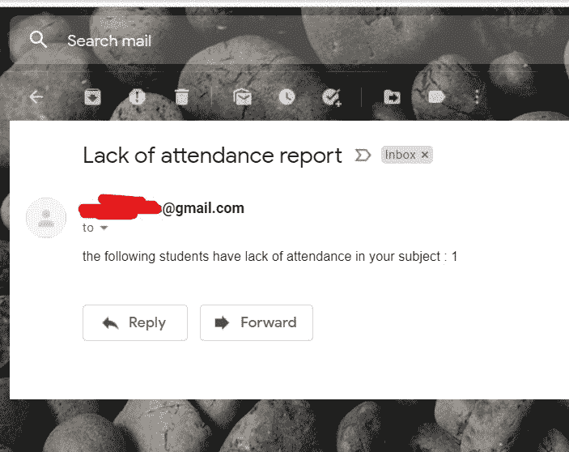

# 使用 Python 的简单考勤跟踪器

> 原文:[https://www . geesforgeks . org/simple-出勤-追踪器-使用-python/](https://www.geeksforgeeks.org/simple-attendance-tracker-using-python/)

在许多大学里，我们对每门学科都有考勤制度，缺乏相同的制度会导致问题。学生很难记住某一特定科目的请假次数。如果每次都要做文书工作来跟踪员工休假的次数，并检查是否是出勤不足，这将花费大量时间，而且效率也很低。

这篇文章将带来一个简单的追踪器和考勤提醒系统。这个系统的输入是一个 excel 表格，包含学生的邮件 id 和他们在每个班级科目中的休假次数。比如说，如果一个学生请假超过 3 天，就不允许他为某个科目写考试。当学生第二次请假时，这个追踪器会向他发送一封电子邮件，提醒他在这个问题上只剩下 1 次了。如果他继续请假，学生和相应的工作人员都会收到关于缺课的电子邮件。唯一要做的就是输入缺课学生的科目代码和学号，剩下的就交给这个追踪器系统处理了。

## 使用的 Python 模块

使用 pip 或 conda 命令安装以下模块。

*   **open pyxl**–更新和读取 excel 表格。
*   **smtplib &电子邮件**–发送电子邮件。

### 正在使用的数据集:

电子表格应包含以下数据:

*   辊号
*   学生邮件 ID
*   主题{1，2，…..N}

对于本文，考虑三个主题及其代码作为输入数字:

*   计算机智能(CI)—-> 1
*   Python —-> 2
*   数据挖掘—-> 3

最初，Excel 工作表应该如下所示:


## 发送邮件的 Gmail ID

建议创建一个单独的邮件标识作为发件人，因为谷歌阻止不太安全的应用程序登录 Gmail。发送邮件必须获得一定的权限，这对于个人邮件标识来说是有风险的。如果您没有授予权限，您将会出现“**错误凭证**”错误，并会收到一封电子邮件，如下图所示:


要避免这些问题，请遵循以下步骤:

*   登录您的帐户。
*   单击右上角的个人资料图标，然后单击管理您的谷歌帐户。


*   转到安全选项卡，搜索“不太安全的应用程序”设置。


*   不太安全的应用程序选项将被关闭。点击“打开访问”。


*   您将看到以下屏幕，并点击切换按钮，允许非谷歌应用程序使用您的 Gmail 帐户。


现在所有的先决条件都准备好了。必须编写 Python 脚本来进行跟踪。让我们一步一步来。

## 逐步实施

*   导入所需模块
*   初始化所需的变量并导入正在使用的数据文件。
*   创建一个在每次更新时保存 excel 的函数

## 蟒蛇 3

```py
def savefile():

    book.save(r'<your-path>\attendance.xlsx')
    print("saved!")
```

*   创建一个跟踪出勤情况的函数:需要一个根据阈值条件检查缺席者列表的函数。更新必须发生在函数外部声明为全局变量的变量上。因此，写了以下几行。

## 蟒蛇 3

```py
def check(no_of_days, row_num, b):

  # to use the globally declared lists and strings
    global staff_mails
    global l2
    global l3
```

*   这个 **check()** 函数接受三个参数:
    *   **天数:**A-row _ num 参数中包含学生总叶数的列表。
    *   **row_num :** 今天缺席者的名单
    *   **b :** 主题代码

**示例:**

> 如果参数是[1，1，2，3]，[1，2，3，4]，1
> 
> **天数:** [1，1，2，3]–下一个列表中每个学生截止日期的休假总数。
> 
> **row_num :** [1，2，3，4]–今天没有点名。
> 
> **b:**1–主题代码:此处为计算机智能

*   循环浏览学生列表(row_num)，并为每个学生检查以下条件:
    *   **如果总叶数==警告阈值**
    *   **如果总叶数>警告阈值**
*   **这里，考虑到一个学生如果请假超过 2 天就不允许写考试。因此，警告阈值为 2。**如果一名学生请假 2 次，包括今天的缺勤，那么必须向他发送一封提醒邮件，否则必须发送两封声明缺勤的邮件，一封给学生，另一封给教职员工。
*   现在，**如果总叶数==警告阈值–**将相应学生的邮件 Id 添加到列表 **'l1 '，**否则，列出 **'l3'** 。如果学生的邮件 ID 被添加到列表**‘L3’**中，那么要将卷号添加到字符串**‘L2’**中发送给工作人员。
*   创建邮件功能:创建两个功能，即 **mailstu()** 和 **mailstaff()** 。可以有一个要向其发送警告的学生列表，但只能有一名相应科目的工作人员。因此，两种不同的方法被相应地编写出来。
    *   在这个脚本中，smtplib 和 email.mime 模块用于发送邮件。
    *   MIME 电子邮件现在被广泛使用。它们可以扩展为 **M** 最终用途 **I** 互联网 **M** 所有 **E** 扩展。它们允许在邮件正文中结合使用纯文本和 HTML。 **email.mime API** 提供了结构化来自 Python 的电子邮件以及添加附件的功能。
    *   **smtplib** 模块提供通过端口连接到主机的电源。端口是为每个域预定义的，正确使用端口有助于建立连接和发送邮件。雅虎的端口号也是 **587** ，但主机将是**smtp.mail.yahoo.com**

## 蟒蛇 3

```py
# for students
def mailstu(li, msg):
    from_id = 'cXXXXXXXXXs@gmail.com'
    pwd = 'XXXXXXXXXXXXX'
    s = smtplib.SMTP('smtp.gmail.com', 587)
    s.starttls()
    s.login(from_id, pwd)

    # for each student to warn send mail
    for i in range(0, len(li)):
        to_id = li[i]
        message = MIMEMultipart()
        message['Subject'] = 'Attendance report'
        message.attach(MIMEText(msg, 'plain'))
        content = message.as_string()
        s.sendmail(from_id, to_id, content)
        s.quit()
    print("mail sent to students")

# for staffs
def mailstaff(mail_id, msg):
    from_id = 'cXXXXXXXXXXs@gmail.com'
    pwd = 'XXXXXXXX'
    to_id = mail_id
    message = MIMEMultipart()
    message['Subject'] = 'Lack of attendance report'
    message.attach(MIMEText(msg, 'plain'))
    s = smtplib.SMTP('smtp.gmail.com', 587)
    s.starttls()
    s.login(from_id, pwd)
    content = message.as_string()
    s.sendmail(from_id, to_id, content)
    s.quit()
    print('Mail Sent to staff')
```

*   最后一步是编写一个循环，从用户那里获取输入，直到他们说不再有输入。

下面给出了遵循上述方法的完整实现。

**示例:**简单考勤追踪器

## 蟒蛇 3

```py
import openpyxl
import smtplib
from email.mime.multipart import MIMEMultipart
from email.mime.text import MIMEText

# loading the excel sheet
book = openpyxl.load_workbook('D:\\attendance.xlsx')

# Choose the sheet
sheet = book['Sheet1']

# counting number of rows / students
r = sheet.max_row

# variable for looping for input
resp = 1

# counting number of columns / subjects
c = sheet.max_column

# list of students to remind
l1 = []

# to concatenate list of roll numbers with
# lack of attendance
l2 = ""

# list of roll numbers with lack of attendance
l3 = []

# staff mail ids
staff_mails = ['erakshaya485@gmail.com', 'yyyyyyyy@gmail.com']

# Warning messages
m1 = "warning!!! you can take only one more day leave for CI class"
m2 = "warning!!! you can take only one more day leave for python class"
m3 = "warning!!! you can take only one more day leave for DM class"

def savefile():
    book.save(r'D:\\attendance.xlsx')
    print("saved!")

def check(no_of_days, row_num, b):

    # to use the globally declared lists and strings
    global staff_mails
    global l2
    global l3

    for student in range(0, len(row_num)):
        # if total no.of.leaves equals threshold
        if no_of_days[student] is 2:
            if b is 1:

                # mail_id appending
                l1.append(sheet.cell(row=row_num[student], column=2).value)
                mailstu(l1, m1)  # sending mail
            elif b is 2:
                l1.append(sheet.cell(row=row_num[student], column=2).value)
                mailstu(l1, m2)
            else:
                l1.append(sheet.cell(row=row_num[student], column=2).value)
                mailstu(l1, m3)

        # if total.no.of.leaves > threshold
        elif no_of_days[student] > 2:
            if b is 1:

                # adding roll no
                l2 = l2+str(sheet.cell(row=row_num[student], column=1).value)

                # student mail_id appending
                l3.append(sheet.cell(row=row_num[student], column=2).value)
                subject = "CI"  # subject based on the code number

            elif b is 2:
                l2 = l2+str(sheet.cell(row=row_num[student], column=1).value)
                l3.append(sheet.cell(row=row_num[student], column=2).value)
                subject = "Python"

            else:
                l2 = l2+str(sheet.cell(row=row_num[student], column=1).value)
                l3.append(sheet.cell(row=row_num[student], column=2).value)
                subject = "Data mining"

        # If threshold crossed, modify the message
        if l2 != "" and len(l3) != 0:

            # message for student
            msg1 = "you have lack of attendance in " + subject + " !!!"

            # message for staff
            msg2 = "the following students have lack of attendance in your subject : "+l2

            mailstu(l3, msg1)  # mail to students
            staff_id = staff_mails[b-1]  # pick respective staff's mail_id
            mailstaff(staff_id, msg2)  # mail to staff

# for students
def mailstu(li, msg):
    from_id = 'crazygirlaks@gmail.com'
    pwd = 'ERAkshaya485'
    s = smtplib.SMTP('smtp.gmail.com', 587, timeout=120)
    s.starttls()
    s.login(from_id, pwd)

    # for each student to warn send mail
    for i in range(0, len(li)):
        to_id = li[i]
        message = MIMEMultipart()
        message['Subject'] = 'Attendance report'
        message.attach(MIMEText(msg, 'plain'))
        content = message.as_string()
        s.sendmail(from_id, to_id, content)
        s.quit()
    print("mail sent to students")

# for staff
def mailstaff(mail_id, msg):
    from_id = 'crazygirlaks@gmail.com'
    pwd = 'ERAkshaya485'
    to_id = mail_id
    message = MIMEMultipart()
    message['Subject'] = 'Lack of attendance report'
    message.attach(MIMEText(msg, 'plain'))
    s = smtplib.SMTP('smtp.gmail.com', 587, timeout=120)
    s.starttls()
    s.login(from_id, pwd)
    content = message.as_string()
    s.sendmail(from_id, to_id, content)
    s.quit()
    print('Mail Sent to staff')

while resp is 1:
    print("1--->CI\n2--->python\n3--->DM")

    # enter the correspondingnumber
    y = int(input("enter subject :"))

    # no.of.absentees for that subject
    no_of_absentees = int(input('no.of.absentees :'))

    if(no_of_absentees > 1):
        x = list(map(int, (input('roll nos :').split(' '))))
    else:
        x = [int(input('roll no :'))]

    # list to hold row of the student in Excel sheet
    row_num = []

    # list to hold total no.of leaves
    # taken by ith student
    no_of_days = []

    for student in x:

        for i in range(2, r+1):

            if y is 1:
                if sheet.cell(row=i, column=1).value is student:
                    m = sheet.cell(row=i, column=3).value
                    m = m+1
                    sheet.cell(row=i, column=3).value = m
                    savefile()
                    no_of_days.append(m)
                    row_num.append(i)

            elif y is 2:
                if sheet.cell(row=i, column=1).value is student:
                    m = sheet.cell(row=i, column=4).value
                    m = m+1
                    sheet.cell(row=i, column=4).value = m+1
                    no_of_days.append(m)
                    row_num.append(i)

            elif y is 3:
                if sheet.cell(row=i, column=1).value is student:
                    m = sheet.cell(row=i, column=5).value
                    m = m+1
                    sheet.cell(row=i, column=5).value = m+1
                    row_num.append(i)
                    no_of_days.append(m)

    check(no_of_days, row_num, y)
    resp = int(input('another subject ? 1---->yes 0--->no'))
```

**输出:**

```py
1--->CI
2--->python
3--->DM
enter subject :1
no.of.absentees :2
roll nos :1 3
saved!
saved!
another subject ? 1---->yes 0--->no 1
1--->CI
2--->python
3--->DM
enter subject :1
no.of.absentees :1
roll no :1
saved!
mail sent to students
another subject ? 1---->yes 0--->no 1
1--->CI
2--->python
3--->DM
enter subject :1
no.of.absentees :1
roll no :1
saved!
mail sent to students
Mail Sent to staff
another subject ? 1---->yes 0--->no 0
```

 

执行前需要记住的要点:

*   主动互联网连接是强制性的。
*   确保 excel 文件没有在窗口中打开，否则在更新时，将显示“拒绝权限错误”。