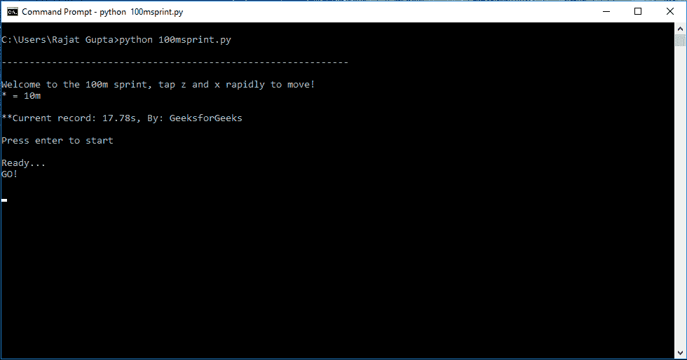
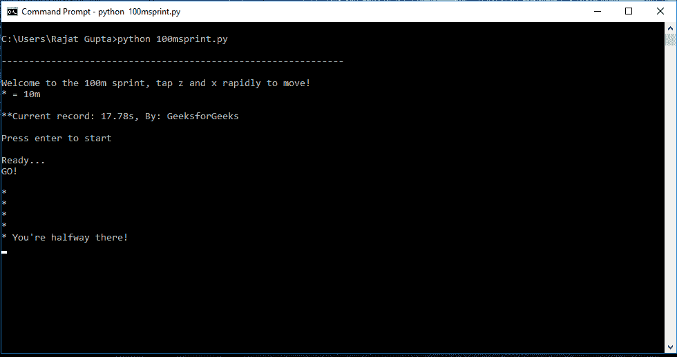
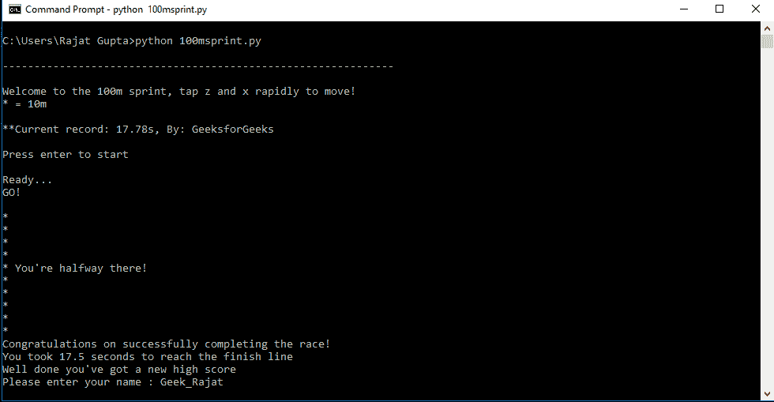

# 简单的 Python 键盘竞速

> 原文:[https://www . geesforgeks . org/simple-keyboard-racing-with-python/](https://www.geeksforgeeks.org/simple-keyboard-racing-with-python/)

让我们用 Python 做一个简单的键盘竞速游戏。在游戏中，参与者快速连续地点击一对键，程序显示参赛者跑完这段距离的总时间。

**规则:**
一看到‘GO！’在屏幕上，开始按“z”和“x”键。每覆盖一米，显示一个“*”符号。按下“z”和“x”一次将计为 1 米；目标是覆盖 10 米。

**使用的模块:**

```py
msvcrt : Used to get keystroke as input for race
time : Used to calculate time taken to complete the race
```

注意 **MSVCRT** 模块只能在终端窗口上运行，不能在 GUI 程序/IDE 上运行。

下面是代码:

## 蟒蛇 3

```py
import msvcrt
import time

high_score = 17.78
name = "GeeksforGeeks"
while True:
    distance = int(0)
    print('\n--------------------------------------------------------------')
    print('\n\nWelcome to the 100m sprint, tap z and x rapidly to move!')
    print('* = 10m')
    print('\nCurrent record:' + str(high_score) + ' by: ' + name)
    print('\nPress enter to start')
    input()
    print('Ready...')
    time.sleep(1)
    print('GO!')

    start_time = time.time()
    while distance < 10:

        k1 = msvcrt.getch().decode('ASCII')
        if k1 == 'z':
            k2 = msvcrt.getch().decode('ASCII')
            if k2 == 'x':
                distance += 1
                if distance == 5:
                    print("* You're halfway there!")
                elif distance % 1 == 0:
                    print('*')

    fin_time = time.time() - start_time
    fin_time = round(fin_time, 2)

    print('Congratulations on successfully completing the race!')
    print('You took', fin_time, 'seconds to reach the finish line')

    if fin_time < high_score:
        print("Well done you've got a new high score ")
        name = input("Please enter your name : ")
        high_score = fin_time
```

**输出:**



游戏启动



游戏进行中



游戏结束:新的高分