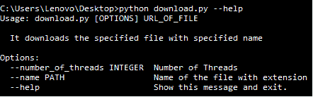
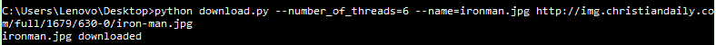

# Python 中的简单多线程下载管理器

> 原文:[https://www . geesforgeks . org/simple-多线程-下载-python 中的管理器/](https://www.geeksforgeeks.org/simple-multithreaded-download-manager-in-python/)

**简介**

下载管理器基本上是一个专门用于从互联网下载独立文件的计算机程序。在这里，我们将借助 Python 中的线程创建一个简单的下载管理器。使用多线程，可以从不同的线程同时以块的形式下载文件。为了实现这一点，我们将创建一个简单的命令行工具，它接受文件的网址，然后下载它。

**先决条件**
安装了 Python 的 Windows 机器。

**设置**
从命令提示符下下载下面提到的包。

1.  **Click 包:** Click 是一个 Python 包，用于创建漂亮的命令行界面，只需要很少的代码。这是“命令行界面创建工具包”。

    ```
    pip install click
    ```

2.  **请求包:**在这个工具中，我们将根据 URL(HTTP 地址)下载一个文件。请求是一个用 Python 编写的 HTTP 库，它允许你发送 HTTP 请求。您可以使用简单的 Python 字典添加标题、表单数据、多部分文件和参数，并以相同的方式访问响应数据。

    ```
    pip install requests
    ```

3.  **线程包:**要使用线程，我们需要线程包。

    ```
    pip install threading
    ```

**实施**

(**注:**程序已拆分成几部分，便于理解。确保在运行代码时没有遗漏代码的任何部分。)

*   在编辑器中创建新的 python 文件
*   首先将需要编写的包导入

```
#N ote: This code will not work on online IDE

# Importing the required packages
import click
import requests
import threading

# The below code is used for each chunk of file handled
# by each thread for downloading the content from specified 
# location to storage
def Handler(start, end, url, filename):

    # specify the starting and ending of the file
    headers = {'Range': 'bytes=%d-%d' % (start, end)}

    # request the specified part and get into variable    
    r = requests.get(url, headers=headers, stream=True)

    # open the file and write the content of the html page 
    # into file.
    with open(filename, "r+b") as fp:

        fp.seek(start)
        var = fp.tell()
        fp.write(r.content)
```

现在我们将在 download_file 函数中实现的实际功能。

*   第一步是用 click.command()修饰函数，这样我们就可以添加命令行参数。我们还可以为各自的命令提供选项。
*   对于输入命令帮助后的实现，我们将显示可以使用的选项。在我们的程序中，有两个选项可以使用。一个是“线程数”，另一个是“名称”。默认情况下，“线程数”取为 4。要更改它，我们可以在运行程序时指定。
*   给出了“name”选项，这样我们就可以为将要下载的文件命名。可以使用 click.argument()指定函数的参数。
*   对于我们的程序，我们需要给出我们想要下载的文件的网址。

```
#Note: This code will not work on online IDE

@click.command(help="It downloads the specified file with specified name")
@click.option('—number_of_threads',default=4, help="No of Threads")
@click.option('--name',type=click.Path(),help="Name of the file with extension")
@click.argument('url_of_file',type=click.Path())
@click.pass_context
def download_file(ctx,url_of_file,name,number_of_threads):
```

下面的代码属于“download_file”函数。

*   在这个函数中，我们首先检查“名称”。如果没有给出“名称”，那么使用来自 url 的名称。
*   下一步是连接到网址，获取内容和内容的大小。

```
r = requests.head(url_of_file)
if name:
    file_name = name
else:
    file_name = url_of_file.split('/')[-1]
try:
    file_size = int(r.headers['content-length'])
except:
    print "Invalid URL"
    return
```

创建具有内容大小的文件

```
part = int(file_size) / number_of_threads
fp = open(file_name, "wb")
fp.write('\0' * file_size)
fp.close()
```

现在，我们创建线程并传递具有主要功能的处理函数:

```
for i in range(number_of_threads):
    start = part * i
    end = start + part

          # create a Thread with start and end locations
          t = threading.Thread(target=Handler,
               kwargs={'start': start, 'end': end, 'url': url_of_file, 'filename': file_name})
          t.setDaemon(True)
          t.start()
```

最后加入线程，从 main 调用“download_file”函数

```
main_thread = threading.current_thread()
for t in threading.enumerate():
    if t is main_thread:
        continue
    t.join()
print '%s downloaded' % file_name

if __name__ == '__main__':
    download_file(obj={})
```

我们已经完成了编码部分，现在按照下面显示的命令运行。py 文件。

[](https://media.geeksforgeeks.org/wp-content/uploads/116.png)

```
“python filename.py” –-help
```

该命令显示点击命令工具的“用法”以及该工具可以接受的选项。
下面是一个示例命令，我们尝试从一个 URL 下载一个 jpg 图像文件，并给出了一个名称和线程数。

[](https://media.geeksforgeeks.org/wp-content/uploads/212.png)

最后，我们成功地完成了它，这是用 Python 构建简单多线程下载管理器的方法之一。

本文由**拉胡尔·博贾纳帕利**供稿。如果你喜欢 GeeksforGeeks 并想投稿，你也可以使用[contribute.geeksforgeeks.org](http://www.contribute.geeksforgeeks.org)写一篇文章或者把你的文章邮寄到 contribute@geeksforgeeks.org。看到你的文章出现在极客博客主页上，帮助其他极客。

如果你发现任何不正确的地方，或者你想分享更多关于上面讨论的话题的信息，请写评论。