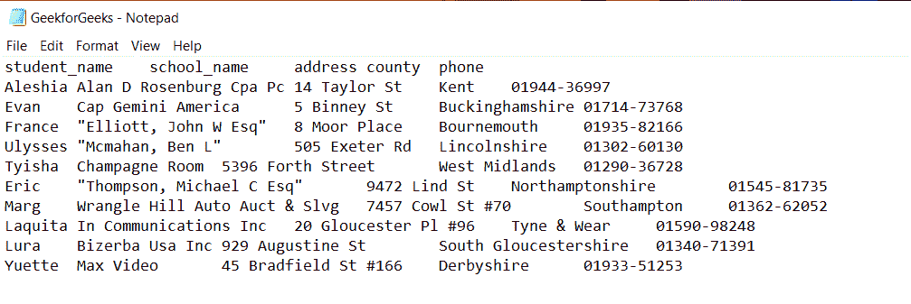
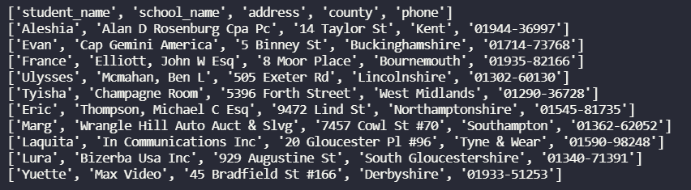
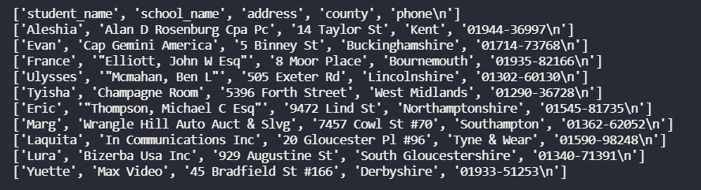

# 用 Python 读取 TSV 文件的简单方法

> 原文:[https://www . geesforgeks . org/simple-read-way-tsv-files-in-python/](https://www.geeksforgeeks.org/simple-ways-to-read-tsv-files-in-python/)

在本文中，我们将讨论如何阅读 Python 中的 TSV 文件。

#### 输入数据:

我们将在所有不同的实现方法中使用相同的输入文件来查看输出。下面是我们将从中读取数据的输入文件。



## 方法 1:使用熊猫

我们将使用熊猫 [read_csv()](https://www.geeksforgeeks.org/python-read-csv-using-pandas-read_csv/) 从 TSV 文件中读取数据。除了 TSV 文件，我们还将分隔符作为制表符传递，因为对于 tsv 文件，制表符将分隔每个字段。

**语法:**

```
data=pandas.read_csv('filename.tsv',sep='\t')
```

**示例:**使用熊猫的程序

## 蟒蛇 3

```
# Simple Way to Read TSV Files in Python using pandas
# importing pandas library
import pandas as pd

# Passing the TSV file to
# read_csv() function
# with tab separator
# This function will
# read data from file
interviews_df = pd.read_csv('GeekforGeeks.tsv', sep='\t')

# printing data
print(interviews_df)
```

**输出:**


## 方法 2:使用 CSV

我们使用 csv.reader()将 TSV 文件对象转换为 csv.reader 对象。然后将分隔符作为' \t '传递给 csv.reader。分隔符用于指示将分隔每个字段的字符。

**语法:**

```
with open("filename.tsv") as file:
    tsv_file = csv.reader(file, delimiter="\t")
```

**示例:**使用 csv 的程序

## 蟒蛇 3

```
# Simple Way to Read TSV Files in Python using csv
# importing csv library
import csv

# open .tsv file
with open("GeekforGeeks.tsv") as file:

    # Passing the TSV file to 
    # reader() function
    # with tab delimiter
    # This function will
    # read data from file
    tsv_file = csv.reader(file, delimiter="\t")

    # printing data line by line
    for line in tsv_file:
        print(line)
```

**输出:**



## 方法 3:使用拆分

用 Python 从 TSV 文件中读取数据的最简单方法是使用 split()。我们可以读取一个给定的 TSV 文件，并将其数据存储到一个列表中。

**语法:**

```
with open("filename.tsv") as file:
  for line in file:
    l=line.split('\t')
```

**示例:**使用分割的程序()

## 蟒蛇 3

```
# Simple Way to Read TSV Files in Python using split
ans = []

# open .tsv file
with open("GeekforGeeks.tsv") as f:

  # Read data line by line
  for line in f:

    # split data by tab
    # store it in list
    l=line.split('\t')

    # append list to ans
    ans.append(l)

# print data line by line
for i in ans:
    print(i)
```

**输出:**

