# 单纯形算法–表格法

> 原文:[https://www . geesforgeks . org/simplex-算法-表格-方法/](https://www.geeksforgeeks.org/simplex-algorithm-tabular-method/)

单纯形算法是**线性规划**中众所周知的优化技术。
LPP(线性规划问题)的一般形式是
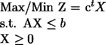

**例:**我们来考虑以下最大化问题。
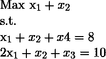
**初步施工步骤:**

*   建立你的矩阵 A. A 将包含约束的系数。
*   矩阵 b 将包含资源量。
*   矩阵 c 将包含目标函数或成本的系数。

对于上述问题–
**矩阵 A–迭代 0 时**

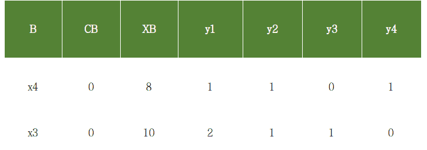

迭代 0 时

**Explanation of table-**
**B :** Basis and contains the basic variables. Simplex algorithm starts with those variables which form an indentity matrix. In the above eg x4 and x3 forms a 2×2 identity matrix.
**CB :** Its the coefficients of the basic variables in the objective function. The objective functions doesn’t contain x4 and x3, so these are 0.
**XB :** The number of resources or we can say the RHS of the constraints.
**yi :** The complete Matrix A.

```
Simplex Algorithm
1\. Start with the initial basis associated with identity matrix.
2\. Calculate the relative profits. 

For MAX problem-
If all the relative profits are less than or equal to 0, then the current basis is the optimal one. STOP.
Else continue to 3.

For MIN problem 
If all the relative profits are greater than or equal to 0, then the current basis is the optimal one. STOP.
Else continue to 3.

3\. Find the column corresponding to max relative profit. Say column k has the max 
Rel. profit. So xk will enter the basis.

4\. Perform a min ratio test to determine which variable will leave the basis.

Index of the min element i.e 'r' will determine the leaving variable.
The basic variable at index r, will leave the basis. 
NOTE: Min ratio test is always performed on positive elements.

5\. It's evident that the entered variable will not form an identity matrix, so 
we will have to perform row operations to make it identity again.
Find the pivot element. The element at index (r, k) will be the pivot element and 
row r will be the pivot row. 

6\. Divide the rth row by pivot to make it 1\. And subtract c*(rth row) from other 
rows to make them 0, where c is the coefficient required to make that row 0.

```

**迭代 1 中的表**

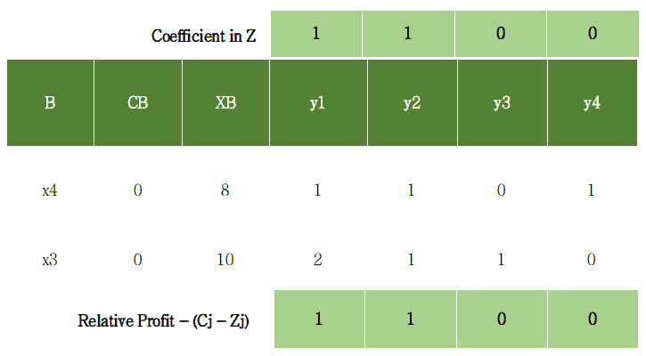

迭代 1 中的表

相对利润的计算–(Cj–Zj)，其中 Cj 是 Z 中的系数，Zj 是 yi * CB
C1–Z1 = 1 –( 1 * 0+2 * 0)
C2–Z2 = 1–(1 * 0+1 * 0)
C3–Z3 = 0–(0 * 0+1 * 0)
C4–Z4 = 0–(1 * 0+0 * 0)

所以相对利润是- 1，1，0，0(如表所示)
显然不是所有的相对利润都小于等于 0。所以将执行下一次迭代。
进入变量和离开变量的确定。
指数 1 时最大相对利润 1。所以 x1 会进入基础。
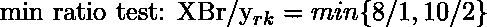
(8，5)的最小值为 5，指数为 2。所以 x3 会留下基础。

由于输入的 x1 执行所需的行操作以生成单位矩阵。

透视索引= [2，4]
透视元素= 2

将第二行除以枢轴元素，即 2，使其为 1。
从 R1 减去 1*R2 使其为 0
见下表。

**迭代 2 中的表**

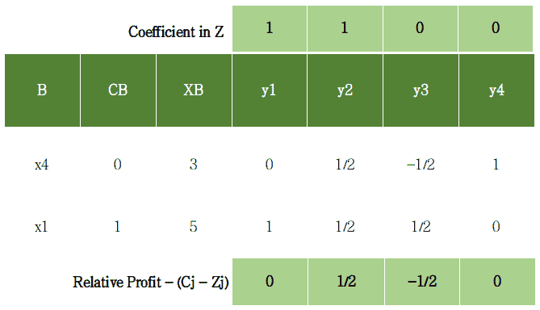

迭代 2 中的表

相对利润= 0，1/2，-1/2，0
透视指数= [1，5]
透视元素= 1/2
执行必要的行操作。
见下一表

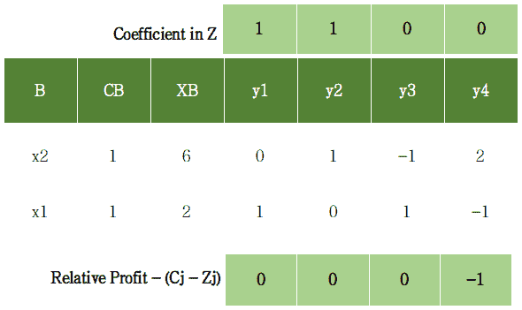

表在迭代 3 中

Relative profits = 0, 0, 0, -1
Since all relative profits are less than or equal to 0\. So optimality is reached.
This will be the final simplex table and the optimal one.
Value of Z at optimality = 6*1 + 2*1 = **8**

**执行该算法时，可能会出现以下情况。**

*   **案例 1**–无界解
    如果最大相对利润对应的列只包含非正实数，那么我们将无法执行最小比率测试。因此它被报道为无界解。
*   **情况 2**–替代解
    如果在任何迭代中，任何一个非基本变量的相对利润为 0，那么它包含替代解。许多最优解将会存在。

**例 2**
上面的例子是一个平等的例子，我们能够找到最初的基础。现在我们将在一个没有恒等式形成的例子中执行单纯形。
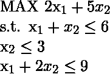
将上述问题转化为标准形式即
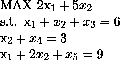
，其中 x3、x4、x5 为**松弛变量**。这些将形成身份，因此是最初的基础。
迭代 0 的表格

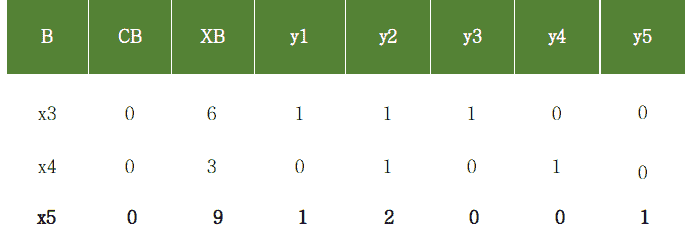

迭代 0 处的表

现在继续前面的例子。
**迭代 1 的表**

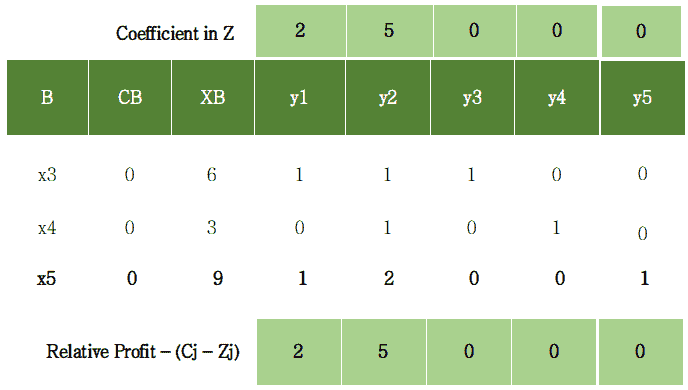

迭代 1 中的表

Relative profits = 2, 5, 0, 0, 0
Pivot Index = [2, 5]
Pivot element = 1

**迭代 2 中的表**

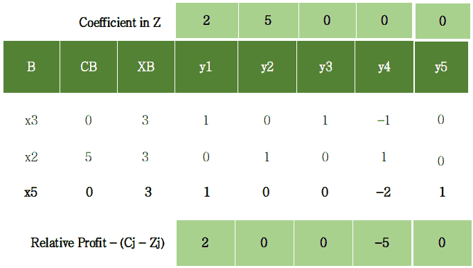

迭代 2 中的表

Relative Profits = 2, 0, 0, -5, 0
Pivot Index = [1, 4]
Pivot Element = 1

**迭代 3 的表**

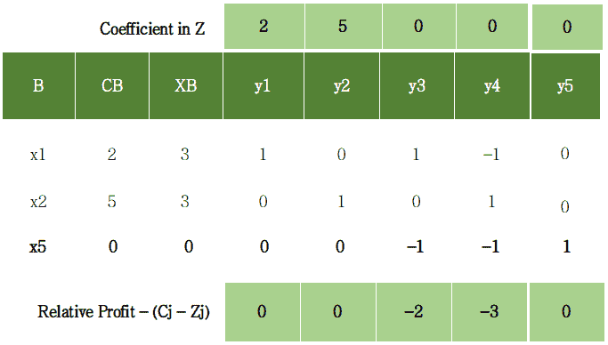

迭代 3 中的表

Relative profits = 0, 0, 0, -2, -3, 0
Since all relative profits are less than equal to 0\. Optimality is reached.
This is the final simplex table and the optimal one.
Value of Z at optimality = 3*2 + 3*5 + 0*0 = **21**

**单纯形算法的代码实现**

```
import numpy as np 
from fractions import Fraction # so that numbers are not displayed in decimal.

print("\n                 ****SiMplex Algorithm ****\n\n")

# inputs 

# A will contain the coefficients of the constraints
A = np.array([[1, 1, 0, 1], [2, 1, 1, 0]])
# b will contain the amount of resources 
b = np.array([8, 10])           
# c will contain coefficients of objective function Z      
c = np.array([1, 1, 0, 0])             

# B will contain the basic variables that make identity matrix
cb = np.array(c[3])
B = np.array([[3], [2]])          
 # cb contains their corresponding coefficients in Z   
cb = np.vstack((cb, c[2]))        
xb = np.transpose([b])                 
# combine matrices B and cb
table = np.hstack((B, cb))             
table = np.hstack((table, xb))         
# combine matrices B, cb and xb
# finally combine matrix A to form the complete simplex table
table = np.hstack((table, A))         
# change the type of table to float
table = np.array(table, dtype ='float') 
# inputs end

# if min problem, make this var 1
MIN = 0

print("Table at itr = 0")
print("B \tCB \tXB \ty1 \ty2 \ty3 \ty4")
for row in table:
    for el in row:
                # limit the denominator under 100
        print(Fraction(str(el)).limit_denominator(100), end ='\t') 
    print()
print()
print("Simplex Working....")

# when optimality reached it will be made 1
reached = 0     
itr = 1
unbounded = 0
alternate = 0

while reached == 0:

    print("Iteration: ", end =' ')
    print(itr)
    print("B \tCB \tXB \ty1 \ty2 \ty3 \ty4")
    for row in table:
        for el in row:
            print(Fraction(str(el)).limit_denominator(100), end ='\t')
        print()

    # calculate Relative profits-> cj - zj for non-basics
    i = 0
    rel_prof = []
    while i<len(A[0]):
        rel_prof.append(c[i] - np.sum(table[:, 1]*table[:, 3 + i]))
        i = i + 1

    print("rel profit: ", end =" ")
    for profit in rel_prof:
        print(Fraction(str(profit)).limit_denominator(100), end =", ")
    print()
    i = 0

    b_var = table[:, 0]
    # checking for alternate solution
    while i<len(A[0]):
        j = 0
        present = 0
        while j<len(b_var):
            if int(b_var[j]) == i:
                present = 1
                break;
            j+= 1
        if present == 0:
            if rel_prof[i] == 0:
                alternate = 1
                print("Case of Alternate found")
                # print(i, end =" ")
        i+= 1
    print()
    flag = 0
    for profit in rel_prof:
        if profit>0:
            flag = 1
            break
        # if all relative profits <= 0
    if flag == 0:
        print("All profits are <= 0, optimality reached")
        reached = 1
        break

    # kth var will enter the basis
    k = rel_prof.index(max(rel_prof))
    min = 99999
    i = 0;
    r = -1
    # min ratio test (only positive values)
    while i<len(table):
        if (table[:, 2][i]>0 and table[:, 3 + k][i]>0): 
            val = table[:, 2][i]/table[:, 3 + k][i]
            if val<min:
                min = val
                r = i     # leaving variable
        i+= 1

        # if no min ratio test was performed
    if r ==-1:
        unbounded = 1
        print("Case of Unbounded")
        break

    print("pivot element index:", end =' ')
    print(np.array([r, 3 + k]))

    pivot = table[r][3 + k]
    print("pivot element: ", end =" ")
    print(Fraction(pivot).limit_denominator(100))

        # perform row operations
    # divide the pivot row with the pivot element
    table[r, 2:len(table[0])] = table[
            r, 2:len(table[0])] / pivot

    # do row operation on other rows
    i = 0
    while i<len(table):
        if i != r:
            table[i, 2:len(table[0])] = table[i,
                 2:len(table[0])] - table[i][3 + k] * 
                 table[r, 2:len(table[0])]
        i += 1

    # assign the new basic variable
    table[r][0] = k
    table[r][1] = c[k]

    print()
    print()
    itr+= 1

print()

print("***************************************************************")
if unbounded == 1:
    print("UNBOUNDED LPP")
    exit()
if alternate == 1:
    print("ALTERNATE Solution")

print("optimal table:")
print("B \tCB \tXB \ty1 \ty2 \ty3 \ty4")
for row in table:
    for el in row:
        print(Fraction(str(el)).limit_denominator(100), end ='\t')
    print()
print()
print("value of Z at optimality: ", end =" ")

basis = []
i = 0
sum = 0
while i<len(table):
    sum += c[int(table[i][0])]*table[i][2]
    temp = "x"+str(int(table[i][0])+1)
    basis.append(temp)
    i+= 1
# if MIN problem make z negative
if MIN == 1:
    print(-Fraction(str(sum)).limit_denominator(100))
else:
    print(Fraction(str(sum)).limit_denominator(100))
print("Final Basis: ", end =" ")
print(basis)

print("Simplex Finished...")
print()
```

对于以上只需插入所需的值，你会得到一个详细的逐步解决你的 LPP 单纯形算法。