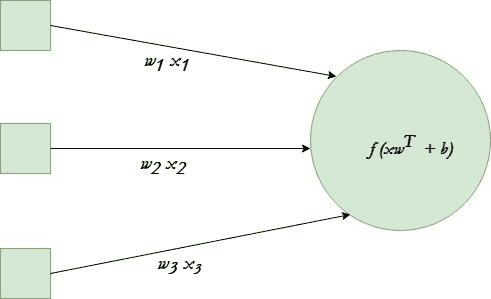

# Python 中的单神经元神经网络

> 原文:[https://www . geesforgeks . org/单神经元-神经网络-python/](https://www.geeksforgeeks.org/single-neuron-neural-network-python/)

神经网络是深度学习的核心，深度学习是一个在许多不同领域都有实际应用的领域。如今，神经网络被用于图像分类、语音识别、目标检测等。现在，让我们试着理解所有这些艺术技巧背后的基本单元。
单个神经元将给定的输入转换成某种输出。根据给定的输入和分配给每个输入的权重，决定神经元是否触发。让我们假设神经元有 3 个输入连接和一个输出。



在给定的示例中，我们将使用 tanh [激活功能](https://www.geeksforgeeks.org/activation-functions-neural-networks/)。
最终目标是找到产生正确结果的神经元的最佳权重集。通过几个不同的训练例子来训练神经元。在每一步计算神经元输出的误差，并反推梯度。计算神经元输出的步骤称为*正向传播*，而梯度的计算称为*反向传播*。
下面是实现:

## 蟒蛇 3

```py
# Python program to implement a
# single neuron neural network

# import all necessary libraries
from numpy import exp, array, random, dot, tanh

# Class to create a neural
# network with single neuron
class NeuralNetwork():

    def __init__(self):

        # Using seed to make sure it'll 
        # generate same weights in every run
        random.seed(1)

        # 3x1 Weight matrix
        self.weight_matrix = 2 * random.random((3, 1)) - 1

    # tanh as activation function
    def tanh(self, x):
        return tanh(x)

    # derivative of tanh function.
    # Needed to calculate the gradients.
    def tanh_derivative(self, x):
        return 1.0 - tanh(x) ** 2

    # forward propagation
    def forward_propagation(self, inputs):
        return self.tanh(dot(inputs, self.weight_matrix))

    # training the neural network.
    def train(self, train_inputs, train_outputs,
                            num_train_iterations):

        # Number of iterations we want to
        # perform for this set of input.
        for iteration in range(num_train_iterations):
            output = self.forward_propagation(train_inputs)

            # Calculate the error in the output.
            error = train_outputs - output

            # multiply the error by input and then
            # by gradient of tanh function to calculate
            # the adjustment needs to be made in weights
            adjustment = dot(train_inputs.T, error *
                             self.tanh_derivative(output))

            # Adjust the weight matrix
            self.weight_matrix += adjustment

# Driver Code
if __name__ == "__main__":

    neural_network = NeuralNetwork()

    print ('Random weights at the start of training')
    print (neural_network.weight_matrix)

    train_inputs = array([[0, 0, 1], [1, 1, 1], [1, 0, 1], [0, 1, 1]])
    train_outputs = array([[0, 1, 1, 0]]).T

    neural_network.train(train_inputs, train_outputs, 10000)

    print ('New weights after training')
    print (neural_network.weight_matrix)

    # Test the neural network with a new situation.
    print ("Testing network on new examples ->")
    print (neural_network.forward_propagation(array([1, 0, 0])))
```

**输出:**

```py
Random weights at the start of training
[[-0.16595599]
 [ 0.44064899]
 [-0.99977125]]

New weights after training
[[5.39428067]
 [0.19482422]
 [0.34317086]]

Testing network on new examples ->
[0.99995873]
```