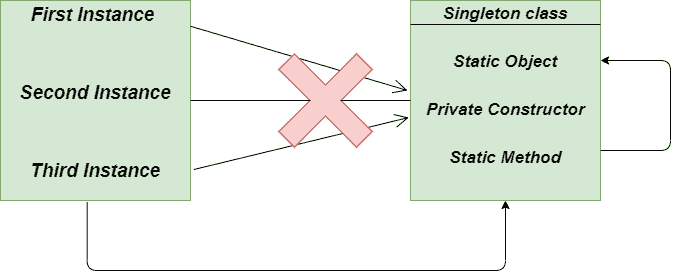
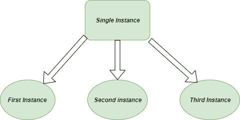
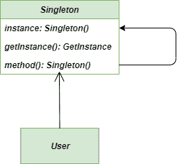

# 单体方法–Python 设计模式

> 原文:[https://www . geesforgeks . org/singleton-method-python-design-patterns/](https://www.geeksforgeeks.org/singleton-method-python-design-patterns/)

**先决条件:** [**单体设计模式|简介**](https://www.geeksforgeeks.org/singleton-design-pattern-introduction/)
单体方法是[创造设计模式](https://www.geeksforgeeks.org/design-patterns-set-1-introduction/)的一种类型，是我们可用的最简单的设计模式之一。这是一种提供一个且只有一个特定类型的对象的方法。它只涉及一个类来创建方法和指定对象。
单例设计模式可以通过一个非常简单的数据库连接的例子来理解。当每个对象创建到数据库的唯一数据库连接时，它将极大地影响项目的成本和费用。所以，做一个单一的连接总是比做额外的不相关的连接更好，这可以通过**单一设计模式**轻松完成。



单一模式

> **定义:**单例模式是一种将类的实例化限制为一个对象的设计模式。

现在让我们来看看单例设计模式的不同实现。

### 方法 1:单稳态/博格单一设计模式

单例行为可以通过博格模式实现，但是不是只有一个类的实例，而是有多个共享相同状态的实例。这里我们不关注实例标识的共享，而是关注共享状态。

## 蟒蛇 3

```
# Singleton Borg pattern
class Borg:

    # state shared by each instance
    __shared_state = dict()

    # constructor method
    def __init__(self):

        self.__dict__ = self.__shared_state
        self.state = 'GeeksforGeeks'

    def __str__(self):

        return self.state

# main method
if __name__ == "__main__":

    person1 = Borg()    # object of class Borg
    person2 = Borg()    # object of class Borg
    person3 = Borg()    # object of class Borg

    person1.state = 'DataStructures' # person1 changed the state
    person2.state = 'Algorithms'     # person2 changed the state

    print(person1)    # output --> Algorithms
    print(person2)    # output --> Algorithms

    person3.state = 'Geeks'  # person3 changed the
                         # the shared state

    print(person1)    # output --> Geeks
    print(person2)    # output --> Geeks
    print(person3)    # output --> Geeks
```

**输出:**

```
Algorithms
Algorithms
Geeks
Geeks
Geeks
```



单一设计模式

### [双重检查锁定](https://en.wikipedia.org/wiki/Double-checked_locking)单例设计模式

很容易注意到，一旦创建了对象，线程的同步就不再有用，因为现在对象永远不会等于无，任何操作序列都会导致一致的结果。
所以，当对象等于无时，那么只有我们在 getInstance 方法上获得**锁定**。

## 蟒蛇 3

```
# Double Checked Locking singleton pattern

import threading

class SingletonDoubleChecked(object):

    # resources shared by each and every
    # instance

    __singleton_lock = threading.Lock()
    __singleton_instance = None

    # define the classmethod
    @classmethod
    def instance(cls):

        # check for the singleton instance
        if not cls.__singleton_instance:
            with cls.__singleton_lock:
                if not cls.__singleton_instance:
                    cls.__singleton_instance = cls()

        # return the singleton instance
        return cls.__singleton_instance

# main method
if __name__ == '__main__':

    # create class X
    class X(SingletonDoubleChecked):
        pass

    # create class Y
    class Y(SingletonDoubleChecked):
        pass

    A1, A2 = X.instance(), X.instance()
    B1, B2 = Y.instance(), Y.instance()

    assert A1 is not B1
    assert A1 is A2
    assert B1 is B2

    print('A1 : ', A1)
    print('A2 : ', A2)
    print('B1 : ', B1)
    print('B2 : ', B2)
```

**输出:**

```
A1 :  __main__.X object at 0x02EA2590
A2 :  __main__.X object at 0x02EA2590
B1 :  __main__.Y object at 0x02EA25B0
B2 :  __main__.Y object at 0x02EA25B0
```

### 单一设计模式的经典实现

在 Singleton 设计模式的经典实现中，我们简单地使用静态方法来创建 getInstance 方法，该方法能够返回共享资源。我们还利用所谓的**虚拟私有构造函数**来提出针对它的异常，尽管这并不是很需要。

## 蟒蛇 3

```
# classic implementation of Singleton Design pattern
class Singleton:

    __shared_instance = 'GeeksforGeeks'

    @staticmethod
    def getInstance():

        """Static Access Method"""
        if Singleton.__shared_instance == 'GeeksforGeeks':
            Singleton()
        return Singleton.__shared_instance

    def __init__(self):

        """virtual private constructor"""
        if Singleton.__shared_instance != 'GeeksforGeeks':
            raise Exception ("This class is a singleton class !")
        else:
            Singleton.__shared_instance = self

# main method
if __name__ == "__main__":

    # create object of Singleton Class
    obj = Singleton()
    print(obj)

    # pick the instance of the class
    obj = Singleton.getInstance()
    print(obj)
```

**输出:**

```
 __main__.Singleton object at 0x014FFE90
 __main__.Singleton object at 0x014FFE90
```

### 类图

单例设计模式的类图



单例类图

### 使用单例方法的优点:

1.  **初始化:**Singleton 方法创建的对象只有在第一次被请求时才会被初始化。
2.  **访问对象:**我们获得了对象实例的全局访问权限。
3.  **实例计数:**在单例方法类中不能有多个实例

### 使用单一方法的缺点:

1.  **多线程环境:**在多线程环境中使用 singleton 方法并不容易，因为我们要注意多线程不会多次创建 singleton 对象。
2.  **单一责任原则:**由于 Singleton 方法是一次解决两个问题，不遵循单一责任原则。
3.  **单元测试过程:**当他们向应用程序引入全局状态时，这使得单元测试变得非常困难。

### 适应性

1.  **全局变量控制:**在我们特别需要全局变量强控制的项目中，强烈推荐使用**单例法**
2.  **日常开发人员使用:**单一模式通常用于提供日志记录、缓存、线程池和配置设置，并且通常与工厂设计模式结合使用。

**进一步阅读:**[**Java 中的单件方法**](https://www.geeksforgeeks.org/singleton-design-pattern/)**[**单件设计模式实践举例**](https://www.geeksforgeeks.org/java-singleton-design-pattern-practices-examples/)**