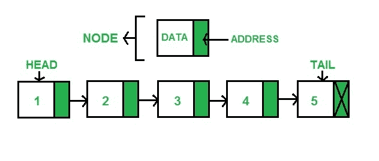

# Python 中 llist 模块的 sllist 类

> 原文:[https://www . geesforgeks . org/sllist-class-of-llist-module-in-python/](https://www.geeksforgeeks.org/sllist-class-of-llist-module-in-python/)

llist 是 CPython 的扩展模块，提供了基本的链表结构。它们明显快于出列甚至标准列表。

### 单链表

这是一个简单的单向数据结构，因此只能从头到尾遍历到最后一个节点。单链表的每个节点包含数据和它前面的节点的地址。简单地说，每个节点指向它后面的节点。下图显示了单链表的一般结构:



在 llist 中，有一个 sllist 对象可以帮助成功实现单链表。

### 列表对象

**class llist . sllist([iterable]):**返回一个从提供的 iterable 初始化的新链表。如果没有给定 iterables，则生成链表，但链表是空的。

```
import llist
from llist import sllist, sllistiterator

lst = llist.sllist(['first', 'second', 'third'])
print(lst)
```

**输出:**

```
sllist([first, second, third])
```

**sllist 支持以下属性:**

*   **first** : read only attribute, prints the first attribute of the list and None if the list is empty.

    ```
    print(lst.first)
    ```

    **输出:**

    ```
    sllistnode(first)
    ```

*   **last**: read only property, returns the last element of the list(tail) and None if the list is empty.

    ```
    print(lst.last)
    ```

    **输出:**

    ```
    sllistnode(third)
    ```

*   **size** : read only attribute that returns the size of the list

    ```
    print(lst.size)
    ```

    **输出:**

    ```
    3
    ```

sslist 还支持以下方法:

*   **append(x)** : adds x to the right side of the list and returns a inserted sllist node. If x already is a sllist node then a new node is created and initialized with the value extracted from x.

    ```
    lst.append('fourth')
    print(lst)
    ```

    **输出:**

    ```
    sllist([first, second, third, fourth])
    ```

*   **appendleft(x)** : adds x to the left side of the list and returns a inserted sllist node. If x already is a sllist node then a new node is created and initialized with the value extracted from x.

    ```
    lst.appendleft('fourth')
    print(lst)
    ```

    **输出:**

    ```
    sllist([fourth, first, second, third])
    ```

*   **appendright(x)** : adds x to the right side of the list and returns a inserted sllist node. If x already is a sllist node then a new node is created and initialized with the value extracted from x.

    ```
    lst.appendright('fourth')
    print(lst)
    ```

    **输出:**

    ```
    sllist([first, second, third, fourth])
    ```

*   **clear()** clears all nodes from the list.

    ```
    lst.clear()
    print(lst)
    ```

    **输出:**

    ```
    sllist()
    ```

*   **extend(iterable)** : appends elements from the iterable to the right side of the list

    ```
    lst.extend(['fourth', 'fifth'])
    print(lst)
    ```

    **输出:**

    ```
    sllist([first, second, third, fourth, fifth])
    ```

*   **extendleft(iterable)** : appends element from the iterable to the left side of the list.

    ```
    lst.extendleft(['fourth', 'fifth'])
    print(lst)
    ```

    **输出:**

    ```
    sllist([fifth, fourth, first, second, third])
    ```

*   **extendright(iterable)** : appends elements from the iterable to the right side of the list

    ```
    lst.extend(['fourth', 'fifth'])
    print(lst)
    ```

    **输出:**

    ```
    sllist([first, second, third, fourth, fifth])
    ```

*   **insertafter(x, node)** : inserts x after specified node, the argument x should be a sllist node, the value of x is extracted and is given to the node to be inserted.

    ```
    node = lst.nodeat(0)
    lst.insertafter('fourth', node)
    print(lst)
    ```

    **输出:**

    ```
    sllist([first, fourth, second, third])
    ```

*   **insertbefore(x, node)** : inserts x before the specified node, the argument x should be a sllist node, the value of x is extracted and is given to the node to be inserted.

    ```
    node = lst.nodeat(1)
    lst.insertbefore('fourth', node)
    print(lst)
    ```

    **输出:**

    ```
    sllist([first, fourth, second, third])
    ```

*   **nodeat()** : returns node at the specified index. Negative indices are allowed if counting is started from right side.

    ```
    node = lst.nodeat(1)
    print(node)
    ```

    **输出:**

    ```
    sllistnode(second)
    ```

*   **pop()** : removes an element from the right side of the list.

    ```
    lst.pop()
    print(lst)
    ```

    **输出:**

    ```
    sllist([first, second])
    ```

*   **popleft()** : removes an element from the left side of the list.

    ```
    lst.popleft()
    print(lst)
    ```

    **输出:**

    ```
    sllist([second, third])
    ```

*   **popright()** : removes an element from the right side of the list.

    ```
    lst.pop()
    print(lst)
    ```

    **输出:**

    ```
    sllist([first, second])
    ```

*   **remove(node)**: removes the specified node

    ```
    node = lst.nodeat(1)
    lst.remove(node)
    print(lst)
    ```

    **输出:**

    ```
    sllist([first, third])
    ```

*   **rotate(n)** : rotates the list n steps. If n is positive rotate to right and if negative to the left.

    ```
    lst.rotate(-1)
    print(lst)
    ```

    **输出:**

    ```
    sllist([second, third, first])
    ```

除了这些方法之外，sllist 还支持迭代、cmp(lst1，lst2)、富比较运算符、常数时间 len(lst)、hash(lst)和下标引用 lst[1234]，用于按索引访问元素。

我们进一步讨论了与 sllist 相关的 llist 的更多对象:

**单列节点**

在单链表中实现一个节点，如果提供了值，可以选择初始化这个节点。

```
node = llist.sllistnode('zeroth')
print(node)
```

**输出:**

```
sllistnode(zeroth)
```

该对象还支持以下属性:

*   **下一个**:列表中的下一个节点
*   **值**:提取特定节点中存储的值

```
node = lst.nodeat(0)
print(node.next)
print(node.value)
```

**输出:**

```
sllistnode(second)
first
```

**sllistiterator 对象**

返回一个新的单链表迭代器。这些对象不是由用户创建的，而是由 sllist 返回的。__iter__()方法来保存迭代状态。迭代 sllistiterator 接口将直接产生存储在节点中的值。

```
import llist 
from llist import sllist

lst = llist.sllist(['first', 'second', 'third'])

for value in lst:
  print(value)
```

**输出:**

```
first
second
third
```