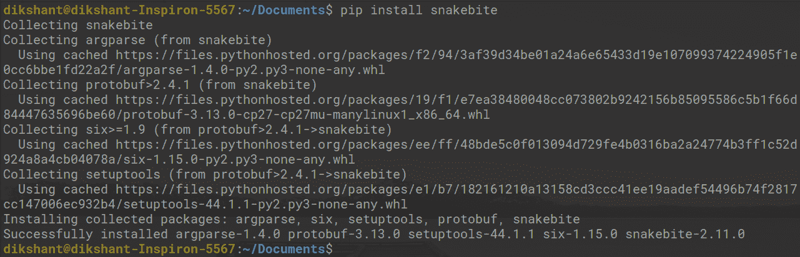
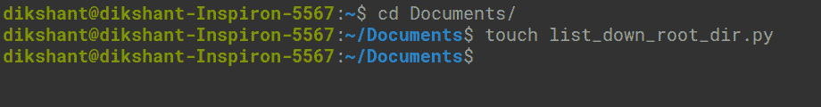
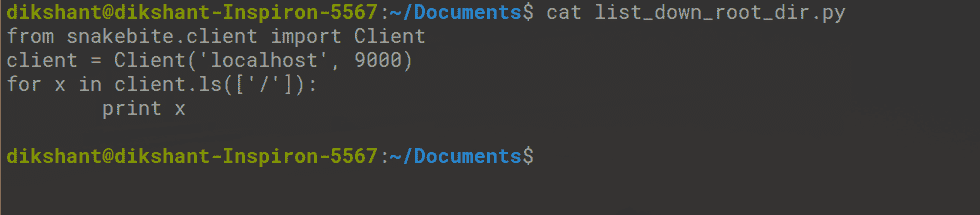
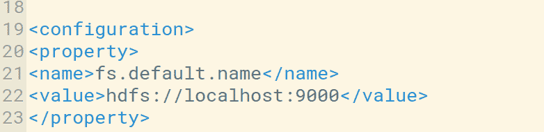
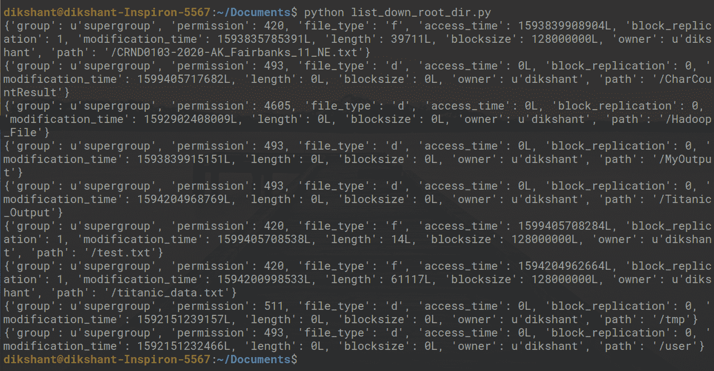

# Hadoop HDFS 蛇咬 Python 包

> 原文:[https://www . geesforgeks . org/蛇咬-python-package-for-Hadoop-HDFS/](https://www.geeksforgeeks.org/snakebite-python-package-for-hadoop-hdfs/)

**先决条件:** [Hadoop](https://www.geeksforgeeks.org/hadoop-introduction/) 和 [HDFS](https://www.geeksforgeeks.org/hadoop-hdfs-hadoop-distributed-file-system/)

**蛇咬**是一个非常流行的 python 包，允许用户使用某种带有 python 应用程序的程序访问 HDFS。蛇咬 Python 包是由 Spotify 开发的。蛇咬还提供了一个 Python 客户端库。蛇咬客户端库使用**原型包**消息与存储所有元数据的名称节点直接通信。所有文件权限、日志、创建数据块的位置都属于元数据。命令行界面也可以在这个基于客户端库的蛇咬 python 包中使用。

让我们讨论如何为 HDFS 安装和配置蛇咬软件包。

**要求:**

*   毒蛇咬伤需要 Python 2 和 python-protobuf 2.4.1 或更高版本。

蛇咬库可以通过[**【pip】**](https://www.geeksforgeeks.org/python-pip/)**轻松安装。**

```
# Make sure you have pip for python version 2 otherwise you will face error while importing module
pip install snakebite

```

我们已经有蛇咬伤，所以要求得到满足。



**客户端库**

客户端库是使用 python 构建的，它使用 Hadoop RPC 协议和 protobuf 消息与处理集群所有元数据的 NameNode 进行通信。在这个客户端库的帮助下，Python 应用程序直接与 HDFS(即 Hadoop 分布式文件系统)通信，而无需使用系统调用与 **hdfs dfs** 建立任何连接。

让我们编写一个简单的 python 程序来理解蛇咬 python 包的工作原理。

**任务:**使用蛇咬客户端库列出 HDFS 根目录的所有内容。**T3】**

**步骤 1:** 在系统中您想要的位置创建一个名为 **list_down_root_dir.py** 的 python 文件。

```
cd Documents/        # Changing directory to Documents(You can choose as per your requirement)

touchlist_down_root_dir.py    # touch command is used to create file in linux enviournment. 

```



**步骤 2:** 在**list _ down _ root _ dir . py**python 文件中编写以下代码。

## 计算机编程语言

```
# importing the package
from snakebite.client import Client
# the below line create client connection to the HDFS NameNode
client = Client('localhost', 9000)
# the loop iterate in root directory to list all the content 
for x in client.ls(['/']):
    print x
```



**客户端()方法说明:**

Client()方法可以接受下面列出的所有参数:

*   **主机(字符串):**名称节点的 IP 地址。
*   **端口(int):**Namenode 的 RPC 端口。

我们可以在 *core-site.xml* 文件中检查主机和默认端口。我们也可以根据自己的使用情况进行配置。



*   **Hadoop _ version(int):**Hadoop 协议版本(默认为:9)
*   **使用 _ 垃圾桶(布尔值):**删除文件时使用垃圾桶。
*   **有效 _ 使用(字符串):**HDFS 操作的有效用户(默认用户为当前用户)。

**步骤 3:** 使用下面的命令**启动 Hadoop 守护程序。**

```
start-dfs.sh  // start your namenode datanode and secondary namenode

start-yarn.sh  // start resourcemanager and nodemanager

```


**步骤 4:** 运行 **list_down_root_dir.py** 文件，观察结果。

```
python list_down_root_dir.py

```



在上图中，你可以看到我的 HDFS 根目录下的所有内容。