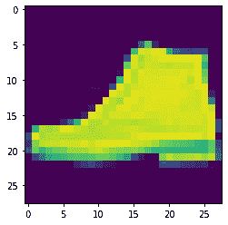

# 使用 Keras 进行软最大回归

> 原文:[https://www . geesforgeks . org/soft max-revolution-using-keras/](https://www.geeksforgeeks.org/softmax-regression-using-keras/)

先决条件:[逻辑回归](https://www.geeksforgeeks.org/ml-logistic-regression-using-python/)

【Keras 入门:
深度学习是机器学习框架的主要子领域之一。它得到了各种库的支持，如 Anano、TensorFlow、Caffe、Mxnet 等。，Keras 是最强大、最易于使用的 python 库之一，它构建在热门的深度学习库(如 TensorFlow、antao 等)之上。，用于创建深度学习模型。
Keras 提供了可用于训练和测试模型的数据集集合。**时尚 MNIST 数据集**是 **tf.keras** 数据集应用编程接口中可用数据集的一部分。该数据集包含 *70* 千张时尚物件的图像，这些物件分布在鞋、包、t 恤等 10 个类别中。这些像素被缩放到 *28 乘 28* 灰度像素。

**方法:**
因此，方法是首先加载 *MNIST 对象数据集*，然后我们将使用 *Matplotlib* 查看示例，以便更好地了解数据集。然后最后我们将通过构建神经网络使用 *Keras API* 对它们进行分类。稍后我们将在测试集上测试我们训练好的模型，以检查我们模型的准确性。
**实现:**
**代码:加载数据**

```py
mnist = tf.keras.datasets.fashion_mnist
(training_images, training_labels), (test_images, test_labels) = mnist.load_data()
```

在这个对象上调用 load_data 将给出两组两个列表，这些是包含数据集项目及其标签的图形的训练和测试值。

**代码:理解数据**

```py
import numpy as np
np.set_printoptions(linewidth = 200)
import matplotlib.pyplot as plt
plt.imshow(training_images[42])

# printing training labels and training images
print(training_labels[42])
print(training_images[42])
```

**输出:**

```py
9
[[  0   0   0   0   0   0   0   0   0   0   0   0   0   0   0   0   0   0   0   0   0   0   0   0   0   0   0   0]
 [  0   0   0   0   0   0   0   0   0   0   0   0   0   0   0   0   0   0   0   0   0   0   0   0   0   0   0   0]
 [  0   0   0   0   0   0   0   0   0   0   0   0   0   0   0   0   0   0   0   0   0   0   0   0   0   0   0   0]
 [  0   0   0   0   0   0   0   0   0   0   0   0   0   0   0   0   0   0   0   0   0   0   0   0   0   0   0   0]
 [  0   0   0   0   0   0   0   0   0   0   0   0   0   0   0   0   0   0   0   0   0   0   0   0   0   0   0   0]
 [  0   0   0   0   0   0   0   0   0   0   0   0   0   0   0   0  82 187  26   0   0   0   0   0   0   0   0   0]
 [  0   0   0   0   0   0   0   0   0   1   0   0   1   0   0 179 240 237 255 240 139  83  64  43  60  54   0   1]
 [  0   0   0   0   0   0   0   0   0   1   0   0   1   0  58 239 222 234 238 246 252 254 255 248 255 187   0   0]
 [  0   0   0   0   0   0   0   0   0   0   2   3   0   0 194 239 226 237 235 232 230 234 234 233 249 171   0   0]
 [  0   0   0   0   0   0   0   0   0   1   1   0   0  10 255 226 242 239 238 239 240 239 242 238 248 192   0   0]
 [  0   0   0   0   0   0   0   0   0   0   0   0   0 172 245 229 240 241 240 241 243 243 241 227 250 209   0   0]
 [  0   0   0   0   0   0   0   0   0   6   5   0  62 255 230 236 239 241 242 241 242 242 238 238 242 253   0   0]
 [  0   0   0   0   0   0   0   0   0   3   0   0 255 235 228 244 241 241 244 243 243 244 243 239 235 255  22   0]
 [  0   0   0   0   0   0   0   0   0   0   0 246 228 220 245 243 237 241 242 242 242 243 239 237 235 253 106   0]
 [  0   0   3   4   4   2   1   0   0  18 243 228 231 241 243 237 238 242 241 240 240 240 235 237 236 246 234   0]
 [  1   0   0   0   0   0   0   0  22 255 238 227 238 239 237 241 241 237 236 238 239 239 239 239 239 237 255   0]
 [  0   0   0   0   0  25  83 168 255 225 225 235 228 230 227 225 227 231 232 237 240 236 238 239 239 235 251  62]
 [  0 165 225 220 224 255 255 233 229 223 227 228 231 232 235 237 233 230 228 230 233 232 235 233 234 235 255  58]
 [ 52 251 221 226 227 225 225 225 226 226 225 227 231 229 232 239 245 250 251 252 254 254 252 254 252 235 255   0]
 [ 31 208 230 233 233 237 236 236 241 235 241 247 251 254 242 236 233 227 219 202 193 189 186 181 171 165 190  42]
 [ 77 199 172 188 199 202 218 219 220 229 234 222 213 209 207 210 203 184 152 171 165 162 162 167 168 157 192  78]
 [  0  45 101 140 159 174 182 186 185 188 195 197 188 175 133  70  19   0   0 209 231 218 222 224 227 217 229  93]
 [  0   0   0   0   0   0   2  24  37  45  32  18  11   0   0   0   0   0   0  72  51  53  37  34  29  31   5   0]
 [  0   0   0   0   0   0   0   0   0   0   0   0   0   0   0   0   0   0   0   0   0   0   0   0   0   0   0   0]
 [  0   0   0   0   0   0   0   0   0   0   0   0   0   0   0   0   0   0   0   0   0   0   0   0   0   0   0   0]
 [  0   0   0   0   0   0   0   0   0   0   0   0   0   0   0   0   0   0   0   0   0   0   0   0   0   0   0   0]
 [  0   0   0   0   0   0   0   0   0   0   0   0   0   0   0   0   0   0   0   0   0   0   0   0   0   0   0   0]
 [  0   0   0   0   0   0   0   0   0   0   0   0   0   0   0   0   0   0   0   0   0   0   0   0   0   0   0   0]]

```



**归一化:**
请注意，数字中的所有值都在 0 到 255 之间。如果我们正在训练一个神经网络，出于各种原因，如果我们将所有的值都视为 0 到 1 之间，这将会更容易，这是一个称为“规范化”的过程……幸运的是，在 Python 中，像这样的列表很容易规范化，而无需循环。我们可以这样做:

**代码:**

```py
training_images = training_images / 255.0
test_images = test_images / 255.0
```

**代码:**实现 Keras 模型

```py
model = tf.keras.models.Sequential([tf.keras.layers.Flatten(), 
                                    tf.keras.layers.Dense(128, activation = tf.nn.relu), 
                                    tf.keras.layers.Dense(10, activation = tf.nn.softmax)])
```

*   **Sequential:** 定义神经网络中各层的序列。
*   **展平:**它只是拍摄图像并将其转换为一维集。
*   **密集:**增加一层神经元。
*   每一层神经元都需要一个**激活功能**来告诉它们该做什么。有很多选择，但现在就用这些吧。
*   **Relu:** 实际上表示“如果 *X > 0* 返回 *X* ，否则返回 0”——所以它所做的只是将 0 或更大的值传递给网络中的下一层。
*   **Softmax:** 取一组值，有效的挑选最大的一个，所以，比如最后一层的输出看起来像*【0.1，0.1，0.05，0.1，9.5，0.1，0.05，0.05，0.05】*，通过它寻找最大的值就省去了你去钓鱼，变成了*【0，0，0，0，1，0，0，0，0，0】*目标是节省大量编码

**第五步:编译模型**
接下来要做的事情，现在模型已经定义好了，就是实际构建它。你可以像以前一样用优化器和损失函数来编译它，然后通过调用 *model.fit* 来训练它，要求它将你的训练数据与你的训练标签相匹配，即让它找出训练数据和它的实际标签之间的关系，所以在将来，如果你有看起来像训练数据的数据，那么它可以预测数据会是什么样子。
**代码:**

```py
model.compile(optimizer = tf.optimizers.Adam(),
              loss = 'sparse_categorical_crossentropy',
              metrics =['accuracy'])

model.fit(training_images, training_labels, epochs = 5)
```

**输出:**

```py
Instructions for updating:
Colocations handled automatically by placer.
Epoch 1/5
60000/60000 [==============================] - 8s 130us/sample - loss: 0.4714 - acc: 0.8322
Epoch 2/5
60000/60000 [==============================] - 8s 137us/sample - loss: 0.3598 - acc: 0.8683
Epoch 3/5
60000/60000 [==============================] - 9s 142us/sample - loss: 0.3201 - acc: 0.8824
Epoch 4/5
60000/60000 [==============================] - 8s 131us/sample - loss: 0.2949 - acc: 0.8917
Epoch 5/5
60000/60000 [==============================] - 8s 140us/sample - loss: 0.2767 - acc: 0.9098

```

一旦完成训练，我们应该会在最后一个时期看到一个精确值。可能看起来像 0.9098。这告诉我们，你的神经网络对训练数据的分类准确率约为 91%。也就是说，它找出了图像和标签之间的模式匹配，这在 91%的情况下是有效的。不算太好，但也不错，因为它只训练了 5 个时期，而且完成得很快。

**第六步:模型评估**

但是它如何处理看不见的数据呢？这就是为什么我们有测试图像。我们可以调用 *model.evaluate* ，传入两套，它会为每套报失。
 **代号:**

```py
model.evaluate(test_images, test_labels)
```

**输出:**

```py
10000/10000 [==============================] - 1s 60us/sample - loss: 0.2908 - acc: 0.8956

```

最后，我们训练了我们的模型，并且在看不见的数据集上获得了 90%的准确率。非常好。

**使用 KERAS 的优势:**
我们已经看到，我们的计算刚刚减少到 7-8 行，而不是 100 行代码。太棒了。总的来说，这有助于我们节省时间和精力，也减少了代码出错的机会。