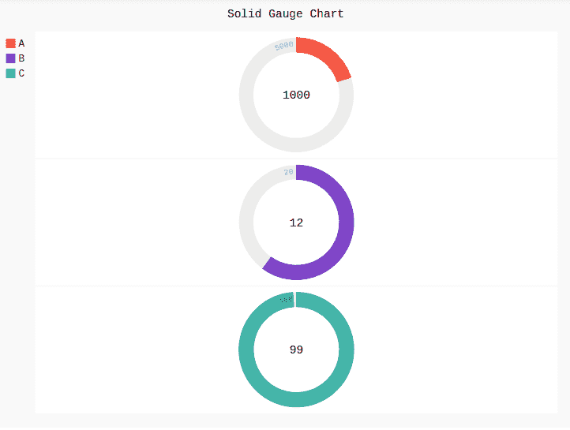
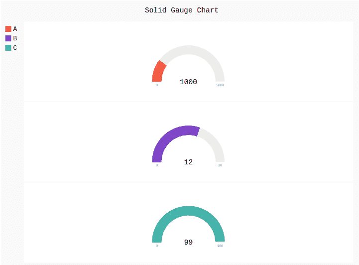

# Pygal 中的固体量规图

> 原文:[https://www.geeksforgeeks.org/solid-gauge-chart-in-pygal/](https://www.geeksforgeeks.org/solid-gauge-chart-in-pygal/)

Pygal 是一个 Python 模块，主要用于构建 SVG(标量矢量图形)图形和图表。SVG 是一种基于矢量的 XML 格式的图形，可以在任何编辑器中编辑。Pygal 可以用最少的代码行创建图表，这些代码行易于理解和编写。

## 立体仪表图

仪表是流行的图表，有助于仪表板，他们预计一个数字在一个范围内一目了然。它可以使用彩色带、指针和组合来显示多个值及其与数字刻度的关系。

**语法:**

```
gauge = pygal.SolidGauge()

```

**例 1:**

## 蟒蛇 3

```
# importing pygal
import pygal

# creating the chart object
Solid_Gauge = pygal.SolidGauge(inner_radius = 0.75)

# naming the title
Solid_Gauge.title = 'Solid Gauge Chart'     

# Random data
Solid_Gauge.add('A', [{'value': 1000, 'max_value': 5000}])
Solid_Gauge.add('B', [{'value': 12, 'max_value': 20}])
Solid_Gauge.add('C', [{'value': 99, 'max_value': 100}])

Solid_Gauge
```

**输出:**



**例 2:**

## 蟒蛇 3

```
# importing pygal
import pygal

# creating the chart object
Solid_Gauge = pygal.SolidGauge(inner_radius = 0.75, 
                               half_pie = True)

# naming the title
Solid_Gauge.title = 'Solid Gauge Chart'     

# Random data
Solid_Gauge.add('A', [{'value': 1000, 'max_value': 5000}])
Solid_Gauge.add('B', [{'value': 12, 'max_value': 20}])
Solid_Gauge.add('C', [{'value': 99, 'max_value': 100}])

Solid_Gauge
```

**输出:**

