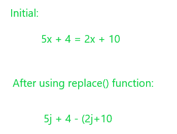
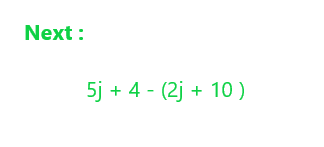
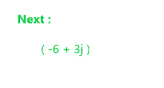

# 使用 Python 中的 eval()求解线性方程

> 原文:[https://www . geesforgeks . org/求解-线性方程-使用-eval-in-python/](https://www.geeksforgeeks.org/solve-linear-equations-using-eval-in-python/)

使用形式为 a + bx = c + dx 的一个变量的线性方程可以在 Python 中使用 [**eval()**](https://www.geeksforgeeks.org/eval-in-python/) 函数求解。输入类型将是字符串形式的线性方程。

**语法:**

```
eval(expression, globals=None, locals=None)
```

在这里，我们将把方程转换成实数和虚数的表达式，这样 eval 就可以很容易地处理它。

例如， **5x + 4 = 2x + 10** 通过将右侧的所有术语向左移动，变为**5j+4 –( 2j+10)**。我们将这个方程转换成一个复杂的方程，因为 eval()无法处理这些方程。将其转换为复数有助于更快的评估。

**第一步:**我们将使用 python 中的 replace()将“=”替换为“-”(并将“x”替换为“j”)。



**第二步:**然后字符串加上“+)”完成表达式。



**第 3 步:**然后进行{“j”:1j }以将公式更改为 eval()函数可以轻松计算的格式。在这一步中，计算所有的常数项以及 x 项或虚数项。



**第 4 步:**然后，被评估的表达式被简单地分解成实部和虚部。如果虚部存在，或者 x 为真而不为零，则打印答案，否则如果虚部为 0 而实部为真，则没有解，否则有无穷多个解。在这里，

```
x = 2.000000
```

是最终的解决方案。

**例 1:**

## 蟒蛇 3

```
def solve(equation):

    # replacing all the x terms with j 
    # the imaginary part
    s1 = equation.replace('x', 'j')

    # shifting the equal sign to start 
    # an opening bracket
    s2 = s1.replace('=', '-(')

    # adding the closing bracket to form 
    # a complete expression
    s = s2+')'

    # mapping the literal j to the complex j
    z = eval(s, {'j': 1j})
    real, imag = z.real, -z.imag

    # if the imaginary part is true return the
    # answer
    if imag:
        return "x = %f" % (real/imag)
    else:
        if real:
            return "No solution"
        else:
            return "Infinite solutions"

equation = "2+3x=5x-7"
print(solve(equation))
```

**Output**

```
x = 4.500000
```

**例 2:**

## 蟒蛇 3

```
def solve(equation):

    # replacing all the x terms with j 
    # the imaginary part
    s1 = equation.replace('x', 'j')

    # shifting the equal sign to start 
    # an opening bracket
    s2 = s1.replace('=', '-(')

    # adding the closing bracket to form 
    # a complete expression
    s = s2+')'

    # mapping the literal j to the complex j
    z = eval(s, {'j': 1j})
    real, imag = z.real, -z.imag

    # if the imaginary part is true return the
    # answer
    if imag:
        return "x = %f" % (real/imag)
    else:
        if real:
            return "No solution"
        else:
            return "Infinite solutions"

equation = "x=x+10"
print(solve(equation))
```

**Output**

```
No solution
```

**例 3:**

## 蟒蛇 3

```
def solve(equation):

    # replacing all the x terms with j
    # the imaginary part
    s1 = equation.replace('x', 'j')

    # shifting the equal sign to start 
    # an opening bracket
    s2 = s1.replace('=', '-(')

    # adding the closing bracket to form 
    # a complete expression
    s = s2+')'

    # mapping the literal j to the complex j
    z = eval(s, {'j': 1j})
    real, imag = z.real, -z.imag

    # if the imaginary part is true return the
    # answer
    if imag:
        return "x = %f" % (real/imag)
    else:
        if real:
            return "No solution"
        else:
            return "Infinite solutions"

equation = "2x=2x"
print(solve(equation))
```

**Output**

```
Infinite solutions
```