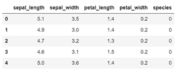
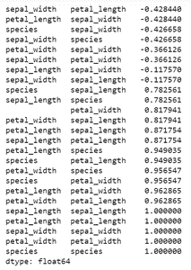
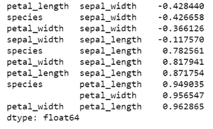

# Python 中的排序关联矩阵

> 原文:[https://www . geeksforgeeks . org/sort-correlation-matrix-in-python/](https://www.geeksforgeeks.org/sort-correlation-matrix-in-python/)

**先决条件:** [关联矩阵](https://www.geeksforgeeks.org/create-a-correlation-matrix-using-python/)

相关矩阵同时研究多个变量之间的相关性。它显示对称的表格数据，其中每一行和每一列代表一个变量，对应的值是表示这两个变量之间关系强度的相关系数。相关系数有多种类型(皮尔逊系数、肯德尔系数、斯皮尔曼系数等)。)通过不同的相关分析方法计算。相关系数值接近 1 的变量表现为强正相关，接近-1 的变量表现为强负相关，接近 0 的变量表现为弱相关或无相关。

在数据分析中，相关矩阵对于总结和发现大量数据中的关系非常有用。它也是机器学习中探索性数据分析和特征选择的常用度量。

对于大数据，解释相关矩阵可能会变得很困难。有时，对相关值进行排序有助于轻松查看各种变量对的依赖程度。在本文中，我们将看到如何在 Python 中对相关矩阵进行排序。

### 方法

*   导入模块
*   加载数据
*   使用上述数据创建相关矩阵
*   对数据进行排序。
*   显示排序的数据

我们将使用 Python 的 Seaborn 包中的 [Iris](https://github.com/mwaskom/seaborn-data) 数据集。数据集包含一种鸢尾花的 3 个类别，每个类别有 50 个属性实例。请注意，相关矩阵会忽略数据中的任何非数字列。因此，首先[使用标签编码将您想要包含在相关性矩阵中的任何非数字数据更改为数字数据](https://www.geeksforgeeks.org/ml-label-encoding-of-datasets-in-python/)。

现在，要对相关矩阵进行排序，首先我们必须将矩阵转换为一维序列。unstack()函数用于执行此操作。该系列将有多个索引。

排序时使用 [sort_values()](https://www.geeksforgeeks.org/python-pandas-dataframe-sort_values-set-1/) 函数。sort_values() 函数按照传递列的升序或降序对数据框进行排序。

> ***语法:** DataFrame.sort_values(by，axis=0，升序=True，inplace=False，kind='quicksort '，na_position='last')*
> 
> ***参数:***
> 
> *   ***排序依据:*** *单个/列名列表数据框排序依据。*
> *   ***轴:*** *0 或‘索引’为行，1 或‘列’为列*
> *   ***升序:*** *布尔值，如果为真则按升序对数据框进行排序*
> *   ***在位:*** *布尔值。如果为真，则对传递的数据框本身进行更改。*
> *   ***种类:*** *字符串，可以有三个输入(“快速排序”、“合并排序”或“heapsort”)算法用于对数据框进行排序。*
> *   ***na _ position:****取两个字符串输入‘last’或‘first’来设置 Null 值的位置。默认值为“最后”。*
> 
> ***返回类型:**返回与函数调用方数据框维度相同的排序数据框。*

**使用中的数据框:**



**例 1:**

## 蟒蛇 3

```py
# Import required libraries
import pandas as pd
import numpy as np
import seaborn as sns
import matplotlib.pyplot as plt
from sklearn.preprocessing import LabelEncoder

# Load dataset
df = sns.load_dataset('iris')

# Convert categorical values to numeric
label_encoder = LabelEncoder()
df['species'] = label_encoder.fit_transform(df['species'])

# Create correlation matrix
corr_mat = df.corr(method='pearson')

# Convert correlation matrix to 1-D Series and sort
sorted_mat = corr_mat.unstack().sort_values()

print(sorted_mat)
```

**输出:**



**例 2:** 排序相关矩阵，不重复

为了去除重复值和自相关值，在将相关矩阵转换为一维序列之前，先得到矩阵的上三角值或下三角值。为此，使用 triu()函数，该函数返回具有相关矩阵形状的上三角矩阵(主对角线以上的元素值为 1，其他元素值为 0)。方法 astype()将矩阵值转换为布尔值。这是函数可以基于另一个条件数组选择数组的地方，所以我们得到的结果是一个相关矩阵的上三角值的矩阵，其余值为空。

然后，相关矩阵被转换为一维数组，以便按照上面的示例进行排序。实现如下:

## 蟒蛇 3

```py
# Import required libraries
import pandas as pd
import numpy as np
import seaborn as sns
import matplotlib.pyplot as plt
from sklearn.preprocessing import LabelEncoder

# Load dataset
df = sns.load_dataset('iris')

# Convert categorical values to numeric
label_encoder = LabelEncoder()
df['species'] = label_encoder.fit_transform(df['species'])

# Create correlation matrix
corr_mat = df.corr(method='pearson')

# Retain upper triangular values of correlation matrix and
# make Lower triangular values Null
upper_corr_mat = corr_mat.where(
    np.triu(np.ones(corr_mat.shape), k=1).astype(np.bool))

# Convert to 1-D series and drop Null values
unique_corr_pairs = upper_corr_mat.unstack().dropna()

# Sort correlation pairs
sorted_mat = unique_corr_pairs.sort_values()
print(sorted_mat)
```

**输出:**

