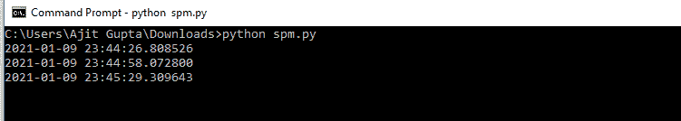

# 使用 PyAutoGUI 的垃圾邮件机器人

> 原文:[https://www.geeksforgeeks.org/spam-bot-using-pyautogui/](https://www.geeksforgeeks.org/spam-bot-using-pyautogui/)

[PyAutoGUI](https://www.geeksforgeeks.org/tag/python-pyautogui/) 是一个 Python 模块，帮助我们以编程方式自动执行按键和鼠标点击。在本文中，我们将学习使用 PyAutoGUI 开发一个垃圾邮件机器人。

**垃圾邮件–**指通过互联网向大量系统发送未经请求的消息。

这个小型项目可以用于许多实际应用，例如:

*   提醒你的朋友或亲戚在每个特定的时间间隔后做一个特定的任务
*   可用于广告目的

在这篇文章中，我们将展示垃圾邮件机器人在电报上的工作，但该代码也可以为 WhatsApp、Instagram 等工作。也就是说，无论我们在哪里找到文本字段，它都会以同样的方式工作。

**接近**

*   导入模块
*   在程序执行中增加 2 秒的延迟
*   创建生成文本消息的机制。pyautogui 的 typen()函数有助于编写文本，sleep 函数帮助我们指定特定的时间间隔(以秒为单位)，在此时间间隔之后必须执行下一条指令。函数的作用是:帮助用户跟踪消息的发送时间。

**语法:**

> 打字机(“<message>”)</message>

*   执行代码

按照以下简单步骤使用 python 开发垃圾邮件机器人:

**示例:**

## 蟒蛇 3

```
import pyautogui, time, datetime

time.sleep(2)

while True:

    # to display the time at which the message is sent 
    print(datetime.datetime.now())
    pyautogui.typewrite("Reminder: Drink water!") 
    pyautogui.press("enter")
    time.sleep(31)

    print(datetime.datetime.now())

    pyautogui.typewrite("Reminder: Take medicine!")
    pyautogui.press("enter")
    time.sleep(31)

    print(datetime.datetime.now())

    pyautogui.typewrite("Reminder: Take the dog for a walk!")
    pyautogui.press("enter")
    time.sleep(31)

    print(datetime.datetime.now())

    pyautogui.typewrite("Reminder: Drink water!")
    pyautogui.press("enter")
    time.sleep(31)

    print(datetime.datetime.now())

    pyautogui.typewrite("Reminder: Drink water!")
    pyautogui.press("enter")
    time.sleep(31)
```

**输出:**

<video class="wp-video-shortcode" id="video-546946-1" width="640" height="360" preload="metadata" controls=""><source type="video/mp4" src="https://media.geeksforgeeks.org/wp-content/uploads/20210122164859/WhatsApp-Video-2021-01-22-at-1.32.50-AM.mp4?_=1">[https://media.geeksforgeeks.org/wp-content/uploads/20210122164859/WhatsApp-Video-2021-01-22-at-1.32.50-AM.mp4](https://media.geeksforgeeks.org/wp-content/uploads/20210122164859/WhatsApp-Video-2021-01-22-at-1.32.50-AM.mp4)</video>

发送消息的日期和时间