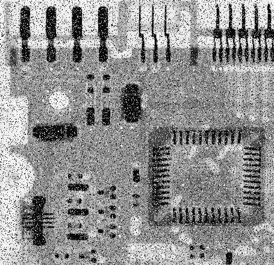
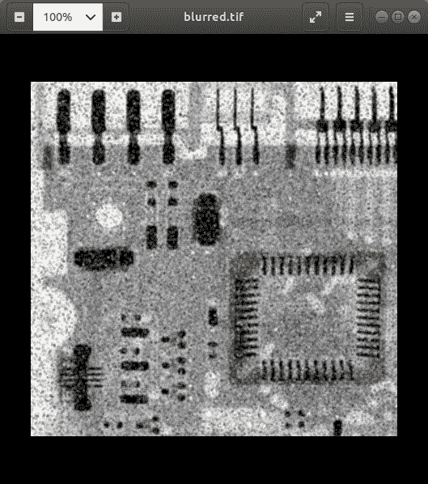
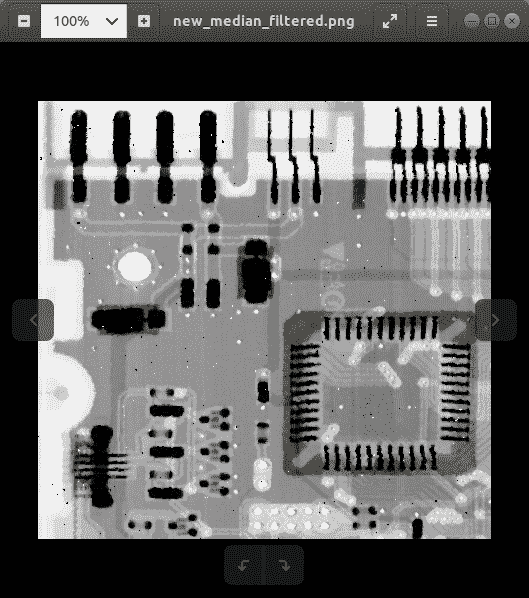

# 空间滤波器–图像处理中的平均滤波器和中值滤波器

> 原文:[https://www . geesforgeks . org/spatial-filters-average-filter-and-中值滤波-图像处理/](https://www.geeksforgeeks.org/spatial-filters-averaging-filter-and-median-filter-in-image-processing/)

[空间滤波](https://www.geeksforgeeks.org/spatial-filtering-and-its-types/)技术直接用于图像的像素。掩模通常被认为是在尺寸上增加的，以便它具有特定的中心像素。该遮罩在图像上移动，使得遮罩的中心穿过所有图像像素。
在本文中，我们将涵盖以下主题–

*   用 Python 编写一个程序来实现空间域平均滤波器，并在不使用内置函数的情况下观察其对图像的模糊效果
*   用 Python 编写一个程序来实现空间域中值滤波，在不使用内置函数的情况下去除椒盐噪声

### 理论

*   **空间域的邻域处理:**这里，为了修改一个像素，我们还考虑了紧邻像素的值。为此，可以考虑 3X3、5X5 或 7X7 邻域掩码。3X3 遮罩的示例如下所示。

```py
f(x-1, y-1) f(x-1, y) f(x-1, y+1)
f(x, y-1) f(x, y) f(x, y+1)
f(x+1, y-1) f(x+1, y) f(x+1, y+1)
```

*   **低通滤波:**又称平滑滤波器。它从图像中移除高频内容。它也用于模糊图像。低通平均滤波器屏蔽如图所示。

```py
1/9 1/9 1/9
1/9 1/9 1/9
1/9 1/9 1/9
```

*   **高通滤波:**在保留或增强高频成分的同时，消除低频区域。高通滤波掩模如图所示。

```py
-1/9 -1/9 -1/9
-1/9 8/9 -1/9
-1/9 -1/9 -1/9
```

*   **中值滤波:**又称非线性滤波。用来消除椒盐噪声。这里，像素值被相邻像素的中值代替。

下面是实现。

**输入图像:**



**平均滤波器:**

## 蟒蛇 3

```py
# Low Pass SPatial Domain Filtering
# to observe the blurring effect

import cv2
import numpy as np

# Read the image
img = cv2.imread('sample.png', 0)

# Obtain number of rows and columns
# of the image
m, n = img.shape

# Develop Averaging filter(3, 3) mask
mask = np.ones([3, 3], dtype = int)
mask = mask / 9

# Convolve the 3X3 mask over the image
img_new = np.zeros([m, n])

for i in range(1, m-1):
    for j in range(1, n-1):
        temp = img[i-1, j-1]*mask[0, 0]+img[i-1, j]*mask[0, 1]+img[i-1, j + 1]*mask[0, 2]+img[i, j-1]*mask[1, 0]+ img[i, j]*mask[1, 1]+img[i, j + 1]*mask[1, 2]+img[i + 1, j-1]*mask[2, 0]+img[i + 1, j]*mask[2, 1]+img[i + 1, j + 1]*mask[2, 2]

        img_new[i, j]= temp

img_new = img_new.astype(np.uint8)
cv2.imwrite('blurred.tif', img_new)
```

**输出:**



在上面的例子中，观察到滤波后的图像稍微模糊。如果我们增加平均掩模的尺寸，可以获得更多的模糊。

**中值滤波:**

## 蟒蛇 3

```py
# Median Spatial Domain Filtering

import cv2
import numpy as np

# Read the image
img_noisy1 = cv2.imread('sample.png', 0)

# Obtain the number of rows and columns
# of the image
m, n = img_noisy1.shape

# Traverse the image. For every 3X3 area,
# find the median of the pixels and
# replace the center pixel by the median
img_new1 = np.zeros([m, n])

for i in range(1, m-1):
    for j in range(1, n-1):
        temp = [img_noisy1[i-1, j-1],
               img_noisy1[i-1, j],
               img_noisy1[i-1, j + 1],
               img_noisy1[i, j-1],
               img_noisy1[i, j],
               img_noisy1[i, j + 1],
               img_noisy1[i + 1, j-1],
               img_noisy1[i + 1, j],
               img_noisy1[i + 1, j + 1]]

        temp = sorted(temp)
        img_new1[i, j]= temp[4]

img_new1 = img_new1.astype(np.uint8)
cv2.imwrite('new_median_filtered.png', img_new1)
```

**输出:**



在上面的例子中，我们可以看到中值滤波后的图像得到了相当大的增强，几乎没有任何椒盐噪声。