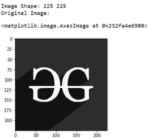
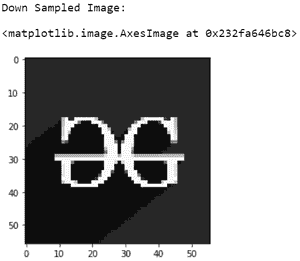
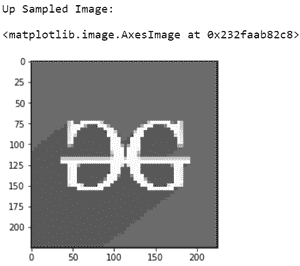

# 图像处理中的空间分辨率(下采样和上采样)

> 原文:[https://www . geesforgeks . org/空间分辨率-图像处理中的下采样和上采样/](https://www.geeksforgeeks.org/spatial-resolution-down-sampling-and-up-sampling-in-image-processing/)

数字图像是一个大小为 *M x N* 的二维数组，其中 *M* 是数组中的行数， *N* 是数组中的列数。数字图像由有限数量的称为像素的离散图像元素组成。每个像素的位置由坐标(x，y)给出，每个像素的值由强度值 *f* 给出。因此，数字图像中的元素可以用 *f(x，y)表示。*

## **空间分辨率**

术语空间分辨率对应于给定图像中的像素总数。如果像素数越多，那么图像的分辨率就越大。

## **下采样**

在下采样技术中，给定图像中的像素数根据采样频率而减少。因此，图像的分辨率和尺寸会降低。

## **上采样**

通过使用上采样插值技术，可以增加下采样图像中的像素数。上采样技术提高了图像的分辨率和尺寸。

一些常用的上采样技术有

*   最近邻插值
*   双线性插值
*   三次插值

在本文中，我们通过复制行和列，使用*最近邻插值*实现了上采样。随着采样率的增加，在重建图像中将会看到伪像。

然而，通过使用双线性插值或三次插值，可以获得更好质量的重建图像。为了更好地理解，下采样和上采样都可以用灰度显示，因为在使用 OpenCV *、*读取图像时，会处理一些颜色值，所以我们将原始输入图像转换为黑白图像。

下面的程序描述了给定图像的下采样和上采样表示:

## 蟒蛇 3

```
# Import cv2, matplotlib, numpy
import cv2
import matplotlib.pyplot as plt
import numpy as np

# Read the original image and know its type
img1 = cv2.imread('g4g.png', 0)

# Obtain the size of the original image
[m, n] = img1.shape
print('Image Shape:', m, n)

# Show original image
print('Original Image:')
plt.imshow(img1, cmap="gray")

# Down sampling

# Assign a down sampling rate
# Here we are down sampling the
# image by 4
f = 4

# Create a matrix of all zeros for
# downsampled values
img2 = np.zeros((m//f, n//f), dtype=np.int)

# Assign the down sampled values from the original
# image according to the down sampling frequency.
# For example, if the down sampling rate f=2, take
# pixel values from alternate rows and columns
# and assign them in the matrix created above
for i in range(0, m, f):
    for j in range(0, n, f):
        try:

            img2[i//f][j//f] = img1[i][j]
        except IndexError:
            pass

# Show down sampled image
print('Down Sampled Image:')
plt.imshow(img2, cmap="gray")

# Up sampling

# Create matrix of zeros to store the upsampled image
img3 = np.zeros((m, n), dtype=np.int)
# new size
for i in range(0, m-1, f):
    for j in range(0, n-1, f):
        img3[i, j] = img2[i//f][j//f]

# Nearest neighbour interpolation-Replication
# Replicating rows

for i in range(1, m-(f-1), f):
    for j in range(0, n-(f-1)):
        img3[i:i+(f-1), j] = img3[i-1, j]

# Replicating columns
for i in range(0, m-1):
    for j in range(1, n-1, f):
        img3[i, j:j+(f-1)] = img3[i, j-1]

# Plot the up sampled image
print('Up Sampled Image:')
plt.imshow(img3, cmap="gray")
```

**输入:**


**输出:**

  