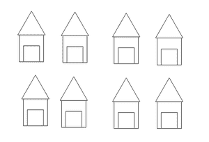
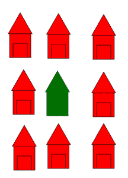
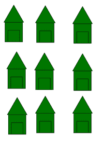
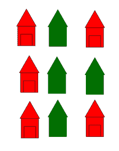
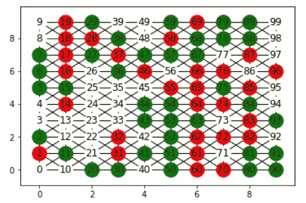
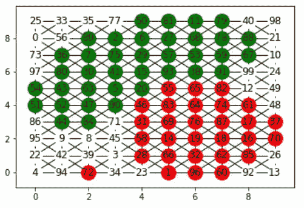

# 社交网络中的空间隔离

> 原文:[https://www . geeksforgeeks . org/社交网络中的空间隔离/](https://www.geeksforgeeks.org/spatial-segregation-in-social-networks/)

**先决条件–**[社交网络简介](https://www.geeksforgeeks.org/introduction-to-social-networks-using-networkx-in-python/)

隔离是指将人与他人或主要群体分离的行为。

空间隔离是指社会群体或任何其他元素在空间中的分布。在空间隔离中，人们倾向于迁移到其他地方，在那里他们有更多像他们一样的邻居。



一个地方的一组房子

根据空间隔离，一个人不可能呆在邻居和你很不一样的地方，你也不可能和你的邻居好好交谈。一个人更有可能迁移到一个他/她的邻居和他们相似的地方，你可以和你的邻居进行一次很好的交谈。

让我们举个例子——假设你去外国生活，你正在决定把房子搬到哪里。所以你会更倾向于选择一个你的邻居来自你的国家，说着和你一样的语言的地方，而不是一个人们来自不同国家，说着不同语言的地方。这就是空间隔离。



与你邻居不同的地方



邻居都和你一样的地方

但有时候不可能所有邻居都和你一样。为此，我们可以为相似的邻居设置一些阈值。

让我们举个例子——假设你所在的地区总共有 9 栋房子，包括你的，假设门槛为 3，这意味着至少有 3 栋房子应该与你相似。



当 t =3 时，这个人会留在这里

这种空间隔离已经被建模，这种模型被称为谢林模型。在谢林模型中，有一个网格有两种不同类型的人，模拟描述了如何使用一个奇妙的模型来实现空间隔离。下面是这种模拟在 Python 中的实现。

**示例:**

创建 10×10 维的网格用于演示。考虑三组节点，用颜色**区分为红色、绿色和白色**。现在基于谢林模型，节点被移向与其相似的节点。这里的相似性基于颜色。迭代次数越多，不相似邻居的数量越少。

## 蟒蛇 3

```py
#import modules
import networkx as nx
import matplotlib.pyplot as plt
import random

# grid dimension
n = 10

# Building the graph
g = nx.grid_2d_graph(10, 10)
pos = dict((s, s) for s in g.nodes())
labels = dict(((i, j), i * 10 + j) for i, j in g.nodes())

# Display the graph in grid form.
def display(g):
    nodes_g = nx.draw_networkx_nodes(
        g, pos, node_color='green', nodelist=type1_node_list)
    nodes_r = nx.draw_networkx_nodes(
        g, pos, node_color='red', nodelist=type2_node_list)
    nodes_w = nx.draw_networkx_nodes(
        g, pos, node_color='white', nodelist=empty_cells)
    nx.draw_networkx_edges(g, pos)
    nx.draw_networkx_labels(g, pos, labels=labels)
    plt.show()

# Get the boundary nodes in the graph as boundary nodes have only 6 neighbors.
def get_boundary(g):
    boundary_nodes_list = []
    for ((u, v), d) in g.nodes(data=True):
        if (u == 0 or v == n - 1 or u == n - 1 or v == 0):
            boundary_nodes_list.append((u, v))
    return boundary_nodes_list

# Get internal neighbors.
def get_internal_neigh(u, v):
    return (
        [(u - 1, v), (u + 1, v), (u, v - 1), (u, v + 1), (u - 1, v + 1),
         (u + 1, v - 1), (u - 1, v - 1), (u + 1, v + 1)])

# Get boundary neighbors.
def get_boundary_neigh(u, v):
    if (u == 0 and v == 0):
        return ([(0, 1), (1, 1), (1, 0)])
    elif (u == n - 1 and v == n - 1):
        return ([(n - 2, n - 2), (n - 1, n - 2), (n - 2, n - 1)])
    elif (u == n - 1 and v == 0):
        return ([(u - 1, v), (u, v + 1), (u - 1, v + 1)])
    elif (u == 0 and v == n - 1):
        return ([(u + 1, v), (u + 1, v - 1), (u, v - 1)])
    elif (u == 0):
        return ([(u, v - 1), (u, v + 1), (u + 1, v), (u + 1, v - 1), (u + 1, v + 1)])
    elif (v == n - 1):
        return ([(u, v - 1), (u - 1, v), (u + 1, v), (u - 1, v - 1), (u + 1, v - 1)])
    elif (u == n - 1):
        return ([(u - 1, v), (u, v - 1), (u, v + 1), (u - 1, v + 1), (u - 1, v - 1)])
    elif (v == 0):
        return ([(u - 1, v), (u + 1, v), (u, v + 1), (u - 1, v + 1), (u + 1, v + 1)])

# Get the list of unsatisfied nodes in the graph.
def get_unsatisfied_nodes_list(g, internal_nodes_list, boundary_nodes_list):
    unsatisfied_nodes_list = []
    t = 3
    for u, v in g.nodes():
        type_of_this_node = g.nodes[(u, v)]['type']

        if (type_of_this_node == 0):
            continue
        else:
            similar_nodes = 0
            if ((u, v) in internal_nodes_list):
                neigh = get_internal_neigh(u, v)
            elif ((u, v) in boundary_nodes_list):
                neigh = get_boundary_neigh(u, v)

            for each in neigh:
                if (g.nodes[each]['type'] == type_of_this_node):
                    similar_nodes += 1
            if (similar_nodes <= t):
                unsatisfied_nodes_list.append((u, v))

    return unsatisfied_nodes_list

# Make the node satisfied by shifting the position
# of unsatisfied node randomly and check if it becomes satisfied.
def make_a_node_satisfied(unsatisfied_nodes_list, empty_cells):
    if (len(unsatisfied_nodes_list) != 0):
        node_to_shift = random.choice(unsatisfied_nodes_list)
        new_position = random.choice(empty_cells)

        g.nodes[new_position]['type'] = g.nodes[node_to_shift]['type']
        g.nodes[node_to_shift]['type'] = 0
        labels[node_to_shift], labels[new_position] = labels[new_position],
        labels[node_to_shift]
    else:
        pass

# for adding diagonal edges
for (u, v) in g.nodes():
    if (u + 1 <= n - 1 and v + 1 <= n - 1):
        g.add_edge((u, v), (u + 1, v + 1))
    if (u + 1 <= n - 1 and v - 1 >= 0):
        g.add_edge((u, v), (u + 1, v - 1))

for ni in g.nodes():
    g.nodes[ni]['type'] = random.randint(0, 2)

type1_node_list = [ni for (ni, d) in g.nodes(data=True) if d['type'] == 1]
type2_node_list = [ni for (ni, d) in g.nodes(data=True) if d['type'] == 2]
empty_cells = [ni for (ni, d) in g.nodes(data=True) if d['type'] == 0]
display(g)

boundary_nodes_list = get_boundary(g)
internal_nodes_list = list(set(g.nodes()) - set(boundary_nodes_list))

unsatisfied_nodes_list = get_unsatisfied_nodes_list(g, internal_nodes_list,
                                                    boundary_nodes_list)

# Loop to move unsatisfied nodes
# vary the value of for loop to visualize different results
for i in range(10000):
    unsatisfied_nodes_list = get_unsatisfied_nodes_list(g, internal_nodes_list,
                                                        boundary_nodes_list)

    make_a_node_satisfied(unsatisfied_nodes_list, empty_cells)

    type1_node_list = [ni for (ni, d) in g.nodes(data=True) if d['type'] == 1]
    type2_node_list = [ni for (ni, d) in g.nodes(data=True) if d['type'] == 2]
    empty_cells = [ni for (ni, d) in g.nodes(data=True) if d['type'] == 0]

display(g)
```

**输出:**



初始图形



经过 10，000 次迭代