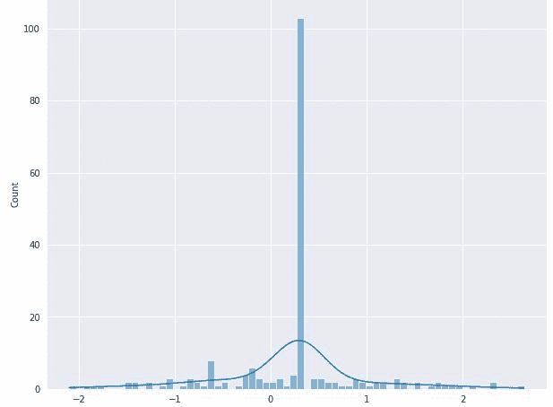
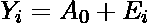
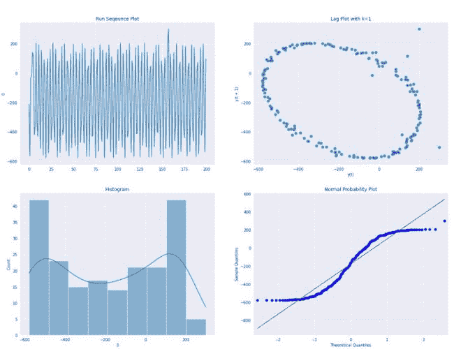
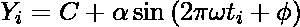

# 光谱图–正弦模型

> 原文:[https://www . geeksforgeeks . org/spectra-plot-sinosodial-model/](https://www.geeksforgeeks.org/spectral-plot-sinusodial-model/)

频谱图用于展示该图的单一主频。这表明单周期正弦模型可能是合适的。



考虑上面的图，让我们假设该图具有如下分布:



现在，我们试图通过样本均值来估计常数。这种类型的分析会导致不正确的结论，因为:

*   样本均值是有偏差
*   平均值的置信区间太小。

在这里，正确选择车型就像


其中，*a*(α)为振幅，*w*(ω)为观测频率，*φ*为相位差。

此后的下一步:

*   估计频谱图的频率，这将有助于开始后续非线性拟合的值。我们可以使用复解调相位图来估计它。
*   做一个[复解调振幅图](https://www.geeksforgeeks.org/complex-demodulation-phase-and-amplitude-plot/)来估计该图的振幅，并确定恒定振幅是否足够。
*   对数据集执行模型的非线性拟合。


#### 实施:

*   在这个实现中，我们将使用光束偏转案例研究，数据集可以从[这里](https://www.itl.nist.gov/div898/handbook/eda/section4/eda4251.htm)下载。

## 蟒蛇 3

```py
# necessary imports
import numpy as np
import pandas as pd
import matplotlib.pyplot as plt
import seaborn as sns
import statsmodels.api as sm
%matplotlib inline
sns.mpl.rcParams['figure.figsize'] = (20.0, 15.0)

# read beam data
beam_data = pd.read_csv('beam_Deflection.txt', header=None)

# draw 4 plot
sns.set_style('darkgrid')

fig, ax  = plt.subplots(2,2)

sns.lineplot(x= pd.Series(beam_data.index),y =beam_data[0],ax =ax[0,0])
ax[0,0].set_title('Run Sequence Plot')

pd.plotting.lag_plot(beam_data[0],ax =ax[0,1])
ax[0,1].set_title('Lag Plot with k=1')

sns.histplot(beam_data[0],kde=True,ax =ax[1,0])
ax[1,0].set_title('Histogram')
sm.ProbPlot(beam_data[0]).qqplot(line='s', ax=ax[1,1],color='blue');
ax[1,1].set_title('Normal Probability Plot')

fig.suptitle('4-plot')
plt.show()
```



*   4-图(滞后图)清楚地表明，有一些周期性类型的函数可以用来描述数据集。现在，让我们假设数据可以通过以下等式拟合:



*   现在，我们绘制复解调相位图和复解调幅度图，以获得上述方程的频率和幅度。从[这里](https://www.geeksforgeeks.org/complex-demodulation-phase-and-amplitude-plot/)可以了解更多如何绘制复解调相位和振幅图。
*   冷启动后，复解调相位图给出的频率为 0.3025，复解调幅度图给出的幅度约为 390。

#### **参考文献:**

*   [**《NIST 手册》**](https://www.itl.nist.gov/div898/handbook/eda/section3/spectru3.htm)