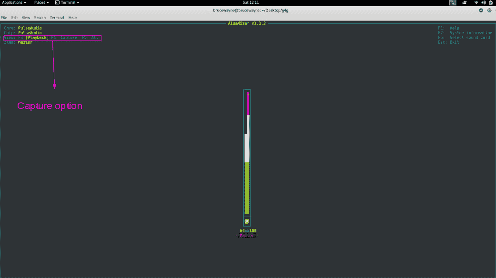
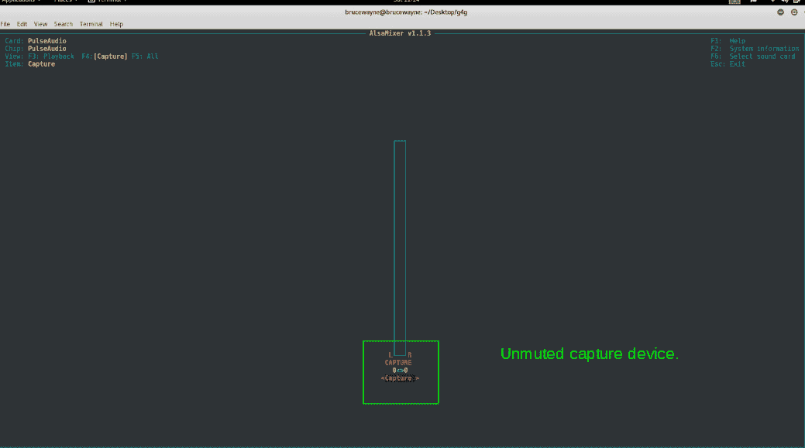
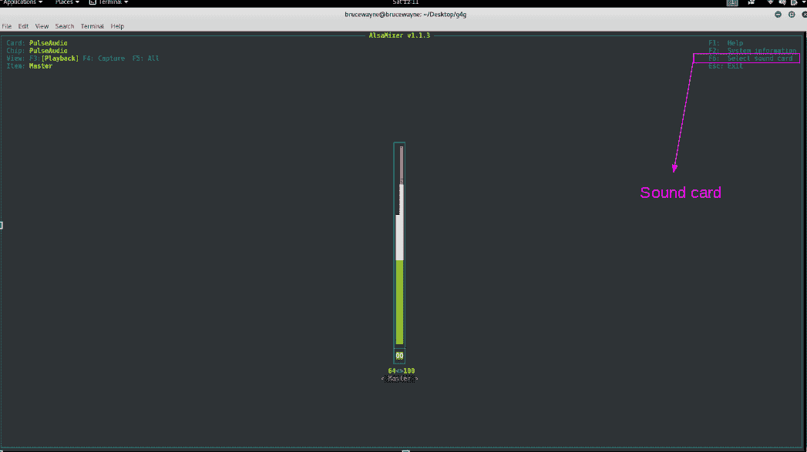
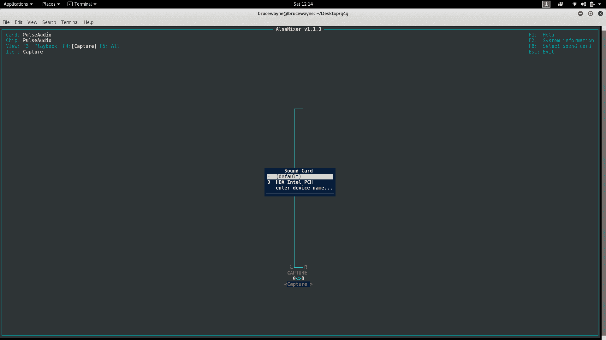

# 使用谷歌语音 API 的 Python 语音识别

> 原文:[https://www . geesforgeks . org/语音识别-python-use-Google-speech-API/](https://www.geeksforgeeks.org/speech-recognition-in-python-using-google-speech-api/)

语音识别是家庭自动化、人工智能等应用中的一个重要特征。本文旨在介绍如何使用 Python 的 SpeechRecognition 库。这很有用，因为它可以在外部麦克风的帮助下在拉斯伯里皮斯等微控制器上使用。

**所需安装**

必须安装以下设备:

1.  **Python 语音识别模块:**

    ```
     sudo pip install SpeechRecognition 
    ```

2.  **PyAudio:** Use the following command for linux users

    ```
    sudo apt-get install python-pyaudio python3-pyaudio
    ```

    如果存储库中的版本太旧，请使用以下命令安装 pyaudio

    ```
    sudo apt-get install portaudio19-dev python-all-dev python3-all-dev && 
    sudo pip install pyaudio
    ```

    使用 pip3 代替 pip 3。
    Windows 用户可以通过在终端执行以下命令来安装 pyaudio

    ```
    pip install pyaudio
    ```

**使用麦克风的语音输入和语音到文本的翻译**

1.  **Configure Microphone (For external microphones):** It is advisable to specify the microphone during the program to avoid any glitches.
    Type **lsusb** in the terminal. A list of connected devices will show up. The microphone name would look like this

    ```
    USB Device 0x46d:0x825: Audio (hw:1, 0)
    ```

    请记下这一点，因为它将在程序中使用。

2.  **设置块大小:**这主要包括指定我们想要一次读取多少字节的数据。通常，该值以 2 的幂指定，如 1024 或 2048
3.  **设置采样率:**采样率定义了记录数值进行处理的频率
4.  **为选择的麦克风设置设备 ID**:在这一步中，我们指定我们希望使用的麦克风的设备 ID，以避免在有多个麦克风的情况下出现歧义。这也有助于调试，因为在运行程序时，我们将知道指定的麦克风是否被识别。在程序中，我们指定一个参数 device_id。如果麦克风无法识别，程序会说找不到 device_id。
5.  **允许调节环境噪音:**由于周围的噪音变化，我们必须允许程序一秒钟或更长时间来调节录制的能量阈值，以便根据外部噪音水平进行调节。
6.  **Speech to text translation:** This is done with the help of Google Speech Recognition. This requires an active internet connection to work. However, there are certain offline Recognition systems such as PocketSphinx, but have a very rigorous installation process that requires several dependencies. Google Speech Recognition is one of the easiest to use.

    上述步骤已在以下实施:

    ```
    #Python 2.x program for Speech Recognition

    import speech_recognition as sr

    #enter the name of usb microphone that you found
    #using lsusb
    #the following name is only used as an example
    mic_name = "USB Device 0x46d:0x825: Audio (hw:1, 0)"
    #Sample rate is how often values are recorded
    sample_rate = 48000
    #Chunk is like a buffer. It stores 2048 samples (bytes of data)
    #here. 
    #it is advisable to use powers of 2 such as 1024 or 2048
    chunk_size = 2048
    #Initialize the recognizer
    r = sr.Recognizer()

    #generate a list of all audio cards/microphones
    mic_list = sr.Microphone.list_microphone_names()

    #the following loop aims to set the device ID of the mic that
    #we specifically want to use to avoid ambiguity.
    for i, microphone_name in enumerate(mic_list):
        if microphone_name == mic_name:
            device_id = i

    #use the microphone as source for input. Here, we also specify 
    #which device ID to specifically look for incase the microphone 
    #is not working, an error will pop up saying "device_id undefined"
    with sr.Microphone(device_index = device_id, sample_rate = sample_rate, 
                            chunk_size = chunk_size) as source:
        #wait for a second to let the recognizer adjust the 
        #energy threshold based on the surrounding noise level
        r.adjust_for_ambient_noise(source)
        print "Say Something"
        #listens for the user's input
        audio = r.listen(source)

        try:
            text = r.recognize_google(audio)
            print "you said: " + text

        #error occurs when google could not understand what was said

        except sr.UnknownValueError:
            print("Google Speech Recognition could not understand audio")

        except sr.RequestError as e:
            print("Could not request results from Google 
                                     Speech Recognition service; {0}".format(e))
    ```

    **将音频文件转录成文本**

    如果我们有一个想要翻译成文本的音频文件，我们只需要用音频文件代替麦克风来替换源。
    为了方便起见，将音频文件和节目放在同一个文件夹中。这适用于 AIFF WAV 的 FLAC 文件。
    下面显示了一个实现

    ```
    #Python 2.x program to transcribe an Audio file
    import speech_recognition as sr

    AUDIO_FILE = ("example.wav")

    # use the audio file as the audio source

    r = sr.Recognizer()

    with sr.AudioFile(AUDIO_FILE) as source:
        #reads the audio file. Here we use record instead of
        #listen
        audio = r.record(source)  

    try:
        print("The audio file contains: " + r.recognize_google(audio))

    except sr.UnknownValueError:
        print("Google Speech Recognition could not understand audio")

    except sr.RequestError as e:
        print("Could not request results from Google Speech 
                  Recognition service; {0}".format(e))
    ```

**故障排除**

通常会遇到以下问题

1.  **Muted Microphone:** This leads to input not being received. To check for this, you can use alsamixer.
    It can be installed using

    ```
    sudo apt-get install libasound2 alsa-utils alsa-oss
    ```

    类型**混合**。输出看起来有点像这样

    ```
    Simple mixer control 'Master', 0
      Capabilities: pvolume pswitch pswitch-joined
      Playback channels: Front Left - Front Right
      Limits: Playback 0 - 65536
      Mono:
      Front Left: Playback 41855 [64%] [on]
      Front Right: Playback 65536 [100%] [on]
    Simple mixer control 'Capture', 0
      Capabilities: cvolume cswitch cswitch-joined
      Capture channels: Front Left - Front Right
      Limits: Capture 0 - 65536
      Front Left: Capture 0 [0%] [off] #switched off
      Front Right: Capture 0 [0%] [off]

    ```

    如您所见，捕获设备当前已关闭。要打开它，请键入 **alsamixer**
    如您在第一张图片中所见，它正在显示我们的回放设备。按 F4 切换到捕获设备。
    

    在第二张图片中，突出显示的部分显示捕获设备已静音。要取消静音，请按空格键
    

    正如您在上一张图片中看到的，突出显示的部分确认捕获设备没有静音。
    

2.  **Current microphone not selected as capture device:**
    In this case, the microphone can be set by typing **alsamixer** and selecting sound cards. Here, you can select default microphone device.
    As shown in the picture, the highlighted portion is where you have to select sound card.
    

    第二张图为声卡的屏幕选择
    

3.  **无互联网连接:**语音到文本的转换需要活跃的互联网连接。

本文由 **Deepak Srivatsav** 供稿。如果你喜欢 GeeksforGeeks 并想投稿，你也可以使用[contribute.geeksforgeeks.org](http://contribute.geeksforgeeks.org)写一篇文章或者把你的文章邮寄到 contribute@geeksforgeeks.org。看到你的文章出现在极客博客主页上，帮助其他极客。

如果你发现任何不正确的地方，或者你想分享更多关于上面讨论的话题的信息，请写评论。