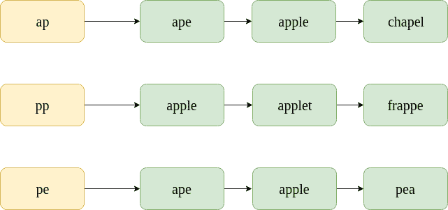
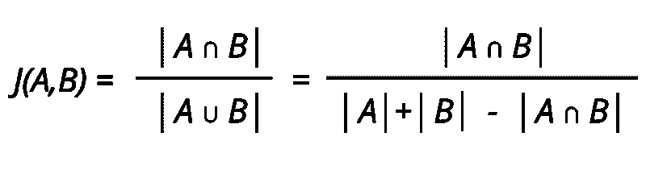
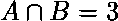
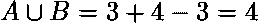

# 使用 K-Gram 重叠进行拼写纠正

> 原文:[https://www . geesforgeks . org/拼写-更正-使用-k-gram-重叠/](https://www.geeksforgeeks.org/spelling-correction-using-k-gram-overlap/)

虽然这篇[文章](https://www.geeksforgeeks.org/edit-distance-dp-5/)中讨论的最小编辑距离提供了一个很好的可能正确的单词列表，但是英语词典中有太多的单词需要考虑找到所有单词对之间的编辑距离。为了简化候选词列表，在典型的红外和自然语言处理系统中使用了 k-gram 重叠。

**K-Grams**
K-grams 是一个字符串的 K 长度子序列。这里，k 可以是 1，2，3 等等。对于 k=1，每个结果子序列被称为“unigram”；对于 k=2，一个“二元模型”；对于 k=3，一个“三元组”。这些是最广泛使用的拼写纠正 k-gram，但 k 的值真的取决于情况和上下文。

例如，考虑字符串“灾难性的”。在这种情况下，

*   **Unigrams:**[“c”、“a”、“t”、“a”、“s”、“t”、“r”、“o”、“p”、“h”、“I”、“c”]
*   **二元模型:**[“ca”、“at”、“ta”、“as”、“st”、“tr”、“ro”、“op”、“ph”、“hi”、“IC”]
*   **trirams:【cat、ata、tas、ast、str、tro、rop、OPF、phi、hic】**

**K-Gram 索引**
K-Gram 索引将一个 K-Gram 映射到包含它的所有可能词汇的发布列表。下图显示了对应于 bigram“ur”的 k-gram 发布列表。

值得注意的是，帖子列表是按字母顺序排序的。

**拼写更正**
在创建可能更正的单词的候选列表时，我们可以使用“k-gram 重叠”来查找最可能的更正。

想想拼错的单词:“appe”。其中包含的二元模型的发布列表如下所示。请注意，这些只是发布列表的样本子集；当然，实际的帖子列表会包含数千个单词。

为了找到两个帖子列表之间的 k-gram 重叠，我们使用了 Jaccard 系数。这里，A 和 B 是两组(发布列表)，A 代表拼写错误的单词，B 代表更正的单词。

现在，考虑一些用于拼写纠正的候选术语，即“ape”和“apple”。

**【猿】**
要找到[雅克卡系数](https://www.geeksforgeeks.org/find-the-jaccard-index-and-jaccard-distance-between-the-two-given-sets/)，只需浏览所有“阿佩”二元模型的发布列表，统计“猿”出现的实例。
在第一个发帖列表中，“猿猴”出现 1 次。在第二个帖子列表中，“ape”出现了 0 次。在第三个帖子列表中，“猿猴”出现了 1 次。因此，。现在，在“appe”中的重磅数是 3，在“ape”中的重磅数是 2。因此，。

J(A，B) = 2/3 = 0.67。

**【苹果】**
。现在“appe”中的重磅数是 3，“apple”中的重磅数是 4。因此，。

J(A，B) = 3/4 = 0.75。

这表明“苹果”是一个更合理的修正。实际上，这种方法用于过滤掉不太可能的校正。

拼写纠正的步骤包括:

*   找出拼错的单词的 k-gram。
*   对于每个 k-gram，线性扫描 k-gram 索引中的发布列表。
*   线性扫描列表后，找到 k-gram 重叠(没有额外的时间复杂度，因为我们找到了 Jaccard 系数)。
*   返回具有最大 k-gram 重叠的术语。