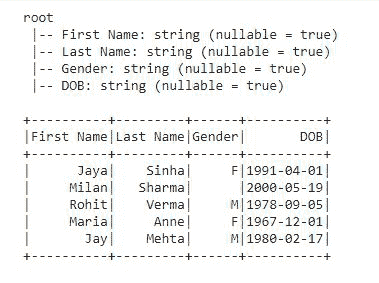
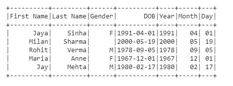
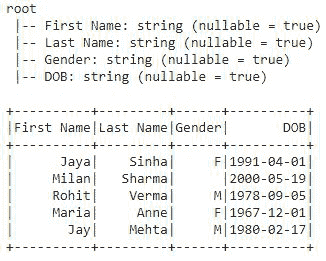
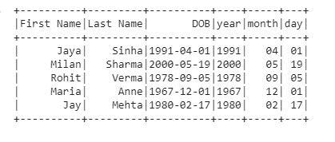
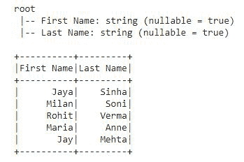
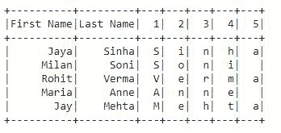

# 在 PySpark 数据框中将单个列拆分为多个列

> 原文:[https://www . geesforgeks . org/split-单列-多列-in-pyspark-dataframe/](https://www.geeksforgeeks.org/split-single-column-into-multiple-columns-in-pyspark-dataframe/)

**pyspark.sql.functions** 提供了一个函数 **split()** ，用于将 DataFrame 字符串 Column 拆分为多列。

> **语法:**py spark . SQL . functions . split(str，pattern，limit=- 1)
> 
> **参数:**
> 
> *   **字符串:**字符串是要拆分的列或字符串。
> *   **模式:**是一个字符串参数，一个代表正则表达式的字符串。这应该是一个 Java 正则表达式。
> *   **极限:**是一个 int 参数。可选指定时的整数值控制应用模式的次数。
>     *   **限制> 0:** 结果数组长度不得超过指定的限制。
>     *   **极限< = 0** :模式必须尽可能多次应用或直到极限。

首先，让我们创建一个数据帧。

## 蟒蛇 3

```
# installing pyspark
!pip install pyspark

# importing pyspark
import pyspark

# importing SparkSession
from pyspark.sql import SparkSession

# importing all from pyspark.sql.function
from pyspark.sql.functions import *

# creating SparkSession object
spark=SparkSession.builder.appName("sparkdf").getOrCreate()

# creating the row data for dataframe
data = [('Jaya', 'Sinha', 'F', '1991-04-01'),
        ('Milan', 'Sharma', '', '2000-05-19'),
        ('Rohit', 'Verma', 'M', '1978-09-05'),
        ('Maria', 'Anne', 'F', '1967-12-01'),
        ('Jay', 'Mehta', 'M', '1980-02-17')
        ]

# giving the column names for the dataframe
columns = ['First Name', 'Last Name', 'Gender', 'DOB']

# creating the dataframe df
df = spark.createDataFrame(data, columns)

# printing dataframe schema
df.printSchema()

# show dataframe
df.show()
```

**输出:**



数据框已创建

**示例 1:** 使用 withColumn()拆分列

在本例中，我们创建了一个简单的数据框，其中包含字符串格式的出生日期 yyy-mm-dd。使用拆分和 **withColumn()** 该列将被拆分为年、月和日期列。

## 蟒蛇 3

```
# split() function defining parameters
split_cols = pyspark.sql.functions.split(df['DOB'], '-')

# Now applying split() using withColumn()
df1 = df.withColumn('Year', split_cols.getItem(0)) \
    .withColumn('Month', split_cols.getItem(1)) \
    .withColumn('Day', split_cols.getItem(2))

# show df
df1.show()
```

**输出:**



拆分列后的数据框

或者，我们也可以这样写，它会给出同样的输出:

## 蟒蛇 3

```
# defining split() along with withColumn()
df2 = df.withColumn('Year', split(df['DOB'], '-').getItem(0)) \
    .withColumn('Month', split(df['DOB'], '-').getItem(1)) \
    .withColumn('Day', split(df['DOB'], '-').getItem(2))

# show df2
df2.show()
```

**输出:**


在上面的示例中，我们使用了 split()的两个参数，即包含列名的“str”和包含该列中数据的模式类型的“pattern”，并从该位置分割数据。

**示例 2:** 使用 select()拆分列

在这个例子中，我们将使用相同的数据帧 df，并使用。选择():

## 蟒蛇 3

```
# creating the row data for dataframe
data = [('Jaya', 'Sinha', 'F', '1991-04-01'),
        ('Milan', 'Sharma', '', '2000-05-19'),
        ('Rohit', 'Verma', 'M', '1978-09-05'),
        ('Maria', 'Anne', 'F', '1967-12-01'),
        ('Jay', 'Mehta', 'M', '1980-02-17')
        ]

# giving the column names for the dataframe
columns = ['First Name', 'Last Name', 'DOB']

# creating the dataframe df
df = spark.createDataFrame(data, columns)

# printing dataframe schema
df.printSchema()

# show dataframe
df.show()

# defining split ()
split_cols = pyspark.sql.functions.split(df['DOB'], '-')

# applying split() using select()
df3 = df.select('First Name', 'Last Name', 'Gender', 'DOB',
                split_cols.getItem(0).alias('year'),
                split_cols.getItem(1).alias('month'),
                split_cols.getItem(2).alias('day'))

# show df3
df3.show()
```

**输出:**

 

在上面的示例中，我们没有在 select()中选择“性别”列，因此它在结果 df3 中不可见。

**示例 3:** 拆分另一个字符串列

## 蟒蛇 3

```
# creating the row data for dataframe
data = [('Jaya', 'Sinha'), ('Milan', 'Soni'),
        ('Rohit', 'Verma'), ('Maria', 'Anne'), 
        ('Jay', 'Mehta')]

# giving the column names for the dataframe
columns = ['First Name', 'Last Name']

# creating the dataframe df
df = spark.createDataFrame(data, columns)

# printing dataframe schema
df.printSchema()

# show dataframe
df.show()

# defining split()
split_cols = pyspark.sql.functions.split(df['Last Name'], '')

# applying split() using .withColumn()
df = df.withColumn('1', split_cols.getItem(0)) \
       .withColumn('2', split_cols.getItem(1)) \
       .withColumn('3', split_cols.getItem(2)) \
       .withColumn('4', split_cols.getItem(3)) \
       .withColumn('5', split_cols.getItem(4))

# show df
df.show()
```

**输出:**

 

在上面的示例中，我们只取了两列名字和姓氏，并将姓氏列值拆分为位于多列中的单个字符。