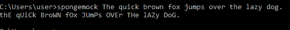
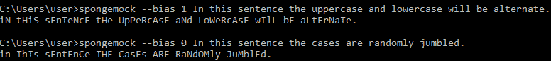
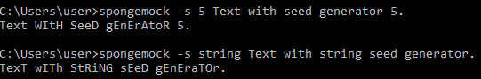

# Python 中的海绵动物模块

> 原文:[https://www.geeksforgeeks.org/spongemock-module-in-python/](https://www.geeksforgeeks.org/spongemock-module-in-python/)

海绵宝宝嘲讽文字(海绵宝宝)是一种字母大小写随机的书写方式。它在网络社区中被用来嘲笑某些东西。这篇文章起源于海绵宝宝卡通系列的一个迷因。

**示例:**

```py
Input : The quick brown fox jumps over the lazy dog.
Output : tHE QuiCK BrOWN fOX juMps over tHe lAzY dOG.

Input : This sentence is to test the function.
Output : This seNtENce is TO TeST THE funcTiON.

```

**`spongemock`** 模块用于命令行界面命令生成海绵宝宝文本。

**安装:**

```py
pip install spongemock
```

用法:

```py
spongemock text
```

**其他可选参数有:**

*   **-h :** 显示此帮助信息并退出
*   **-c :** 将模拟文本复制到剪贴板
*   **-b BIAS :** 此 BIAS 用于连续增加从之前模拟的情况中进行交换的机会。值为 0 将确保机会总是 50/50，值为 1 将确保在第一次随机选择后大写完全振荡。默认值为 0.5
*   **-s SEED :** 随机数发生器的种子。可以是任何数字或字符串(数字被解析)
*   **-s STRSEED :** seed for random number generator. Does not attempt to parse the string to a number

    **示例:**

    *   带默认参数:
    *   演示-b : 
    *   演示-s : 