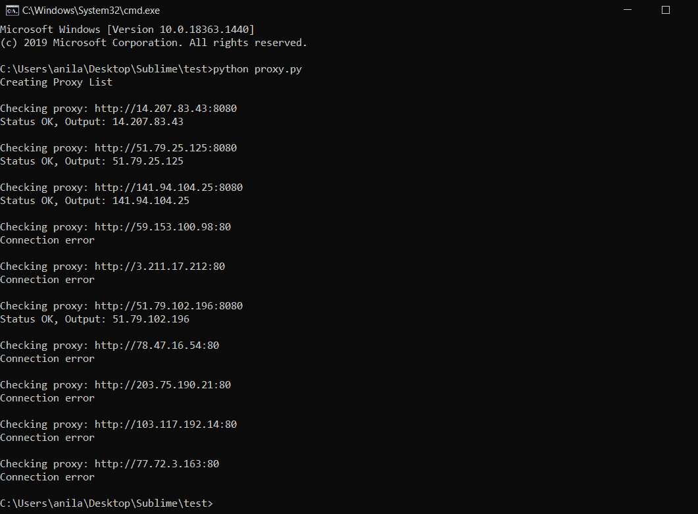

# 使用 Python 进行网页抓取时欺骗 IP 地址

> 原文:[https://www . geeksforgeeks . org/欺骗-IP-address-when-web-scratch-using-python/](https://www.geeksforgeeks.org/spoofing-ip-address-when-web-scraping-using-python/)

在本文中，我们将使用 Python 中的旋转代理来废弃一个使用请求的网站。

### **所需模块**

*   [**Requests**](https://www.geeksforgeeks.org/python-requests-tutorial/) 模块允许你发送 HTTP 请求并返回一个包含状态、页面内容等所有数据的响应。

**语法:**

> requests.get(url，参数)

*   [**JSON JavaScript 对象符号**](https://www.geeksforgeeks.org/python-json/) 是一种结构化数据的格式。它主要用于在浏览器和服务器之间存储和传输数据。Python 也通过一个名为 json 的内置包支持 JSON。这个包提供了使用 JSON 对象的所有必要工具，包括解析、序列化、反序列化等等。

### **接近**

*   如果您没有使用 [rapidapi](https://rapidapi.com/max00355/api/proxy-orbit1/) ，请手动创建一组 http 代理。*(这里 create_proxy()函数用于使用 rapidapi 生成一组 http 代理)*
*   使用 ***requests.get(url，代理=代理)*** 和**代理**作为参数，迭代代理集合并向网站发送 ***GET*** 请求。

**语法:**

> *requests.get(url，代理=代理)*

*   如果代理工作正常，那么它应该返回一个 URL 的对象。

除了处理代码之外，几乎不需要做更多的设置，下面给出了这些设置的细节。

**使用 Rapidapi 获取一组代理:**

*   首先需要从 rapidapi 购买这个 [API](https://rapidapi.com/max00355/api/proxy-orbit1/) 的订阅，然后去仪表盘选择 Python，复制 api_key。
*   用 API 键和 rapidapi 主机初始化头。

**语法:**

> 标题= { 0
> 
> x-rapidapi-key ':" paste _ API _ key _ here "，
> 
> x-rapidapi 主机:“代理动态观察 1.p.rapidapi.com”
> 
> }

*   向应用编程接口发送一个带有标题的获取请求，

**语法:**

> response = requests.request("GET "，url，headers = headers)

*   这将返回一个 JSON，使用 json.loads()解析文本，我们可以在“curl”键中找到代理服务器地址。

**语法:**

> response = JSON . loads(response . text)
> 
> 代理=响应['curl']

### **在请求中发送代理。获取()作为参数:**

使用 ***requests.get()*** 发送一个 **GET** 请求以及一个代理到这个 [url](https://ipecho.net/plain) ，它将返回当前会话的代理服务器地址。

**语法:**

> #注意:在浏览器中打开 https://ipecho.net/plain 将显示会话的当前 ip 地址。
> 
> 代理= 'http://78.47.16.54:80 '
> 
> page = requests . get(' https://ipecho . net/plain '，proxy = {“http”:proxy，“https”:proxy })
> 
> 打印(页面.文本)

**程序:**

## 蟒蛇 3

```
import requests
import json

# Gets proxies from rapidapi to create
# a set of proxies.
# Use this function only if you have rapidapi key.
def create_proxy():
    url = "https://proxy-orbit1.p.rapidapi.com/v1/"

    # Initialise the headers and paste the API key
    # of proxy-orbit1 from rapidapi.
    headers = {
        'x-rapidapi-key': "paste_api_key_here",
        'x-rapidapi-host': "proxy-orbit1.p.rapidapi.com"
    }

    # Sends a GET request to the above url along with api
    # keys which returns an object containing data in json
    # format which is then parsed using json.loads.
    response = requests.request("GET", url, headers=headers)
    response = json.loads(response.text)

    # The proxy server ip address is present in 'curl' key.
    proxy = response['curl']
    return proxy

# Main Function
if __name__ == "__main__":

    # Create an empty set and call the create_proxy()
    # function to generate a set of proxies from rapidapi.
    # Orbit proxy Rapid api key is required.
    proxies = set()
    print("Creating Proxy List")
    for __ in range(10):
        proxies.add(create_proxy())

    # If you do not have rapidapi then create a set of
    # proxies manually.
    # proxies = {'http://78.47.16.54:80',
    #      'http://203.75.190.21:80', 'http://77.72.3.163:80'}

    # Iterate the proxies and check if it is working.
    for proxy in proxies:
        print("\nChecking proxy:", proxy)
        try:

            # https://ipecho.net/plain returns the ip address
            # of the current session if a GET request is sent.
            page = requests.get('https://ipecho.net/plain',
                                proxies={"http": proxy, "https": proxy})
            print("Status OK, Output:", page.text)
        except OSError as e:

            # Proxy returns Connection error
            print(e)
```

**输出**:

