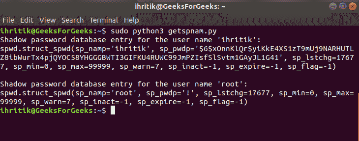

# Python 中的 spwd 模块

> 原文:[https://www.geeksforgeeks.org/spwd-module-in-python/](https://www.geeksforgeeks.org/spwd-module-in-python/)

Python 中的`***spwd module***`提供了对 *Unix 影子密码数据库*的访问。存储在数据库中的条目是类似元组的对象，其属性类似于在 [< shadow.h >头文件](http://man7.org/linux/man-pages/man3/shadow.3.html)中定义的 *spwd 结构*的成员。

以下是元组状对象的属性，表示存储在 *Unix 影子密码数据库*中的条目:

| **指数** | **属性** | **表示** |
| --- | --- | --- |
| **0** | **sp_namp** | **登录名** |
| **1** | sp _ pwdp | **加密密码** |
| **2** | sp _ lschg | **最后更改日期** |
| **3** | **sp_min** | **变更之间的最小天数** |
| **4** | **sp_max** | **变更之间的最大天数** |
| **5** | **sp_warn** | **密码到期前警告用户的天数** |
| **6** | sp _ inat | **密码过期后直到账户被禁用的天数** |
| **7** | **sp _ expires** | **自 1970-01-01 账户到期后的天数** |
| **8** | sp _ flag | **保留** |

Python 中的`***spwd module***`定义了以下两种方法:

*   `***spwd.getspnam() method***`
*   `***spwd.getspall() method***`

**注意:** `***spwd***`模块是 UNIX 特有的服务。因此，本模块的所有方法仅在 UNIX 版本上可用。

## `*spwd.getspnam() method -*`

`***spwd.getspnam()***`Python 中的方法用于获取存储在 Unix 影子密码数据库中的指定用户名的条目。
此方法要求用户有足够的权限访问影子密码数据库。*权限错误*如果用户没有足够的权限，将引发异常。

> **语法:** spwd.getspnam(名称)
> 
> **参数:**
> **名称:**代表需要输入影子密码数据库的用户名的字符串值。
> 
> **返回类型:**该方法返回类‘spwd . struct _ spwd’的元组状对象，该对象表示与指定用户名关联的影子密码数据库条目。

**代码:**使用 `spwd.getspnam()`方法

```
# Python program to explain spwd.getspnam() method

# importing spwd module 
import spwd

# User name
name = "ihritik"

# Get the shadow password
# database entry for the
# specified user name
# using spwd.getspnam() method
entry = spwd.getspnam(name)

# Print the retrieved entry
print("Shadow password database entry for the user name '%s':" %name)
print(entry)

# User name
name = "root"

# Get the shadow password
# database entry for the
# specified user name
# using spwd.getspnam() method
entry = spwd.getspnam(name)

# Print the retrieved entry
print("\nShadow password database entry for the user name '%s':" %name)
print(entry)
```

**输出:**


## `*spwd.getspall() method -*`

`***spwd.getspall()***`Python 中的方法用于获取影子密码数据库中存储的所有可用条目。此方法还要求用户有足够的权限访问影子密码数据库。

> **语法：** spwd.getspall（）
> 
> **参数:**不需要参数。
> 
> **返回类型:**该方法返回类‘spwd . struct _ spwd’的元组状对象列表，其元素表示影子密码数据库条目。

**代码:**使用`spwd.getspall()`方法

```
# Python program to explain spwd.getspall() method

# importing spwd module 
import spwd

# Get the all available 
# shadow password database entries
# using spwd.getspall() method
entries = spwd.getspall()

# Print the retrieved entries
print("Shadow password database entries:")
for row in entries:
    print(row)
```

**Output:**

```
Shadow password database entries:
spwd.struct_spwd(sp_namp=’root’, sp_pwdp=’!’, sp_lstchg=17677, sp_min=0, sp_max=99999, sp_warn=7, sp_inact=-1, sp_expire=-1, sp_flag=-1)
spwd.struct_spwd(sp_namp=’daemon’, sp_pwdp=’*’, sp_lstchg=17536, sp_min=0, sp_max=99999, sp_warn=7, sp_inact=-1, sp_expire=-1, sp_flag=-1)
spwd.struct_spwd(sp_namp=’bin’, sp_pwdp=’*’, sp_lstchg=17536, sp_min=0, sp_max=99999, sp_warn=7, sp_inact=-1, sp_expire=-1, sp_flag=-1)
spwd.struct_spwd(sp_namp=’sys’, sp_pwdp=’*’, sp_lstchg=17536, sp_min=0, sp_max=99999, sp_warn=7, sp_inact=-1, sp_expire=-1, sp_flag=-1)
spwd.struct_spwd(sp_namp=’sync’, sp_pwdp=’*’, sp_lstchg=17536, sp_min=0, sp_max=99999, sp_warn=7, sp_inact=-1, sp_expire=-1, sp_flag=-1)
spwd.struct_spwd(sp_namp=’games’, sp_pwdp=’*’, sp_lstchg=17536, sp_min=0, sp_max=99999, sp_warn=7, sp_inact=-1, sp_expire=-1, sp_flag=-1)
spwd.struct_spwd(sp_namp=’man’, sp_pwdp=’*’, sp_lstchg=17536, sp_min=0, sp_max=99999, sp_warn=7, sp_inact=-1, sp_expire=-1, sp_flag=-1)
spwd.struct_spwd(sp_namp=’lp’, sp_pwdp=’*’, sp_lstchg=17536, sp_min=0, sp_max=99999, sp_warn=7, sp_inact=-1, sp_expire=-1, sp_flag=-1)
spwd.struct_spwd(sp_namp=’mail’, sp_pwdp=’*’, sp_lstchg=17536, sp_min=0, sp_max=99999, sp_warn=7, sp_inact=-1, sp_expire=-1, sp_flag=-1)
spwd.struct_spwd(sp_namp=’news’, sp_pwdp=’*’, sp_lstchg=17536, sp_min=0, sp_max=99999, sp_warn=7, sp_inact=-1, sp_expire=-1, sp_flag=-1)
spwd.struct_spwd(sp_namp=’uucp’, sp_pwdp=’*’, sp_lstchg=17536, sp_min=0, sp_max=99999, sp_warn=7, sp_inact=-1, sp_expire=-1, sp_flag=-1)
spwd.struct_spwd(sp_namp=’proxy’, sp_pwdp=’*’, sp_lstchg=17536, sp_min=0, sp_max=99999, sp_warn=7, sp_inact=-1, sp_expire=-1, sp_flag=-1)
spwd.struct_spwd(sp_namp=’www-data’, sp_pwdp=’*’, sp_lstchg=17536, sp_min=0, sp_max=99999, sp_warn=7, sp_inact=-1, sp_expire=-1, sp_flag=-1)
spwd.struct_spwd(sp_namp=’backup’, sp_pwdp=’*’, sp_lstchg=17536, sp_min=0, sp_max=99999, sp_warn=7, sp_inact=-1, sp_expire=-1, sp_flag=-1)
spwd.struct_spwd(sp_namp=’list’, sp_pwdp=’*’, sp_lstchg=17536, sp_min=0, sp_max=99999, sp_warn=7, sp_inact=-1, sp_expire=-1, sp_flag=-1)
spwd.struct_spwd(sp_namp=’irc’, sp_pwdp=’*’, sp_lstchg=17536, sp_min=0, sp_max=99999, sp_warn=7, sp_inact=-1, sp_expire=-1, sp_flag=-1)
spwd.struct_spwd(sp_namp=’gnats’, sp_pwdp=’*’, sp_lstchg=17536, sp_min=0, sp_max=99999, sp_warn=7, sp_inact=-1, sp_expire=-1, sp_flag=-1)
spwd.struct_spwd(sp_namp=’nobody’, sp_pwdp=’*’, sp_lstchg=17536, sp_min=0, sp_max=99999, sp_warn=7, sp_inact=-1, sp_expire=-1, sp_flag=-1)
spwd.struct_spwd(sp_namp=’systemd-timesync’, sp_pwdp=’*’, sp_lstchg=17536, sp_min=0, sp_max=99999, sp_warn=7, sp_inact=-1, sp_expire=-1, sp_flag=-1)
spwd.struct_spwd(sp_namp=’systemd-network’, sp_pwdp=’*’, sp_lstchg=17536, sp_min=0, sp_max=99999, sp_warn=7, sp_inact=-1, sp_expire=-1, sp_flag=-1)
spwd.struct_spwd(sp_namp=’systemd-resolve’, sp_pwdp=’*’, sp_lstchg=17536, sp_min=0, sp_max=99999, sp_warn=7, sp_inact=-1, sp_expire=-1, sp_flag=-1)
spwd.struct_spwd(sp_namp=’systemd-bus-proxy’, sp_pwdp=’*’, sp_lstchg=17536, sp_min=0, sp_max=99999, sp_warn=7, sp_inact=-1, sp_expire=-1, sp_flag=-1)
spwd.struct_spwd(sp_namp=’syslog’, sp_pwdp=’*’, sp_lstchg=17536, sp_min=0, sp_max=99999, sp_warn=7, sp_inact=-1, sp_expire=-1, sp_flag=-1)
spwd.struct_spwd(sp_namp=’messagebus’, sp_pwdp=’*’, sp_lstchg=17536, sp_min=0, sp_max=99999, sp_warn=7, sp_inact=-1, sp_expire=-1, sp_flag=-1)
spwd.struct_spwd(sp_namp=’_apt’, sp_pwdp=’*’, sp_lstchg=17536, sp_min=0, sp_max=99999, sp_warn=7, sp_inact=-1, sp_expire=-1, sp_flag=-1)
spwd.struct_spwd(sp_namp=’uuidd’, sp_pwdp=’*’, sp_lstchg=17536, sp_min=0, sp_max=99999, sp_warn=7, sp_inact=-1, sp_expire=-1, sp_flag=-1)
spwd.struct_spwd(sp_namp=’rtkit’, sp_pwdp=’*’, sp_lstchg=17536, sp_min=0, sp_max=99999, sp_warn=7, sp_inact=-1, sp_expire=-1, sp_flag=-1)
spwd.struct_spwd(sp_namp=’avahi-autoipd’, sp_pwdp=’*’, sp_lstchg=17536, sp_min=0, sp_max=99999, sp_warn=7, sp_inact=-1, sp_expire=-1, sp_flag=-1)
spwd.struct_spwd(sp_namp=’usbmux’, sp_pwdp=’*’, sp_lstchg=17536, sp_min=0, sp_max=99999, sp_warn=7, sp_inact=-1, sp_expire=-1, sp_flag=-1)
spwd.struct_spwd(sp_namp=’dnsmasq’, sp_pwdp=’*’, sp_lstchg=17536, sp_min=0, sp_max=99999, sp_warn=7, sp_inact=-1, sp_expire=-1, sp_flag=-1)
spwd.struct_spwd(sp_namp=’whoopsie’, sp_pwdp=’*’, sp_lstchg=17536, sp_min=0, sp_max=99999, sp_warn=7, sp_inact=-1, sp_expire=-1, sp_flag=-1)
spwd.struct_spwd(sp_namp=’kernoops’, sp_pwdp=’*’, sp_lstchg=17536, sp_min=0, sp_max=99999, sp_warn=7, sp_inact=-1, sp_expire=-1, sp_flag=-1)
spwd.struct_spwd(sp_namp=’speech-dispatcher’, sp_pwdp=’!’, sp_lstchg=17536, sp_min=0, sp_max=99999, sp_warn=7, sp_inact=-1, sp_expire=-1, sp_flag=-1)
spwd.struct_spwd(sp_namp=’avahi’, sp_pwdp=’*’, sp_lstchg=17536, sp_min=0, sp_max=99999, sp_warn=7, sp_inact=-1, sp_expire=-1, sp_flag=-1)
spwd.struct_spwd(sp_namp=’saned’, sp_pwdp=’*’, sp_lstchg=17536, sp_min=0, sp_max=99999, sp_warn=7, sp_inact=-1, sp_expire=-1, sp_flag=-1)
spwd.struct_spwd(sp_namp=’pulse’, sp_pwdp=’*’, sp_lstchg=17536, sp_min=0, sp_max=99999, sp_warn=7, sp_inact=-1, sp_expire=-1, sp_flag=-1)
spwd.struct_spwd(sp_namp=’colord’, sp_pwdp=’*’, sp_lstchg=17536, sp_min=0, sp_max=99999, sp_warn=7, sp_inact=-1, sp_expire=-1, sp_flag=-1)
spwd.struct_spwd(sp_namp=’hplip’, sp_pwdp=’*’, sp_lstchg=17536, sp_min=0, sp_max=99999, sp_warn=7, sp_inact=-1, sp_expire=-1, sp_flag=-1)
spwd.struct_spwd(sp_namp=’geoclue’, sp_pwdp=’*’, sp_lstchg=17536, sp_min=0, sp_max=99999, sp_warn=7, sp_inact=-1, sp_expire=-1, sp_flag=-1)
spwd.struct_spwd(sp_namp=’gdm’, sp_pwdp=’*’, sp_lstchg=17536, sp_min=0, sp_max=99999, sp_warn=7, sp_inact=-1, sp_expire=-1, sp_flag=-1)
spwd.struct_spwd(sp_namp=’ihritik’, sp_pwdp=’$6$xOnnKlQr$yiKkE4XS1zT9mUj9NARHUTLZ8ibWurTx4pjQYOC58YHGGGBWTI3GIFKU4RUWC99JmPZIsfSlSvtm1GAyJL1G41′, sp_lstchg=17677, sp_min=0, sp_max=99999, sp_warn=7, sp_inact=-1, sp_expire=-1, sp_flag=-1)
spwd.struct_spwd(sp_namp=’sshd’, sp_pwdp=’*’, sp_lstchg=17692, sp_min=0, sp_max=99999, sp_warn=7, sp_inact=-1, sp_expire=-1, sp_flag=-1)
spwd.struct_spwd(sp_namp=’master’, sp_pwdp=’$6$oMUtyit0$zCrJ3K5XEWEhqclJW.rsL9SP3zWHkLhT8rQ75fhJ4P6zZlhF3aOfymQT8A/VRqkJrutWCuWXvaekMUP/IIgFG1′, sp_lstchg=17972, sp_min=0, sp_max=99999, sp_warn=7, sp_inact=-1, sp_expire=-1, sp_flag=-1)
```