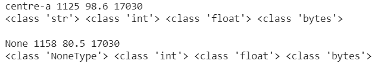

# SQLite 数据类型及其对应的 Python 类型

> 原文:[https://www . geesforgeks . org/SQLite-data types-及其对应的 python-types/](https://www.geeksforgeeks.org/sqlite-datatypes-and-its-corresponding-python-types/)

[SQLite](https://www.geeksforgeeks.org/introduction-to-sqlite/) 是一个基于 C 语言的库，提供了一个可移植且无服务器的 [SQL](https://www.geeksforgeeks.org/sql-tutorial/) 数据库引擎。它具有基于文件的体系结构；因此，它可以读写磁盘。由于 SQLite 是一个零配置数据库，在使用之前不需要安装或设置。从 Python 2.5.x 开始，SQLite3 默认附带 Python。

在本文中，我们将讨论 [SQLite 数据类型](https://www.geeksforgeeks.org/sqlite-data-types/)及其对应的 Python 类型

## SQLite 中的存储类

存储类可以称为相似数据类型的集合。SQLite 提供以下存储类:

<figure class="table">

| 

存储类

 | 

存储的值

 |
| --- | --- |
| 空 | 空 |
| 整数 | 有符号整数(1、2、3、4、5 或 8 字节，具体取决于大小) |
| 真实的 | 浮点值(8 字节 IEEE 浮点数)

 |
| 文本 | 文本字符串(以 UTF-8、UTF-16BE 或 UTF-16LE 编码 |
| 二进制大对象 | 数据完全按照输入的方式存储，通常是二进制格式 |

</figure>

术语**存储类**可以与**数据类型**相互使用。

## 对应的 Python 数据类型

SQLite 数据类型及其对应的 Python 类型如下

<figure class="table">

| 

存储类

 | 

Python 数据类型

 |
| --- | --- |
| 空 | 没有人

 |
| 整数 | （同 Internationalorganizations）国际组织 |
| 真实的 | 漂浮物 |
| 文本 | 潜艇用热中子反应堆（submarine thermal reactor 的缩写） |
| 一滴 | 字节 |

</figure>

type()函数可以在 python 中用来获取参数的类。在下面的程序中，type()函数用于打印我们存储在数据库中的每个值的类。

> **注意:**下面的程序使用 GeeksforGeeks 标志作为来自[这个](https://www.geeksforgeeks.org/create-geeksforgeeks-logo-using-html-and-css/)页面的 logo.png 进行演示。

让我们举一个例子，我们正在创建一个名为“gfg”的数据库，然后创建一个名为 exam_hall 的表，该表包含如下几列:

1.  名称(文本)，
2.  个人识别码(整数)，
3.  入住率(真实)，
4.  标志(BLOB)。

然后我们在其中插入一些行，并在 Python 中的 SQL 查询的帮助下检查获取的值的数据类型。

## 蟒蛇 3

```py
# Python3 program to demonstrate SQLite3 datatypes
# and corresponding Python3 types

# import the sqlite3 package
import sqlite3  

# create connection to database
cnt = sqlite3.connect('gfg.db')  

# Create a exam_hall relation
cnt.execute('''CREATE TABLE exam_hall(
NAME TEXT,
PIN INTEGER,
OCCUPANCY REAL,
LOGO BLOB);''')

# Open the logo file in read, binary mode
# read the image as binary data into a variable
fileh = open('/content/JSBinCollaborativeJavaScriptDebugging6-300x160.png', 'rb')
img = fileh.read()

# Insert tuples for the relation
cnt.execute('''INSERT INTO exam_hall VALUES(
'centre-a',1125,98.6,?)''', (img,))
cnt.execute('''INSERT INTO exam_hall VALUES(
NULL,1158,80.5,?)''', (img,))

# Query the data, print the data and its type
# note: Printing the image binary data is impractical due to its huge size
# instead number of bytes are being printed using len()
cursor = cnt.execute('''SELECT * FROM exam_hall;''')
for i in cursor:
    print(str(i[0])+" "+str(i[1])+" "+str(i[2])+" "+str(len(i[3])))
    print(str(type(i[0]))+" "+str(type(i[1]))+" " +
          str(type(i[2]))+" "+str(type(i[3]))+"\n")
```

**输出:**



从该程序的输出中，可以观察到以下情况:

1.  作为**文本**插入的“中心-a”被 python 解释为**字符串**
2.  被插入为 **INTEGER** 的 1125、1158 被 python 解释为 **int**
3.  被插入为**真实**的 98.6、80.5 被 python 解释为**浮动**
4.  **空**被 python 解释为**非类型**
5.  以二进制格式作为 **BLOB** 插入的徽标图像被 python 解释为**字节**。