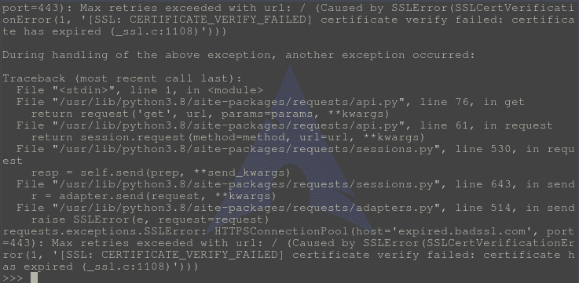
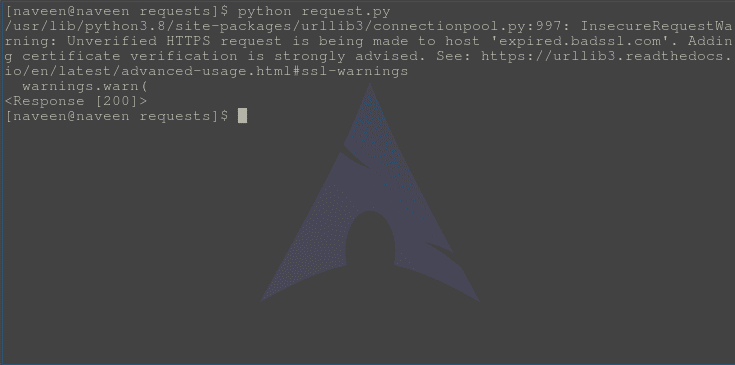

# SSL 证书验证–Python 请求

> 原文:[https://www . geesforgeks . org/SSL-证书-验证-python-requests/](https://www.geeksforgeeks.org/ssl-certificate-verification-python-requests/)

请求验证 HTTPS 请求的 SSL 证书，就像网络浏览器一样。SSL 证书是将加密密钥数字绑定到组织详细信息的小型数据文件。通常，具有 SSL 证书的网站被称为安全网站。默认情况下，启用了 SSL 验证，如果请求无法验证证书，它将抛出一个 SSL 错误。

#### 禁用 SSL 证书验证

让我们尝试使用 Python 请求访问一个带有无效 SSL 证书的网站

## 蟒蛇 3

```py
# import requests module
import requests

# Making a get request
response = requests.get('https://expired.badssl.com/')

# print request object
print(response)
```

**输出:-**



该网站没有 SSL 设置，因此会引发此错误。
要禁用证书验证，在客户端可以使用**验证**属性。

## 蟒蛇 3

```py
# import requests module
import requests

# Making a get request
response = requests.get('https://expired.badssl.com/', verify = False)

# print request object
print(response)
```

**输出**



由于输出响应 200 被打印，我们可以假设请求是成功的。

#### 手动 SSL 验证

也可以仅通过 python 请求将链接传递给证书进行验证。

## 蟒蛇 3

```py
# import requests module
import requests

# Making a get request
response = requests.get('https://github.com', verify ='/path / to / certfile')

# print request object
print(response)
```

如果为 github.com 的 SSL 证书提供的路径是正确的，这将是可行的。

#### 客户端证书

您还可以指定一个本地证书作为客户端证书、单个文件(包含私钥和证书)或两个文件路径的元组:

```py
>>> requests.get('https://kennethreitz.org', cert=('/path/client.cert', '/path/client.key'))
```

或者持久的:

```py
s = requests.Session()
s.cert = '/path/client.cert'
```

如果您指定了错误的路径或无效的证书，您将得到一个错误:

```py
>>> requests.get('https://kennethreitz.org', cert='/wrong_path/client.pem')
SSLError: [Errno 336265225] _ssl.c:347: error:140B0009:SSL routines:SSL_CTX_use_PrivateKey_file:PEM lib
```