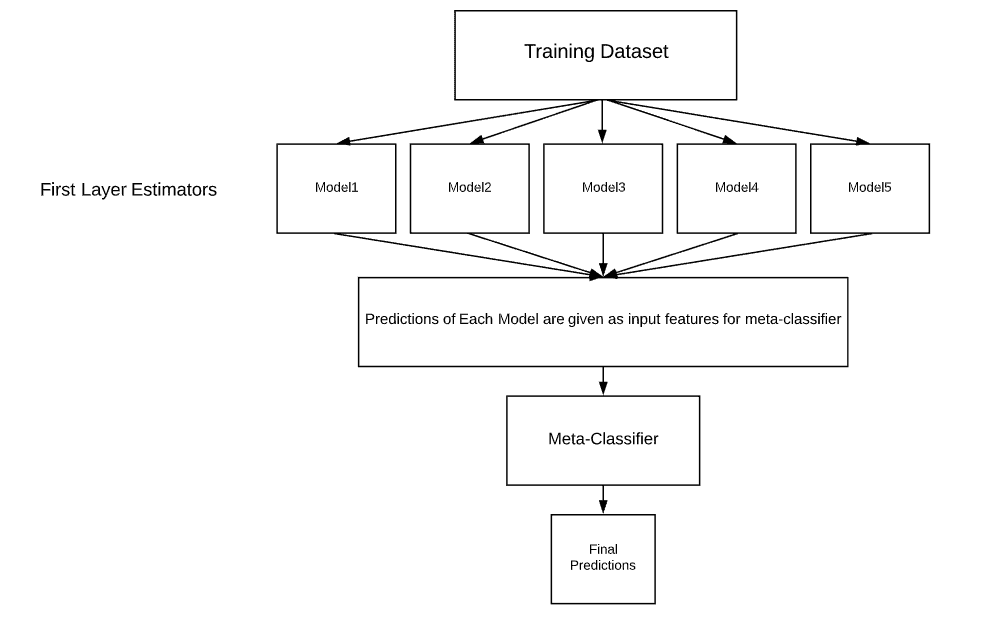
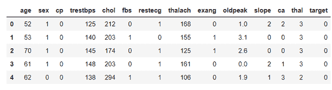
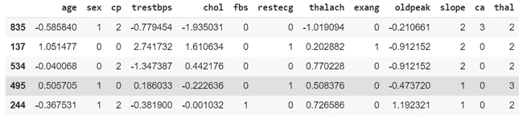
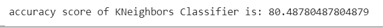
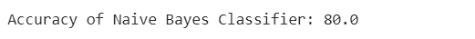

# 机器学习中的堆叠

> 原文:[https://www . geesforgeks . org/stacking-in-machine-learning-2/](https://www.geeksforgeeks.org/stacking-in-machine-learning-2/)

**叠加:**
叠加是一种集合分类或回归模型的方式，它由两层估计组成。第一层由用于预测测试数据集输出的所有基线模型组成。第二层由元分类器或回归器组成，它将基线模型的所有预测作为输入，并生成新的预测。
**堆叠架构:**



堆叠架构

**mlxtend:**
Mlxtend(机器学习扩展)是一个 Python 库，包含了日常数据科学任务的有用工具。它由许多对数据科学和机器学习任务有用的工具组成，例如:

1.  特征选择
2.  特征抽出
3.  形象化
4.  集合

还有更多。
本文介绍了如何在分类数据集上实现堆叠分类器。
**为什么堆叠？**
大多数机器学习和数据科学竞赛都是通过使用堆叠模型赢得的。它们可以提高单个模型显示的现有精度。我们可以通过在第一层架构中选择不同的算法来获得大多数堆叠模型，因为不同的算法通过组合两个模型来捕获训练数据中的不同趋势，可以给出更好和更准确的结果。
**在系统上安装库:**

> pip 安装 mlextend
> pip 安装熊猫
> pip 安装-U scikit-learn

**代码:导入所需库:**

## 蟒蛇 3

```py
import pandas as pd
import matplotlib.pyplot as plt
from mlxtend.plotting import plot_confusion_matrix
from mlxtend.classifier import StackingClassifier
from sklearn.model_selection import train_test_split
from sklearn.preprocessing import StandardScaler
from sklearn.linear_model import LogisticRegression
from sklearn.neighbors import KNeighborsClassifier
from sklearn.naive_bayes import GaussianNB
from sklearn.metrics import confusion_matrix
from sklearn.metrics import accuracy_score
```

**代码:加载数据集**

## 蟒蛇 3

```py
df = pd.read_csv('heart.csv')    # loading the dataset
df.head()                        # viewing top 5 rows of dataset
```

**输出:**



**代码:**

## 蟒蛇 3

```py
# Creating X and y for training
X = df.drop('target', axis = 1)
y = df['target']
```

**代码:将数据拆分为列车和测试**

## 蟒蛇 3

```py
# 20 % training dataset is considered for testing
X_train, X_test, y_train, y_test = train_test_split(X, y, test_size = 0.2, random_state = 42)
```

**代码:数据标准化**

## 蟒蛇 3

```py
# initializing sc object
sc = StandardScaler() 
# variables that needed to be transformed
var_transform = ['thalach', 'age', 'trestbps', 'oldpeak', 'chol']
X_train[var_transform] = sc.fit_transform(X_train[var_transform])   # standardising training data
X_test[var_transform] = sc.transform(X_test[var_transform])            # standardising test data
print(X_train.head())
```

**输出:**



**代码:构建第一层估算器**

## 蟒蛇 3

```py
KNC = KNeighborsClassifier()   # initialising KNeighbors Classifier
NB = GaussianNB()              # initialising Naive Bayes
```

让我们用我们的第一层估计器来训练和评估，以观察堆叠模型和通用模型的性能差异
**代码:训练 kneighgborksclassifier**

## 蟒蛇 3

```py
model_kNeighborsClassifier = KNC.fit(X_train, y_train)   # fitting Training Set
pred_knc = model_kNeighborsClassifier.predict(X_test)   # Predicting on test dataset
```

**代码:评估 KNeighborsClassifier**

## 蟒蛇 3

```py
acc_knc = accuracy_score(y_test, pred_knc)  # evaluating accuracy score
print('accuracy score of KNeighbors Classifier is:', acc_knc * 100)
```

**输出:**



**代码:训练朴素贝叶斯分类器**

## 蟒蛇 3

```py
model_NaiveBayes = NB.fit(X_train, y_train)
pred_nb = model_NaiveBayes.predict(X_test)
```

**代码:评估朴素贝叶斯分类器**

## 蟒蛇 3

```py
acc_nb = accuracy_score(y_test, pred_nb)
print('Accuracy of Naive Bayes Classifier:', acc_nb * 100)
```

**输出:**



**代码:实现堆叠分类器**

## 蟒蛇 3

```py
lr = LogisticRegression()  # defining meta-classifier
clf_stack = StackingClassifier(classifiers =[KNC, NB], meta_classifier = lr, use_probas = True, use_features_in_secondary = True)
```

*   use_probas=True 表示堆叠分类器使用预测概率作为输入，而不是使用预测类。
*   use_features_in_secondary=True 表示堆叠分类器不仅将预测作为输入，还使用数据集中的要素来预测新数据。

**代码:训练堆叠分类器**

## 蟒蛇 3

```py
model_stack = clf_stack.fit(X_train, y_train)   # training of stacked model
pred_stack = model_stack.predict(X_test)       # predictions on test data using stacked model
```

**代码:评估堆叠分类器**

## 蟒蛇 3

```py
acc_stack = accuracy_score(y_test, pred_stack)  # evaluating accuracy
print('accuracy score of Stacked model:', acc_stack * 100)
```

**输出:**


我们的两个单独模型的准确率接近 80%，我们的堆叠模型的准确率接近 84%。通过结合两个单独的模型，我们获得了显著的性能提升。
**代号:**

## 蟒蛇 3

```py
model_stack = clf_stack.fit(X_train, y_train)   # training of stacked model
pred_stack = model_stack.predict(X_test)       # predictions on test data using stacked model
```

**代码:评估堆叠分类器**

## 蟒蛇 3

```py
acc_stack = accuracy_score(y_test, pred_stack)  # evaluating accuracy
print('accuracy score of Stacked model:', acc_stack * 100)
```

**输出:**


我们的两个单独模型的准确率接近 80%，我们的堆叠模型的准确率接近 84%。通过结合两个单独的模型，我们获得了显著的性能提升。