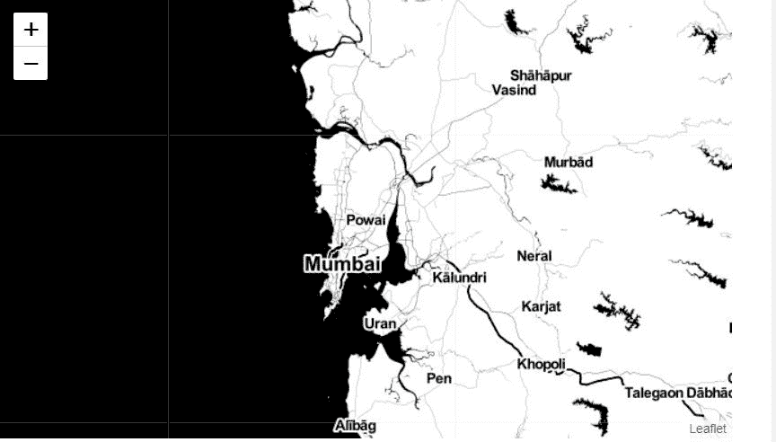
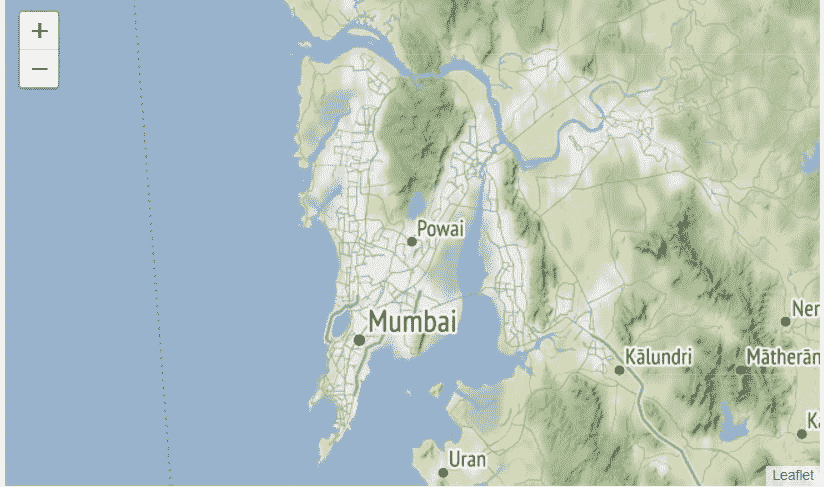
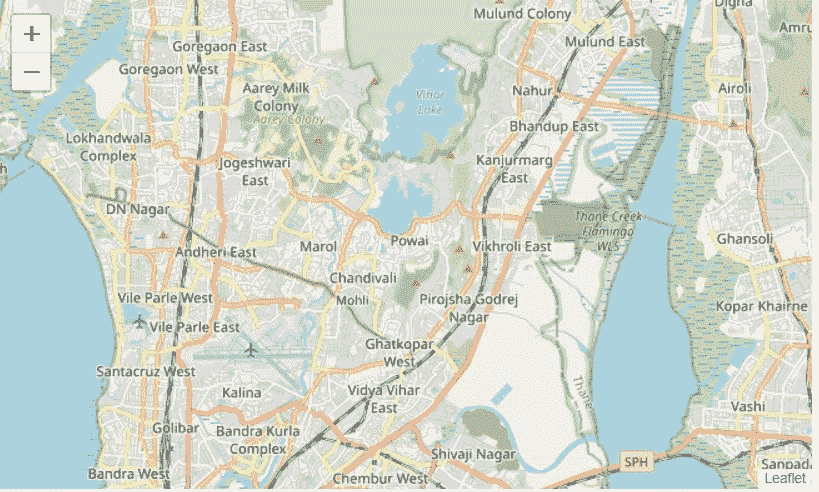

# 蟒蛇叶中的雄蕊调色剂、雄蕊地形和地图框亮地图

> 原文:[https://www . geesforgeks . org/stame-toner-stame-terrain-and-mapbox-bright-maps-in-python-leaf/](https://www.geeksforgeeks.org/stamen-toner-stamen-terrain-and-mapbox-bright-maps-in-python-folium/)

leaf library 是 Python 中一个强大的数据可视化库，人们使用它来可视化地理空间数据和地图。有了叶库，我们可以借助世界上任何一个地点的经纬度来创建该地点的地图。我们还可以通过在地图顶部叠加标记和标记簇来创建有趣的可视化效果。我们可以创建不同风格的地图，如街道级别、雄蕊地图和地图框明亮地图。叶可以使用“地图”功能创建地图。地图是交互式的，这意味着我们可以在创建地图后根据自己的选择指定缩放级别来放大和缩小地图。默认的地图样式是开放街道地图，当我们放大时显示一个区域的街道视图，当我们缩小时显示世界各国的边界。叶库具有多种特征。最重要的功能之一是地图样式，我们可以使用 tiles 参数创建不同的地图样式。瓷砖包括雄蕊色调、雄蕊地形等。雄蕊调色剂用于可视化的特征，如河流蜿蜒和沿海地区。另一种瓷砖风格是雄蕊地形，用于可视化特征，如山丘阴影和自然植被颜色。

### 雄蕊调色剂图

这些是高对比度的黑白地图。它们被用于数据混搭，以及探索和可视化河流弯曲和沿海地区。

### 雄蕊地形图

这些地图用于突出小山阴影和自然植被颜色。它们展示了双车道道路的高级标注功能和线条综合。

### 地图框明亮地图

这些地图与默认样式相似，只是边框在低缩放级别下不可见。它们与默认样式不同，因为默认样式以每个国家的母语显示国家名称，而 Mapbox Bright 样式平铺以英语显示所有国家名称。

**例 1:** **以孟买为中心的世界地图**

```py
import numpy as np  
import pandas as pd
import folium

# define the world map
world_map = folium.Map()

# create a Stamen Toner map of the world
# centered around Mumbai
world_map = folium.Map(location =[19.11763765873, 72.9060384756], 
                       zoom_start = 10, tiles ='Stamen Toner')

# display map
world_map
```

**输出:**


**例 2:** **以孟买为中心的世界雄蕊地形图**

```py
import numpy as np  
import pandas as pd
import folium

# define the world map
world_map = folium.Map()

# create a Stamen Terrain map of the world 
# centered around Mumbai with a zoom level 
# of 10
world_map = folium.Map(location =[19.11763765873, 72.9060384756],
                       zoom_start = 10, tiles ='Stamen Terrain')

# display map
world_map
```

**输出:**



**例 3:** **以孟买为中心的世界地图**

```py
import numpy as np  
import pandas as pd
import folium

# define the world map
world_map = folium.Map()

# create a Mapbox Bright map of the world 
# centered around Mumbai with a zoom level 
# of 10
world_map = folium.Map(location =[19.11763765873, 72.9060384756], 
                       zoom_start = 10, tiles ='Mapbox Bright')

# display the map
world_map
```

**输出:**
