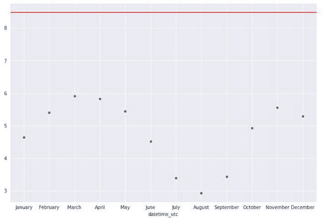

# 标准偏差图

> 原文:[https://www.geeksforgeeks.org/standard-deviation-plot/](https://www.geeksforgeeks.org/standard-deviation-plot/)

标准差图用于检查不同数据组之间是否存在偏差。这些组可以手动生成，也可以根据数据集的某些属性来决定。

标准偏差图可由以下内容组成:

*   **纵轴:**组标准偏差
*   **横轴:**组的组标识符/标签。

在总标准偏差中绘制一条参考直线。

标准差图用于回答以下问题:

*   变异有什么变化吗？
*   变化的幅度有多大？
*   变异的转移有什么明显的模式吗？

标准偏差图一般用于测量刻度，同样的刻度测量也可以用于寻找具有平均值的绝对图和平均偏差图。这些图在识别异常值方面也提供了更好的准确性。

### 标准差图的用途

*   标准偏差图一般用于测量刻度，同样的刻度测量也可以用平均绝对图和平均偏差图来发现。这些图在识别异常值方面也提供了更好的准确性。
*   许多分析中的一个常见假设，如单因素分析，即不同水平的因素变量的方差是相同的。标准偏差图可用于验证这一点。
*   我们还可以通过将数据分成大小相等的分区并绘制每个分区的方差来验证单变量数据的恒定方差假设。

### **实施**

*   在这个实现中，我们使用来自 Kaggle 的德里天气数据集。数据集的链接可以在[这里](https://www.kaggle.com/mahirkukreja/delhi-weather-data)找到

## 蟒蛇 3

```
# import necessary modeules
import matplotlib.pyplot as plt
import pandas as pd
import seaborn as sns

sns.set_style('darkgrid')
%matplotlib inline
sns.mpl.rcParams['figure.figsize'] = (10.0, 8.0)

# read weather dataset
df =pd.read_csv('weather.csv')
# remove the hours and minutes from time to keep date only
df['datetime_utc'] = pd.to_datetime(df['datetime_utc']).dt.date
df.head()

# group by dataframe into months, calculate standard deviation,
# and sort them in chronological order 
month_Df =df.groupby(df['datetime_utc'].dt.strftime('%B'))[" _tempm"].std()
new_order = ['January', 'February', 'March', 'April', 'May', 'June', 'July', 
             'August', 'September', 'October', 'November', 'December']
month_Df=month_Df.reindex(new_order)
month_Df

# plot scatterplot of the standard deviation (standard deviation plot)
graph =sns.scatterplot(y= month_Df.values, x= month_Df.index)
graph.axhline(df[" _tempm"].std(), color='red')
plt.show()
```

```
datetime_utc    _conds    _dewptm    _fog    _hail    _heatindexm    _hum    _precipm    _pressurem    _rain    _snow    _tempm    _thunder    _tornado    _vism    _wdird    _wdire    _wgustm    _windchillm    _wspdm
0    1996-11-01    Smoke    9.0    0    0    NaN    27.0    NaN    1010.0    0    0    30.0    0    0    5.0    280.0    West    NaN    NaN    7.4
1    1996-11-01    Smoke    10.0    0    0    NaN    32.0    NaN    -9999.0    0    0    28.0    0    0    NaN    0.0    North    NaN    NaN    NaN
2    1996-11-01    Smoke    11.0    0    0    NaN    44.0    NaN    -9999.0    0    0    24.0    0    0    NaN    0.0    North    NaN    NaN    NaN
3    1996-11-01    Smoke    10.0    0    0    NaN    41.0    NaN    1010.0    0    0    24.0    0    0    2.0    0.0    North    NaN    NaN    NaN
4    1996-11-01    Smoke    11.0    0    0    NaN    47.0    NaN    1011.0    0    0    23.0    0    0    1.2    0.0    North    NaN    NaN    0.0
```

```
datetime_utc
April        5.817769
August       2.928722
December     5.288852
February     5.404892
January      4.646874
July         3.394908
June         4.520245
March        5.905230
May          5.441476
November     5.556417
October      4.930381
September    3.437260
Name:  _tempm, dtype: float64
```



标准偏差图

### **实施**

*   [NIST 笔记本](https://www.itl.nist.gov/div898/handbook/eda/section3/sdplot.htm)