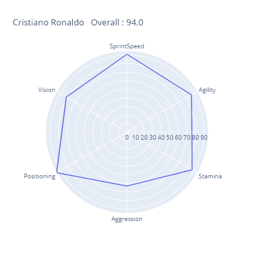
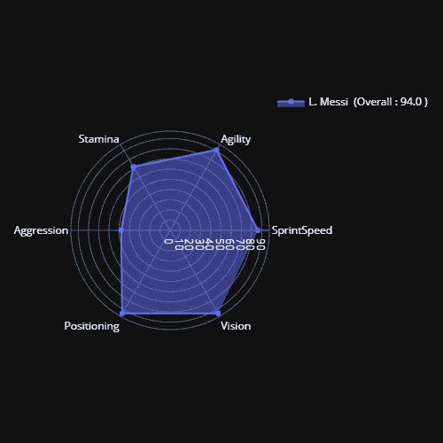
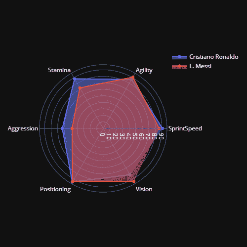

# Python 中的星图

> 原文:[https://www.geeksforgeeks.org/star-charts-in-python/](https://www.geeksforgeeks.org/star-charts-in-python/)

星图或雷达图用于显示多元数据，其中每个变量提供了每个观测值的一些共同属性的度量。剧情中的每一颗星都代表一次观察。星形图用于检查单个数据点的相对值，并定位相似和不相似的点。

星图由一系列称为半径的等角辐条组成，每个辐条代表一个变量的观测值。辐条的数据长度与变量中与最大数据点相关的点的变量大小成比例。绘制了一条连接所有数据点的线

星形图可以用来回答以下问题:

*   对于给定的观察，哪个变量占主导地位？
*   哪些观察最相似，即是否有任何观察集群？
*   有异常值吗？

### **应用程序**

*   明星图通常用于体育可视化和游戏，如国际足联，职业进化足球(PES)，以可视化球员的优势和劣势。
*   星形图也可以用于质量改进，以便可视化不同的性能指标。

### 限制:

*   星标图并不是一个很好的方式来可视化序数或分类变量，它并不代表一个类别比另一个更好或更差。
*   星象图有时会在两个不相关的变量之间建立联系。这就是为什么一个星盘不能被信任来做权衡决定。
*   变量的排序也会影响星图的形状。例如，值 9、2、9、1、9、1 产生不同于 9、9、9、2、1、1 的尖峰。

### **实施:**

*   对于这个实现，我们将使用 plotly 和一些通用包。这些软件包预先安装在合作实验室中，但也可以安装在本地环境中。要在本地环境中安装 plotly，请遵循[这些说明](https://plotly.com/python/getting-started/)。
*   对于这个实现，我们将使用 FIFA-19 玩家数据集，您可以从 [Kaggle](https://www.kaggle.com/karangadiya/fifa19) 获取数据集。

## 蟒蛇 3

```py
# code
import pandas as pd
import numpy as np
import plotly.express as px
import plotly.graph_objects as go

# read dataset from csv and perform preprocessing
data = pd.read_csv('data.csv')
data.head()

# remove goalkeepers data for performing fair comparison
goalkeeper_index = data[data['Position'] == 'GK' ].index
data.drop(index_names,inplace=True)

# remove columns which are not required for this visualisation purpose
plt_vars = ['SprintSpeed','Agility','Stamina','Aggression',
            'Positioning','Vision']
data.drop(data_cols, axis =1, inplace=True)

# plot unfilled scatter plot
px.line_polar(data, r = pd.Series(data.loc[1,plt_vars].values),
              theta=plt_vars,line_close=True,
              title =
  f'{data.loc[1,"Name"]} \n Overall : {data.loc[1,"Overall"]} \
          Potential: {data.loc[1,"Potential"]}', width = 500)

# plot filled star plot
fig = go.Figure(data=go.Scatterpolar(
  r=pd.Series(data.loc[0,plt_vars].values),
  theta=plt_vars,
  fill='toself',
  name =
f'{data.loc[0,"Name"]}  (Overall : {data.loc[0,"Overall"]}  \
        Potential: {data.loc[0,"Potential"]} )'),)

fig.update_layout(
  polar=dict(
    radialaxis=dict(
      visible=True,
    ),
  ),
  template = 'plotly_dark',
  showlegend=True,

)

fig.show()

# plot star plot for comparison
fig = go.Figure()

fig.add_trace(go.Scatterpolar(
      r=pd.Series(data.loc[1,plt_vars].values),
      theta=plt_vars,
      fill='toself',
      name=data.loc[1, 'Name']
))
fig.add_trace(go.Scatterpolar(
      r=pd.Series(data.loc[0,plt_vars].values),
      theta=plt_vars,
      fill='toself',
      name=data.loc[0, 'Name']
))

fig.update_layout(
  polar=dict(
    radialaxis=dict(
      visible=True
          )),
    template = 'plotly_dark',

  showlegend=True
)

fig.show()
```



未填充的星形图



实心星形图



与星空剧情比较

### 参考文献:

*   [**NIST 笔记本**T3】](https://www.itl.nist.gov/div898/handbook/eda/section3/starplot.htm)