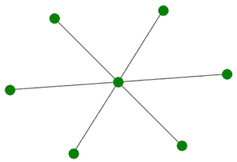
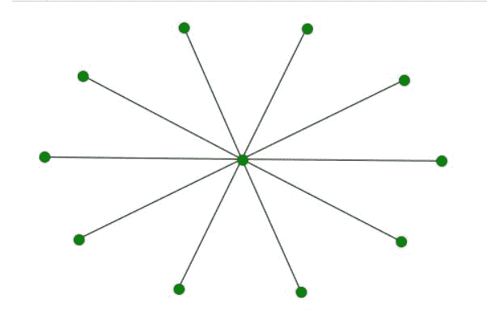

# 使用 Networkx Python 的星图

> 原文:[https://www . geesforgeks . org/star-graph-use-networkx-python/](https://www.geeksforgeeks.org/star-graph-using-networkx-python/)

在本文中，我们将看到使用网络 Python 的星形图。星形图是一种特殊类型的图，其中 n-1 个顶点的度数为 1，单个顶点的度数为 n–1。这看起来像是 n–1 个顶点连接到一个中心顶点。一个有 n 个顶点的星图叫做 Sn。

**星图属性:**

*   它有 n+1 个顶点。
*   它有 n 条边。
*   它没有任何周期。
*   星图 S <sub>n</sub> 的直径是(2，n)的最小值。
*   星图是一棵树。
*   它没有未连接的组件。
*   星图的色数是(2，n + 1)的最小值。

**S<sub>10</sub>示例:**


S <sub>10</sub>

**S<sub>6</sub>示例:**



S <sub>6</sub>

**进场:**

*   我们将导入所需的网络模块
*   之后，我们将初始化 6 个节点。
*   我们将使用 star_graph()函数创建图形对象 G。
*   我们将使用 nx.draw()函数实现该图。
*   我们将通过向 nx.draw()传递额外的参数来使节点的颜色为绿色并增加大小。

**例 1:**

## 蟒蛇 3

```
# import required module
import networkx as nx

# create object
G = nx.star_graph(6)

# illustrate graph
nx.draw(G, node_color = 'green',
        node_size = 100)
```

**输出:**


**说明:**

当我们将 6 作为参数传递给 star_graph()函数时，我们得到了一个有 6 条边的星型图作为输出。我们通过向 nx.draw()函数传递额外的参数 node_size 和 node_color 来改变节点的颜色和大小。

**例 2:**

## 蟒蛇 3

```
# import required module
import networkx as nx

# create object
G = nx.star_graph(10)

# illustrate graph
nx.draw(G, node_color = 'green',
        node_size = 100)
```

**输出:**



**说明:**

当我们将 10 作为参数传递给 star_graph()函数时，我们得到了一个有 10 条边的星型图作为输出。我们通过向 nx.draw()函数传递额外的参数 node_size 和 node_color 来改变节点的颜色和大小。