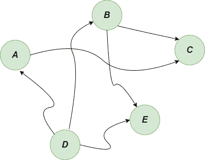
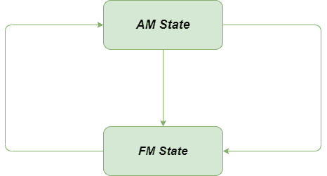
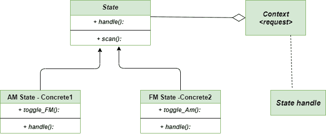

# 状态方法–Python 设计模式

> 原文:[https://www . geesforgeks . org/state-method-python-design-patterns/](https://www.geeksforgeeks.org/state-method-python-design-patterns/)

状态方法是 **[行为设计模式](https://www.geeksforgeeks.org/design-patterns-set-1-introduction/)** ，当对象内部状态发生变化时，允许对象改变其行为。它有助于将状态实现为状态模式接口的派生类。如果我们必须根据对象的状态来改变对象的行为，我们可以在对象中有一个状态变量，并使用 if-else 条件块根据状态来执行不同的操作。它可以被称为面向对象的状态机。它通过从模式的超类调用方法来实现状态转换。

### 不使用状态方法的问题

状态方法模式表示 **[有限状态机](https://www.geeksforgeeks.org/introduction-of-finite-automata/)** 。



有限状态机图

在任何时刻，程序中可能存在有限数量的状态。每个州的行为和其他方面都是独一无二的。甚至程序也可以在任何时刻从一种状态改变到另一种状态。当且仅当所需的转换在规则中可用时，程序才能从一种状态转到另一种状态。当我们增加大量国家时，这肯定会变得困难。处理代码将变得困难，因为转换逻辑中的任何微小变化都可能导致每个方法中状态条件的变化。=

### 用状态法求解

让我们通过考虑**电台**的例子来看看上述问题的解决方案。这里的电台有两个州，分别是 **Am 州**和 **FM 州**。我们可以使用开关在这两种状态之间切换。State 方法建议我们应该为对象的所有可能状态创建一个新的类，并将所有特定于状态的行为提取到这些类中。

原始对象名为 context，它存储对表示其当前状态的一个状态对象的引用，并表示该对象的所有与状态相关的工作，而不是单独实现所有行为。



无状态问题方法

```py
"""State class: Base State class"""
class State:

    """Base state. This is to share functionality"""

    def scan(self):

        """Scan the dial to the next station"""
        self.pos += 1

        """check for the last station"""
        if self.pos == len(self.stations):
            self.pos = 0
        print("Visiting... Station is {} {}".format(self.stations[self.pos], self.name))

"""Separate Class for AM state of the radio"""
class AmState(State):

    """constructor for AM state class"""
    def __init__(self, radio):

        self.radio = radio
        self.stations = ["1250", "1380", "1510"]
        self.pos = 0
        self.name = "AM"

    """method for toggling the state"""
    def toggle_amfm(self):
        print("Switching to FM")
        self.radio.state = self.radio.fmstate

"""Separate class for FM state"""
class FmState(State):

    """Constriuctor for FM state"""
    def __init__(self, radio):
        self.radio = radio
        self.stations = ["81.3", "89.1", "103.9"]
        self.pos = 0
        self.name = "FM"

    """method for toggling the state"""
    def toggle_amfm(self):
        print("Switching to AM")
        self.radio.state = self.radio.amstate

"""Dedicated class Radio"""
class Radio:

    """A radio. It has a scan button, and an AM / FM toggle switch."""

    def __init__(self):

        """We have an AM state and an FM state"""
        self.fmstate = FmState(self)
        self.amstate = AmState(self)
        self.state = self.fmstate

    """method to toggle the switch"""
    def toggle_amfm(self):
        self.state.toggle_amfm()

    """method to scan """
    def scan(self):
        self.state.scan()

""" main method """
if __name__ == "__main__":

    """ create radio object"""
    radio = Radio()
    actions = [radio.scan] * 3 + [radio.toggle_amfm] + [radio.scan] * 3
    actions *= 2

    for action in actions:
        action()
```

### 输出

```py
Visiting... Station is 89.1 FM
Visiting... Station is 103.9 FM
Visiting... Station is 81.3 FM
Switching to AM
Visiting... Station is 1380 AM
Visiting... Station is 1510 AM
Visiting... Station is 1250 AM
Visiting... Station is 1380 AM
Visiting... Station is 1510 AM
Visiting... Station is 1250 AM
Switching to FM
Visiting... Station is 89.1 FM
Visiting... Station is 103.9 FM
Visiting... Station is 81.3 FM

```

### UML 图

下面是状态方法的 UML 图



UML 图-状态-方法

### 优势

*   **打开/关闭原则:**我们可以轻松引入新的状态，而无需改变客户端代码现有状态的内容。
*   **单一责任原则:**它有助于将特定状态的代码组织成单独的类，这有助于使代码对其他开发人员也是可行的。
*   **提高内聚性:**它还提高了内聚性，因为特定于状态的行为被聚合到混凝土状态类中，这些类被放在代码中的一个位置。

### 不足之处

*   **使系统变得复杂:**如果一个系统只有几个状态，那么使用**状态方法**不是一个好的选择，因为你最终会添加不必要的代码。
*   **在运行时改变状态:**当我们需要在运行时通过输入不同的子类来改变状态时，使用 state 方法，这也将被认为是一个缺点，因为我们有一个带有一些逻辑的清晰的单独的 State 类，并且从另一方面来看，类的数量在增加。
*   **子类依赖关系:**这里每个状态派生类都耦合到它的兄弟，这直接或间接地引入了子类之间的依赖关系。

**进一步阅读–****[爪哇](https://www.geeksforgeeks.org/state-design-pattern/)州法**