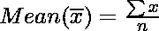
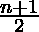
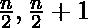
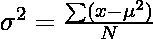
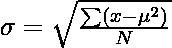

# 用 Python 统计

> 原文:[https://www.geeksforgeeks.org/statistics-with-python/](https://www.geeksforgeeks.org/statistics-with-python/)

[**统计学**](https://www.geeksforgeeks.org/introduction-of-statistics-and-its-types/) 一般来说，就是收集数据，制表，以及解释数值数据的方法。这是一个应用数学领域，涉及数据收集、分析、解释和表达。通过统计，我们可以看到数据是如何被用来解决复杂问题的。

在本教程中，我们将学习使用 Python 解决统计问题，还将学习其背后的概念。让我们从理解一些在整篇文章中都有用的概念开始。

**注意:**我们将借助 Python 提供的**统计**模块来覆盖描述性统计。

## 理解描述性统计

用外行人的话来说，描述性统计一般是指借助图表、表格、Excel 文件等一些有代表性的方法来描述数据。数据的描述方式可以表达一些有意义的信息，也可以用来发现一些未来的趋势。描述和总结单个变量称为**单变量分析。**描述两个变量之间的统计关系称为**双变量分析。**描述多个变量之间的统计关系称为**多元分析。**

**描述性统计有两种类型–**

*   中心趋势的度量
*   可变性的度量


## 中心趋势的度量

中心趋势的**度量**是试图描述整个数据集的单个值。中心趋势有三个主要特征–

*   均值
*   中位数
    *   中位数下限
    *   中位数高
*   方式


### 均值

它是观察值的总和除以观察值的总数。它也被定义为平均值，即总和除以计数。



[**mean()**](https://www.geeksforgeeks.org/python-statistics-mean-function/) 函数返回在其参数中传递的数据的平均值。如果传递的参数为空，则会引发**统计错误**。

**示例:**

## 蟒蛇 3

```py
# Python code to demonstrate the working of
# mean()

# importing statistics to handle statistical
# operations
import statistics

# initializing list
li = [1, 2, 3, 3, 2, 2, 2, 1]

# using mean() to calculate average of list
# elements
print ("The average of list values is : ",end="")
print (statistics.mean(li))
```

**输出:**

```py
The average of list values is : 2
```

### 中位数

它是数据集的中间值。它将数据分成两半。如果数据集中的元素数量是奇数，则中心元素是中值，如果是偶数，则中值是两个中心元素的平均值。

**奇数:**



**偶数:**



[**中位数()**](https://www.geeksforgeeks.org/python-statistics-median/) 函数用于计算中位数，即数据的中间元素。如果传递的参数为空，则会出现**统计错误**。

**示例:**

## 蟒蛇 3

```py
# Python code to demonstrate the
# working of median() on various
# range of data-sets

# importing the statistics module
from statistics import median

# Importing fractions module as fr
from fractions import Fraction as fr

# tuple of positive integer numbers
data1 = (2, 3, 4, 5, 7, 9, 11)

# tuple of floating point values
data2 = (2.4, 5.1, 6.7, 8.9)

# tuple of fractional numbers
data3 = (fr(1, 2), fr(44, 12),
        fr(10, 3), fr(2, 3))

# tuple of a set of negative integers
data4 = (-5, -1, -12, -19, -3)

# tuple of set of positive
# and negative integers
data5 = (-1, -2, -3, -4, 4, 3, 2, 1)

# Printing the median of above datasets
print("Median of data-set 1 is % s" % (median(data1)))
print("Median of data-set 2 is % s" % (median(data2)))
print("Median of data-set 3 is % s" % (median(data3)))
print("Median of data-set 4 is % s" % (median(data4)))
print("Median of data-set 5 is % s" % (median(data5)))
```

**输出:**

```py
Median of data-set 1 is 5
Median of data-set 2 is 5.9
Median of data-set 3 is 2
Median of data-set 4 is -5
Median of data-set 5 is 0.0
```

### 中位数下限

[**middle _ low()**](https://www.geeksforgeeks.org/median_low-python-statistics/)函数在元素个数为奇数的情况下返回数据的中值，但在元素个数为偶数的情况下，返回中间两个元素中较低的一个。如果传递的参数为空，则会出现**统计错误**

**示例:**

## 蟒蛇 3

```py
# Python code to demonstrate the
# working of median_low()

# importing the statistics module
import statistics

# simple list of a set of integers
set1 = [1, 3, 3, 4, 5, 7]

# Print median of the data-set

# Median value may or may not
# lie within the data-set
print("Median of the set is % s"
    % (statistics.median(set1)))

# Print low median of the data-set
print("Low Median of the set is % s "
    % (statistics.median_low(set1)))
```

**输出:**

```py
Median of the set is 3.5
Low Median of the set is 3 
```

### 中位数高

[**中值 _ 高()**](https://www.geeksforgeeks.org/python-statistics-median_high/) 函数在元素个数为奇数的情况下返回数据的中值，但在元素个数为偶数的情况下，返回中间两个元素中较高的一个。如果传递的参数为空，则会引发**统计错误**。

**示例:**

## 蟒蛇 3

```py
# Working of median_high() and median() to
# demonstrate the difference between them.

# importing the statistics module
import statistics

# simple list of a set of integers
set1 = [1, 3, 3, 4, 5, 7]

# Print median of the data-set

# Median value may or may not
# lie within the data-set
print("Median of the set is %s"
    % (statistics.median(set1)))

# Print high median of the data-set
print("High Median of the set is %s "
    % (statistics.median_high(set1)))
```

**输出:**

```py
Median of the set is 3.5
High Median of the set is 4 
```

### 方式

它是给定数据集中频率最高的值。如果所有数据点的频率相同，数据集可能没有模式。此外，如果遇到两个或更多具有相同频率的数据点，我们可以有多个模式。

[**模式()**](https://www.geeksforgeeks.org/python-statistics-mode-function/) 函数返回出现次数最多的数字。如果传递的参数为空，则会出现**统计错误**。

**示例:**

## 蟒蛇 3

```py
# Python code to demonstrate the
# working of mode() function
# on a various range of data types

# Importing the statistics module
from statistics import mode

# Importing fractions module as fr
# Enables to calculate harmonic_mean of a
# set in Fraction
from fractions import Fraction as fr

# tuple of positive integer numbers
data1 = (2, 3, 3, 4, 5, 5, 5, 5, 6, 6, 6, 7)

# tuple of a set of floating point values
data2 = (2.4, 1.3, 1.3, 1.3, 2.4, 4.6)

# tuple of a set of fractional numbers
data3 = (fr(1, 2), fr(1, 2), fr(10, 3), fr(2, 3))

# tuple of a set of negative integers
data4 = (-1, -2, -2, -2, -7, -7, -9)

# tuple of strings
data5 = ("red", "blue", "black", "blue", "black", "black", "brown")

# Printing out the mode of the above data-sets
print("Mode of data set 1 is % s" % (mode(data1)))
print("Mode of data set 2 is % s" % (mode(data2)))
print("Mode of data set 3 is % s" % (mode(data3)))
print("Mode of data set 4 is % s" % (mode(data4)))
print("Mode of data set 5 is % s" % (mode(data5)))
```

**输出:**

```py
Mode of data set 1 is 5
Mode of data set 2 is 1.3
Mode of data set 3 is 1/2
Mode of data set 4 is -2
Mode of data set 5 is black
```

参考下面的文章来获得关于平均值和中心趋势度量的详细信息。

*   [Python 中的统计函数|集合 1(中心位置的平均值和度量)](https://www.geeksforgeeks.org/statistical-functions-python-set-1averages-measure-central-location/)

## 可变性的度量

到目前为止，我们已经研究了中心倾向的度量，但是仅仅这一点还不足以描述数据。为了克服这一点，我们需要可变性的**度量**。可变性的度量被称为数据的传播或我们的数据分布得有多好。最常见的可变性度量是:

*   范围
*   差异
*   标准偏差


### 范围

我们的数据集中最大和最小数据点之间的差异称为范围。范围与数据的扩散成正比，这意味着范围越大，数据的扩散就越大，反之亦然。

> 范围=最大数据值–最小数据值

我们可以分别使用[**【max()**](https://www.geeksforgeeks.org/python-max-function/)和 [**min()**](https://www.geeksforgeeks.org/python-min-function/) 方法计算最大值和最小值。

**示例:**

## 蟒蛇 3

```py
# Sample Data
arr = [1, 2, 3, 4, 5]

#Finding Max
Maximum = max(arr)
# Finding Min
Minimum = min(arr)

# Difference Of Max and Min
Range = Maximum-Minimum    
print("Maximum = {}, Minimum = {} and Range = {}".format(
    Maximum, Minimum, Range))
```

**输出:**

```py
Maximum = 5, Minimum = 1 and Range = 4
```

### 差异

它被定义为与平均值的平均平方偏差。它的计算方法是找出每个数据点与平均值(也称为平均值)之间的差异，将它们平方，将所有数据点相加，然后除以数据集中存在的数据点数量。



其中 N =项数

u =平均值

统计模块提供 [**方差()**](https://www.geeksforgeeks.org/python-statistics-variance/) 方法，完成场景背后的所有数学运算。如果传递的参数为空，则会引发**统计错误**。

**示例:**

## 蟒蛇 3

```py
# Python code to demonstrate variance()
# function on varying range of data-types

# importing statistics module
from statistics import variance

# importing fractions as parameter values
from fractions import Fraction as fr

# tuple of a set of positive integers
# numbers are spread apart but not very much
sample1 = (1, 2, 5, 4, 8, 9, 12)

# tuple of a set of negative integers
sample2 = (-2, -4, -3, -1, -5, -6)

# tuple of a set of positive and negative numbers
# data-points are spread apart considerably
sample3 = (-9, -1, -0, 2, 1, 3, 4, 19)

# tuple of a set of fractional numbers
sample4 = (fr(1, 2), fr(2, 3), fr(3, 4),
           fr(5, 6), fr(7, 8))

# tuple of a set of floating point values
sample5 = (1.23, 1.45, 2.1, 2.2, 1.9)

# Print the variance of each samples
print("Variance of Sample1 is % s " % (variance(sample1)))
print("Variance of Sample2 is % s " % (variance(sample2)))
print("Variance of Sample3 is % s " % (variance(sample3)))
print("Variance of Sample4 is % s " % (variance(sample4)))
print("Variance of Sample5 is % s " % (variance(sample5)))
```

**输出:**

```py
Variance of Sample1 is 15.80952380952381 
Variance of Sample2 is 3.5 
Variance of Sample3 is 61.125 
Variance of Sample4 is 1/45 
Variance of Sample5 is 0.17613000000000006 
```

### 标准偏差

它被定义为方差的平方根。它是通过求平均值来计算的，然后从平均值中减去每个数字，也就是我们所知道的平均值，并对结果进行平方。将所有值相加，然后除以平方根后的项数。



其中 N =项数

u =平均值

[**【stdev()】**](https://www.geeksforgeeks.org/python-statistics-stdev/)**方法的统计模块返回数据的标准差。如果传递的参数为空，则会引发**统计错误**。**

****示例:****

## **蟒蛇 3**

```py
# Python code to demonstrate stdev()
# function on various range of datasets

# importing the statistics module
from statistics import stdev

# importing fractions as parameter values
from fractions import Fraction as fr

# creating a varying range of sample sets
# numbers are spread apart but not very much
sample1 = (1, 2, 5, 4, 8, 9, 12)

# tuple of a set of negative integers
sample2 = (-2, -4, -3, -1, -5, -6)

# tuple of a set of positive and negative numbers
# data-points are spread apart considerably
sample3 = (-9, -1, -0, 2, 1, 3, 4, 19)

# tuple of a set of floating point values
sample4 = (1.23, 1.45, 2.1, 2.2, 1.9)

# Print the standard deviation of
# following sample sets of observations
print("The Standard Deviation of Sample1 is % s"
      % (stdev(sample1)))

print("The Standard Deviation of Sample2 is % s"
      % (stdev(sample2)))

print("The Standard Deviation of Sample3 is % s"
      % (stdev(sample3)))

print("The Standard Deviation of Sample4 is % s"
      % (stdev(sample4)))
```

****输出:****

```py
The Standard Deviation of Sample1 is 3.9761191895520196
The Standard Deviation of Sample2 is 1.8708286933869707
The Standard Deviation of Sample3 is 7.8182478855559445
The Standard Deviation of Sample4 is 0.41967844833872525
```

**请参考下面的文章来获得关于可变性度量的详细信息。**

*   **[Python 中的统计函数|集合 2(扩展的度量)](https://www.geeksforgeeks.org/statistical-functions-in-python-set-2-measure-of-spread/)**