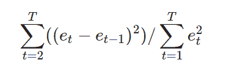

# Python 中的 statsmodels.durbin_watson()

> 原文:[https://www . geesforgeks . org/stats models-dur bin _ Watson-in-python/](https://www.geeksforgeeks.org/statsmodels-durbin_watson-in-python/)

借助`**statsmodels.durbin_watson()**`方法，我们可以得到 durbin watson 检验统计量，它等于 **2*(1-r)** ，其中 r 是残差之间的自相关。



> **语法:** `statsmodels.durbin_watson(residual)`
> **返回:**返回 durbin watson 的单个浮点值。

**例#1 :**
在这个例子中我们可以看到，通过使用`statsmodels.durbin_watson()`方法，我们能够通过使用这个方法得到杜宾沃森检验统计值。

```
# import numpy and statsmodels
import numpy as np
from statsmodels.stats.stattools import durbin_watson

g = np.array([1, 2, 3])
# Using statsmodels.durbin_watson() method
gfg = durbin_watson(g)

print(gfg)
```

**输出:**

> 0.14285714285714285

**例 2 :**

```
# import numpy and statsmodels
import numpy as np
from statsmodels.stats.stattools import durbin_watson

g = np.array([1, 2, 3, 4, -3, -2, -1])
# Using statsmodels.durbin_watson() method
gfg = durbin_watson(g)

print(gfg)
```

**输出:**

> 1.2272727272727273