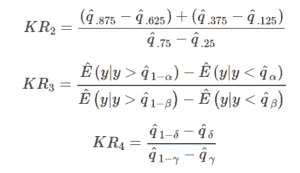

# Python 中的 statsmodels.expected _ robust _ 峰度()

> 原文:[https://www . geesforgeks . org/stats models-expected _ robust _ 峰度-in-python/](https://www.geeksforgeeks.org/statsmodels-expected_robust_kurtosis-in-python/)

借助`**statsmodels.expected_robust_kurtosis()**`方法，我们可以用`statsmodels.expected_robust_kurtosis()`方法计算稳健峰度测度的期望值。



> **语法:** `statsmodels.expected_robust_kurtosis(ab, db)`
> 
> **返回:**返回四个峰度值，即 kr1、kr2、kr3 和 kr4。

**示例#1 :**
在这个示例中，我们可以看到，通过使用`statsmodels.expected_robust_kurtosis()`方法，我们能够使用该方法获得稳健峰度度量的期望值。

```
# import numpy and statsmodels
import numpy as np
from statsmodels.stats.stattools import expected_robust_kurtosis

# Using statsmodels.expected_robust_kurtosis() method
gfg = expected_robust_kurtosis()

print(gfg)
```

**输出:**

> [3.0000000 1.23309512 2.58522712 2.90584695]

**例 2 :**

```
# import numpy and statsmodels
import numpy as np
from statsmodels.stats.stattools import expected_robust_kurtosis

# Using statsmodels.expected_robust_kurtosis() method
gfg = expected_robust_kurtosis([12, 22], [6, 7])

print(gfg)
```

**输出:**

> [3.0000000 1.23309512 1.23859789 1.0535188 ]