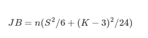

# Python 中的 statsmodels.jarque_bera()

> 原文:[https://www . geesforgeks . org/stats models-jarque _ bera-in-python/](https://www.geeksforgeeks.org/statsmodels-jarque_bera-in-python/)

借助`**statsmodels.jarque_bera()**`方法，我们可以得到正态性的 jarque bera 检验，它是一个基于偏斜度和峰度的检验，并且具有渐近分布。



> **语法:** `statsmodels.jarque_bera(residual, axis)`
> **返回:**返回 jarque bera 测试统计数据、p 值、偏斜度和峰度。

**例#1 :**
在本例中我们可以看到，通过使用`statsmodels.jarque_bera()`方法，我们能够通过使用该方法获得 jarque bera 检验统计量、p 值、偏斜度和峰度。

```py
# import numpy and statsmodels
import numpy as np
from statsmodels.stats.stattools import jarque_bera

g = np.array([1, 2, 3])
# Using statsmodels.jarque_bera() method
gfg = jarque_bera(g)

print(gfg)
```

**输出:**

> (0.28125, 0.8688150562628432, 0.0, 1.5)

**例 2 :**

```py
# import numpy and statsmodels
import numpy as np
from statsmodels.stats.stattools import jarque_bera

g = np.array([1, 2, 3, -1, -2, -3])
# Using statsmodels.jarque_bera() method
gfg = jarque_bera(g)

print(gfg)
```

**输出:**

> (0.5625000000000003, 0.7548396019890072, 0.0, 1.4999999999999996)