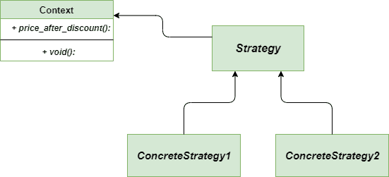

# 策略方法——Python 设计模式

> 原文:[https://www . geesforgeks . org/strategy-method-python-design-patterns/](https://www.geeksforgeeks.org/strategy-method-python-design-patterns/)

策略方法是 [**行为设计模式**](https://www.geeksforgeeks.org/design-patterns-set-1-introduction/) ，它允许您定义完整的算法家族，封装每个算法并将它们放入单独的类中，还允许在那里交换对象。它在 Python 中通过用类外定义的函数的内容动态替换类内定义的方法的内容来实现。它允许在运行时选择算法。这种方法也称为**政策法**。

### 不使用策略方法的问题

假设您为部门商店创建了一个应用程序。*看起来简单？*最初，只有一种类型的折扣被称为打折。所以。一切都进行得很顺利，对于一个开发者来说，维护这样一个简单的应用程序并不难，但是部门商店的老板久而久之要求为顾客提供一些其他类型的折扣。说做这些改变很容易，但要以有效的方式实现这些改变肯定不太容易。

### 使用策略方法的解决方案

让我们看看如何以有效的方式解决上述问题。我们可以创建一个特定的类，将所有算法提取到单独的类中，称为**策略**。实际类应该存储对策略类之一的引用。

## 蟒蛇 3

```py
"""A separate class for Item"""
class Item:

    """Constructor function with price and discount"""

    def __init__(self, price, discount_strategy = None):

        """take price and discount strategy"""

        self.price = price
        self.discount_strategy = discount_strategy

    """A separate function for price after discount"""

    def price_after_discount(self):

        if self.discount_strategy:
            discount = self.discount_strategy(self)
        else:
            discount = 0

        return self.price - discount

    def __repr__(self):

        statement = "Price: {}, price after discount: {}"
        return statement.format(self.price, self.price_after_discount())

"""function dedicated to On Sale Discount"""
def on_sale_discount(order):

    return order.price * 0.25 + 20

"""function dedicated to 20 % discount"""
def twenty_percent_discount(order):

    return order.price * 0.20

"""main function"""
if __name__ == "__main__":

    print(Item(20000))

    """with discount strategy as 20 % discount"""
    print(Item(20000, discount_strategy = twenty_percent_discount))

    """with discount strategy as On Sale Discount"""
    print(Item(20000, discount_strategy = on_sale_discount))
```

**输出:**

```py
Price: 20000, price after discount: 20000
Price: 20000, price after discount: 16000.0
Price: 20000, price after discount: 14980.0 
```

### 类图

下面是策略方法的类图



类图策略方法

### 优势

*   **开放/封闭原则:**在不改变客户端代码的情况下引入新策略总是很容易的。
*   **隔离:**我们可以从客户端的代码中隔离出算法的具体实现细节。
*   **封装:**用于实现算法的数据结构完全封装在 Strategy 类中。因此，可以在不影响上下文类的情况下更改算法的实现
*   **运行时切换:**应用程序可以在运行时切换策略。

### 不足之处

*   **创建额外对象:**在大多数情况下，应用程序使用所需的策略对象配置上下文。因此，应用程序需要创建和维护两个对象来代替一个对象。
*   **客户的认知:**客户之间的策略差异应该很明显，以便能够为他们选择最佳策略。
*   **增加复杂度:**当我们只有少量的算法要实现时，那么其浪费资源来实现 Strategy 方法。

### 适应性

*   **很多相似的类:**当我们有很多相似的类，它们的执行方式不同时，这个方法是非常优选的。
*   **征服隔离:**一般用于将类的业务逻辑从算法实现中隔离出来。

**进一步阅读–**[**Java 中的战略方法**](https://www.geeksforgeeks.org/strategy-pattern-set-1/)