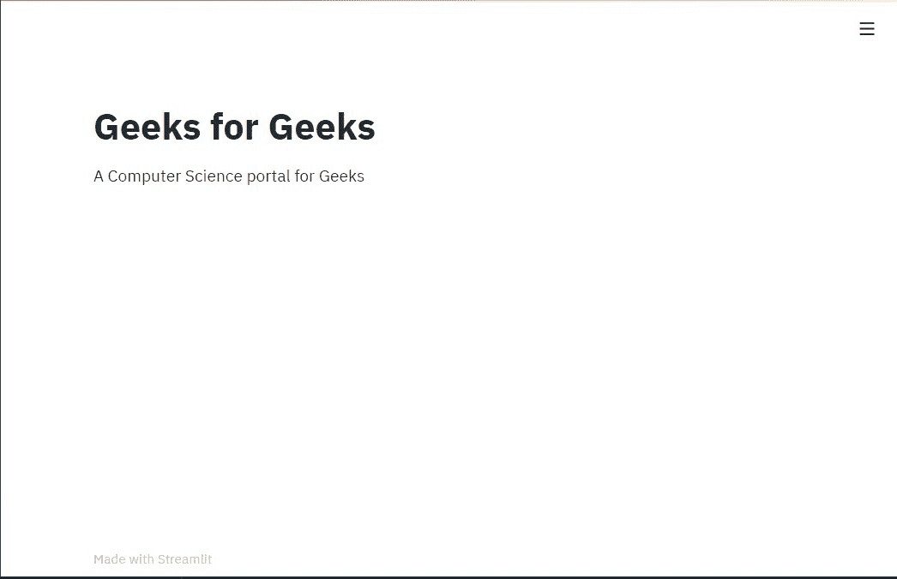

# 简化–介绍和设置

> 原文:[https://www . geesforgeks . org/streamlit-introduction-and-setup/](https://www.geeksforgeeks.org/streamlit-introduction-and-setup/)

Streamlit 是一个 python 语言的开源应用框架。它帮助我们在短时间内为数据科学和机器学习创建漂亮的网络应用。它与 scikit-learn、keras、pytorch、latex、numpy、pandas、matplotlib 等主要 python 库兼容..安装此库的语法如下所示。

**在命令提示符下键入以下内容，安装流线–**

```
pip install streamlit

```

**创建一个简单的应用程序(Hello World)–**

```
*The 'hello, world!' script in Streamlit:*
streamlit hello

# to run your python script
streamlit run myFirstStreamlitApp.py
```

你可以使用 **Ctrl + C** 随时停止运行你的应用。

**优势:**
1。它包含 python 脚本。
2。创建惊人的网络应用程序需要更少的代码。
3。不需要回调，因为小部件被视为变量。
4。数据缓存简化并加速了计算流水线。

**劣势:**
1。Streamlit 的数据缓存无法跟踪函数体之外发生的数据更改。

**这里描述了它的一些基本功能。**

**1。添加标题**

```
# myFirstStreamlitApp.py

#import the library
import streamlit as stl

# add title to your app
stl.title("Geeks for Geeks")
```

**输出:**


**2。添加一些文字**

```
# myFirstStreamlitApp.py

#import the library
import streamlit as stl

# add title to your app
stl.title("Geeks for Geeks")

#adding text to your app
stl.write("A Computer Science portal for Geeks")
```

**输出:**

