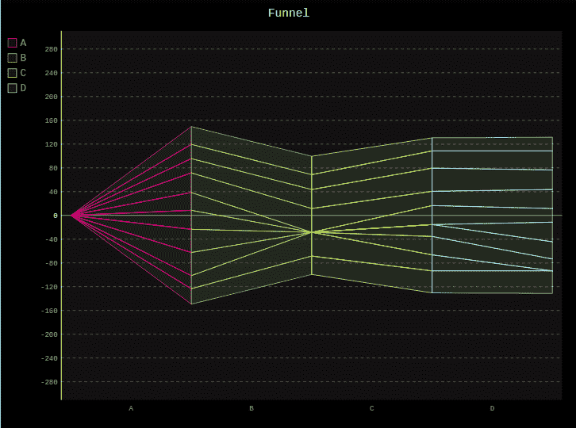
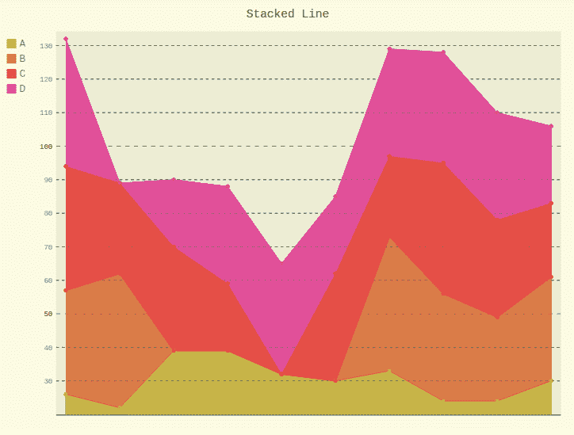
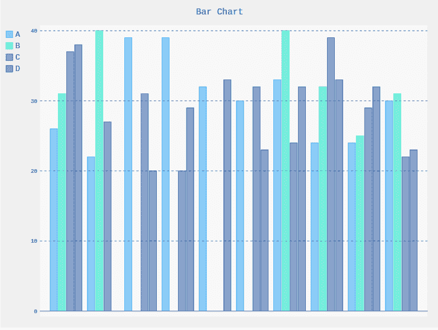

# Pygal 中的造型图

> 原文:[https://www.geeksforgeeks.org/styling-graphs-in-pygal/](https://www.geeksforgeeks.org/styling-graphs-in-pygal/)

**Pygal** 是一个 Python 模块，主要用于构建 SVG(标量矢量图形)图形和图表。SVG 是一种基于矢量的 XML 格式的图形，可以在任何编辑器中编辑。Pygal 可以用最少的代码行创建图表，这些代码行易于理解和编写。

Pygal 是 Python 模块，它在 pygal.style 类下提供了 14 种内置样式，如下所示:

*   深色风格
*   新风格
*   深色日光风格
*   LightSolarizedStyle
*   LightStyle
*   干净的风格
*   红蓝风格
*   深色样式
*   浅色样式
*   TurquoiseStyle
*   LightGreenStyle
*   暗绿色风格
*   深色绿色风格
*   BlueStyle(蓝色样式)

**注意:**通过在样式参数中传递样式名称，可以使用这些样式来设置任何图形的样式。

**示例 1:** 造型漏斗图

## 蟒蛇 3

```
# importing pygal
import pygal
from pygal.style import NeonStyle

# creating the chart object
funnel = pygal.Funnel(style = NeonStyle)

# naming the title
funnel.title = 'Funnel'        

# Random data
funnel.add('A', [26, 22, 39, 39, 32, 30, 33, 24, 24, 30])
funnel.add('B', [31, 40, None, None, None, None, 40, 32, 25, 31])
funnel.add('C', [37, 27, 31, 20, None, 32, 24, 39, 29, 22])
funnel.add('D', [38, None, 20, 29, 33, 23, 32, 33, 32, 23])

funnel
```

**输出:**



**示例 2:** 造型堆叠折线图

## 蟒蛇 3

```
# importing pygal
import pygal
from pygal.style import LightSolarizedStyle

# creating the chart object
line = pygal.StackedLine(fill = True, style = LightSolarizedStyle)

# naming the title
line.title = 'Stacked Line'        

# Random data
line.add('A', [26, 22, 39, 39, 32, 30, 33, 24, 24, 30])
line.add('B', [31, 40, None, None, None, None, 40, 32, 25, 31])
line.add('C', [37, 27, 31, 20, None, 32, 24, 39, 29, 22])
line.add('D', [38, None, 20, 29, 33, 23, 32, 33, 32, 23])

line
```

**输出:**



**示例 3:** 样式条形图

## 蟒蛇 3

```
# importing pygal
import pygal
from pygal.style import BlueStyle

# creating the chart object
bar = pygal.Bar(fill = True, style = BlueStyle)

# naming the title
bar.title = 'Bar Chart'        

# Random data
bar.add('A', [26, 22, 39, 39, 32, 30, 33, 24, 24, 30])
bar.add('B', [31, 40, None, None, None, None, 40, 32, 25, 31])
bar.add('C', [37, 27, 31, 20, None, 32, 24, 39, 29, 22])
bar.add('D', [38, None, 20, 29, 33, 23, 32, 33, 32, 23])

bar
```

**输出:**

