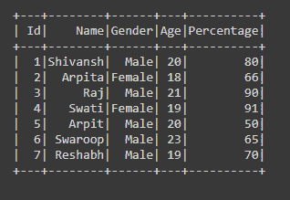
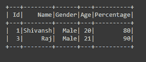
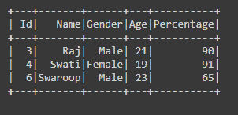
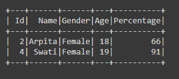
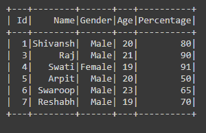

# 在 PySpark

中用多个条件对数据进行子集化或过滤

> 原文:[https://www . geesforgeks . org/subset-or-filter-data-with-multi-conditions-in-py spark/](https://www.geeksforgeeks.org/subset-or-filter-data-with-multiple-conditions-in-pyspark/)

有时在处理由多行多列组成的大数据帧时，我们必须过滤数据帧，或者我们需要数据帧的子集来根据我们的需要应用操作。为了获取子集或过滤数据，有时仅用一个条件是不够的，很多时候我们必须通过多个条件来过滤或获取该数据帧的子集。因此，在本文中，我们将学习如何根据 PySpark 数据框中的多个条件对 ro 进行子集化或过滤。

要对数据帧中的数据进行子集化或过滤，我们使用**过滤器()**功能。filter 函数用于根据给定的条件(应该是单个或多个)从 dataframe 中过滤数据。

> **语法:** df.filter(条件)
> 
> 其中 df 是从中对数据进行子集化或过滤的数据帧。

我们可以通过两种方式将多个条件传递给函数:

*   使用双引号(“条件”)
*   在条件中使用点符号

**让我们创建一个数据帧。**

## 计算机编程语言

```
# importing necessary libraries
from pyspark.sql import SparkSession

# function to create SparkSession
def create_session():
    spk = SparkSession.builder \
        .master("local") \
        .appName("Student_report.com") \
        .getOrCreate()
    return spk

def create_df(spark, data, schema):
    df1 = spark.createDataFrame(data, schema)
    return df1

if __name__ == "__main__":

    # calling function to create SparkSession
    spark = create_session()

    input_data = [(1, "Shivansh", "Male", 20, 80),
                  (2, "Arpita", "Female", 18, 66),
                  (3, "Raj", "Male", 21, 90),
                  (4, "Swati", "Female", 19, 91),
                  (5, "Arpit", "Male", 20, 50),
                  (6, "Swaroop", "Male", 23, 65),
                  (7, "Reshabh", "Male", 19, 70)]
    schema = ["Id", "Name", "Gender", "Age", "Percentage"]

    # calling function to create dataframe
    df = create_df(spark, input_data, schema)
    df.show()
```

**输出:**



让我们在这里应用过滤器:

**示例 1:在("")双引号**中使用*****和“*** **运算符****

## **计算机编程语言**

```
# subset or filter the dataframe by
# passing Multiple condition
df = df.filter("Gender == 'Male' and Percentage>70")
df.show()
```

****输出:****

****

****示例 2:在("")双引号**中使用 **或******运算符******

## ****计算机编程语言****

```
**# subset or filter the data with
# multiple condition
df = df.filter("Age>20 or Percentage>80")
df.show()**
```

******输出:******

********

******例 3:用****&******符用** **(。)操作员********

## ****计算机编程语言****

```
**# subset or filter the dataframe by
# passing Multiple condition
df = df.filter((df.Gender=='Female') & (df.Age>=18))
df.show()**
```

******输出:******

********

******例 4:使用****' |*****'*****运算符与** **(。)操作员******

## ****计算机编程语言****

```
**# subset or filter the data with
# multiple condition
df = df.filter((df.Gender=='Male') | (df.Percentage>90))
df.show()**
```

******输出:******

********