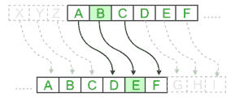

# 替换密码

> 原文:[https://www.geeksforgeeks.org/substitution-cipher/](https://www.geeksforgeeks.org/substitution-cipher/)

隐藏一些数据被称为加密。当纯文本被加密时，它变得不可读，被称为密文。在替换密码中，给定的固定字符集的任何纯文本字符都被同一集中的其他字符替换，具体取决于密钥。比如移位 1，A 会被 B 取代，B 会变成 C，以此类推。

**注:**代换密码的特例称为[凯撒密码](https://www.geeksforgeeks.org/caesar-cipher-in-cryptography/)，其中密钥取 3。

#### 数学表示

根据该方案，A = 0，B = 1，…，Z = 25，通过首先将字母转换成数字，可以使用模运算来表示加密。用移位 n 加密一个字母可以用数学方法来描述。


(带相移 n 的加密相位)


(带相移 n 的解密相位)



**示例:**

```
Plain Text: I am studying Data Encryption
Key: 4
Output: M eq wxyhCmrk Hexe IrgvCtxmsr

Plain Text: ABCDEFGHIJKLMNOPQRSTUVWXYZ
Key: 4
Output: EFGHIJKLMNOPQRSTUVWXYZabcd
```

**替代密码算法:**

**输入:**

*   由小写和大写字母组成的字符串，称为明文。
*   表示所需键的整数。

**程序:**

*   创建所有字符的列表。
*   创建一个字典来存储所有字符的替换。
*   对于每个字符，根据规则转换给定的字符，这取决于我们是加密还是解密文本。
*   打印生成的新字符串。

下面是实现。

## 蟒蛇 3

```
# Python program to demonstrate
# Substitution Cipher

import string

# A list containing all characters
all_letters= string.ascii_letters

"""
create a dictionary to store the substitution
for the given alphabet in the plain text
based on the key
"""

dict1 = {}
key = 4

for i in range(len(all_letters)):
    dict1[all_letters[i]] = all_letters[(i+key)%len(all_letters)]

plain_txt= "I am studying Data Encryption"
cipher_txt=[]

# loop to generate ciphertext

for char in plain_txt:
    if char in all_letters:
        temp = dict1[char]
        cipher_txt.append(temp)
    else:
        temp =char
        cipher_txt.append(temp)

cipher_txt= "".join(cipher_txt)
print("Cipher Text is: ",cipher_txt)

"""
create a dictionary to store the substitution
for the given alphabet in the cipher
text based on the key
"""

dict2 = {}    
for i in range(len(all_letters)):
    dict2[all_letters[i]] = all_letters[(i-key)%(len(all_letters))]

# loop to recover plain text
decrypt_txt = []

for char in cipher_txt:
    if char in all_letters:
        temp = dict2[char]
        decrypt_txt.append(temp)
    else:
        temp = char
        decrypt_txt.append(temp)

decrypt_txt = "".join(decrypt_txt)
print("Recovered plain text :", decrypt_txt)
```

**输出:**

```
Cipher Text is:  M eq wxyhCmrk Hexe IrgvCtxmsr
Recovered plain text : I am studying Data Encryption
```