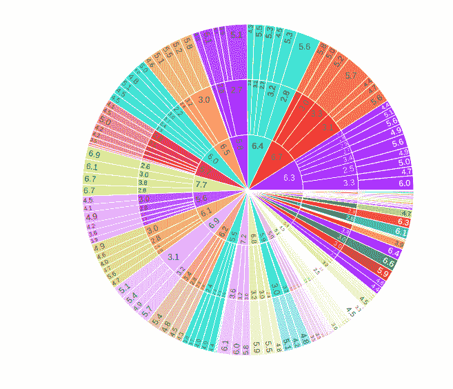
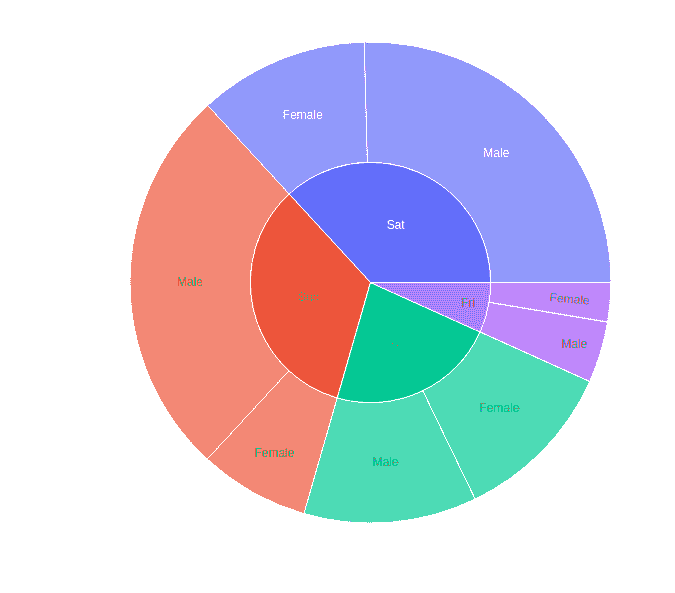
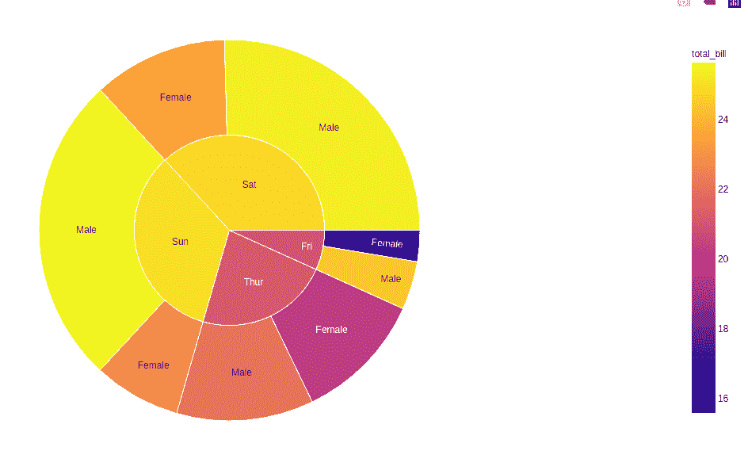
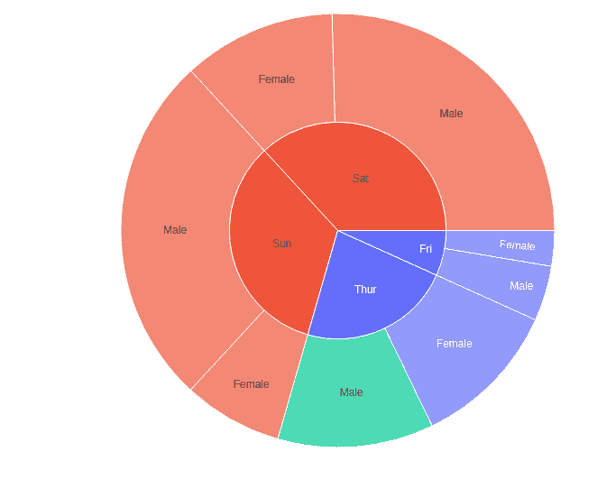
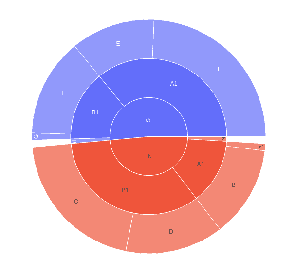

# 使用 Python 中的 Plotly 绘制太阳爆发图

> 原文:[https://www . geesforgeks . org/sunburst-plot-use-plot-in-python/](https://www.geeksforgeeks.org/sunburst-plot-using-plotly-in-python/)

**Plotly** 是一个 Python 库，用来设计图形，尤其是交互图形。它可以绘制各种图形和图表，如直方图、条形图、箱线图、展开图等。它主要用于数据分析以及财务分析。plotly 是一个交互式可视化库。

## 《阴谋》中的太阳爆发情节

**日爆图**将从根到叶的分层数据逐渐可视化。根从中心开始，水针被添加到外环。层次结构的每一级都由一个环或圆来表示，最里面的圆，进一步的环被分成表示数据点的切片，切片的大小表示数据值。

> **语法:**plot . express . sunburst(data _ frame = None，name=None，values=None，parents=None，path=None，ids=None，color_continuous_scale=None，range_color=None，color_continuous_midpoint=None，color _ distributed _ sequence = None，color _ distributed _ map = { }，hover_name=None，hover_data=None，custom_data=None，labels={}，title=None，template=None，width=None，height=None，range
> 
> **参数:**
> 
> **data_frame:** 需要传递此参数才能使用列名(而不是关键字名)。
> 
> **名称:**data _ frame 中列的名称，或者 pandas Series 或 array_like 对象。此列或 array_like 中的值用作扇区的标签。
> 
> **值:**data _ frame 中列的名称或 pandas Series 或 array_like 对象。来自该列或 array_like 的值用于设置与扇区相关联的值。
> 
> **父项:**data _ frame 中列的名称，或者 pandas Series 或 array_like 对象。此列或 array_like 中的值在 sunburst 和 treemap 图表中用作父值。
> 
> **路径:**data _ frame 中的列名，或 pandas Series，或 array_like 对象列名列表或矩形数据框的列，定义从根到叶的扇区层次结构。
> 
> **id:**data _ frame 中列的名称，或者 pandas Series 或 array_like 对象。来自该列或 array_like 的值用于设置扇区的 id

**示例:**

## 蟒蛇 3

```py
import plotly.express as px

df = px.data.iris()

fig = px.sunburst(df, path=['sepal_length', 
                            'sepal_width',
                            'petal_length'], 
                  values='petal_width')
fig.show()
```

**输出:**



## 绘制分层数据

矩形数据框表示分层数据，其中不同的列对应于不同的分层级别。使用路径参数绘制此类列**。Path 参数取 data_frame 或 pandas Series 中的列名，或 array_like 对象，列名列表或定义扇区层次结构的矩形数据帧的列，从根到叶。**

**注意:**当 id 或父代与路径一起传递时，会引发错误。

**示例:**

## 蟒蛇 3

```py
import plotly.express as px

df = px.data.tips()

fig = px.sunburst(df, path=['day', 'sex'], 
                  values='total_bill')
fig.show()
```

**输出:**



### 使用连续颜色参数绘制分层数据

如果传递了 color 参数，节点的颜色将被计算为其子节点的颜色值的平均值。

**示例:**

## 蟒蛇 3

```py
import plotly.express as px

df = px.data.tips()

fig = px.sunburst(df, path=['day', 'sex'], 
                  values='total_bill', color='total_bill')
fig.show()
```

**输出:**



### 使用离散颜色参数绘制分层数据

当非数字数据传递给颜色参数时，则使用离散数据。如果一个扇区的颜色列对其所有子扇区具有相同的值，则使用相应的颜色，否则将使用离散颜色的相同第一颜色。

**示例:**

## 蟒蛇 3

```py
import plotly.express as px

df = px.data.tips()

fig = px.sunburst(df, path=['day', 'sex'], 
                  values='total_bill', color='time')
fig.show()
```

**输出:**



### 绘制缺少值的分层数据

如果数据集的形状不是完全矩形，那么缺失的值应该被称为无。父项中没有一项必须是叶子，否则将引发 valueError。

**示例:**

## 蟒蛇 3

```py
import plotly.express as px
import pandas as pd

A = ["A", "B", "C", "D", None, "E",
           "F", "G", "H", None]

B = ["A1", "A1", "B1", "B1", "N",
           "A1", "A1", "B1", "B1", "N"]
C = ["N", "N", "N", "N", "N",
           "S", "S", "S", "S", "S"]
D = [1, 13, 21, 14, 1, 12, 25, 1, 14, 1]

df = pd.DataFrame(
    dict(A=A, B=B, C=C, D=D)
)

fig = px.sunburst(df, path=['C', 'B', 'A'], values='D')
fig.show()
```

**输出:**

