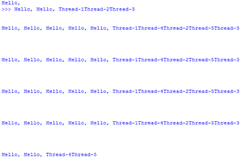

# Python 中使用信号量的同步

> 原文:[https://www . geeksforgeeks . org/python 中使用信号量进行同步/](https://www.geeksforgeeks.org/synchronization-by-using-semaphore-in-python/)

在**锁定**和**锁定**中，一次只允许执行一个**线程**，但有时我们的要求是一次执行特定数量的**线程**。

假设我们一次必须允许 10 个成员访问数据库，并且只允许 4 个成员访问网络连接。为了处理这种类型的需求，我们不能使用锁和锁的概念，这里我们应该使用**信号量**。信号量可以用来限制对容量有限的共享资源的访问。它是**同步的高级部分。**

**创建信号量的对象:**

```
object_name = Semaphore(count)

```

这里的“计数”是允许同时访问的线程数。计数的默认值是 1。

当一个线程执行 **acquire()** 方法时，“计数”变量的值将减 1，当一个线程执行 **release()** 方法时，“计数”变量的值将增 1。即每当调用 acquire()方法时，计数变量的值将递减，每当调用release()方法时，“计数”变量的值将递增。

**创建信号量对象的方法:**

**案例 1** :

```
object_name.Semaphore()
```

在这种情况下，默认情况下，count 变量的值为 1，因此只允许一个线程访问。与**锁定**概念完全相同。

**案例 2** :

```
object_name.Semaphore(n) 
```

在这种情况下，一个信号量对象一次可以被 n 个线程访问。剩余的线程必须等到释放信号量。

**信号量的可执行代码:**

## 蟒蛇 3

```
# importing the modules
from threading import *         
import time        

# creating thread instance where count = 3
obj = Semaphore(3)        

# creating instance
def display(name):    

    # calling acquire method
    obj.acquire()                
    for i in range(5):
        print('Hello, ', end = '')
        time.sleep(1)
        print(name)

        # calling release method
        obj.release()    

# creating multiple thread 
t1 = Thread(target = display , args = ('Thread-1',))
t2 = Thread(target = display , args = ('Thread-2',))
t3 = Thread(target = display , args = ('Thread-3',))
t4 = Thread(target = display , args = ('Thread-4',))
t5 = Thread(target = display , args = ('Thread-5',))

# calling the threads 
t1.start()
t2.start()
t3.start()
t4.start()
t5.start()
```

**输出:**



在上面的例子中，我们首先创建了一个信号量类的实例，其中“计数”的值是 3，这意味着信号量对象一次可以被 3 个线程访问。现在我们已经创建了 display()方法，它将打印线程名称 5 次。现在我们创建了 5 个线程，现在每当我们调用 start()方法时，允许 3 个线程访问 Semaphore 对象，因此允许 3 个线程一次执行 display()方法，但是在这个例子中，每当我们执行时，我们都会得到不规则的输出，因为一次有 3 个线程在执行 display()方法。