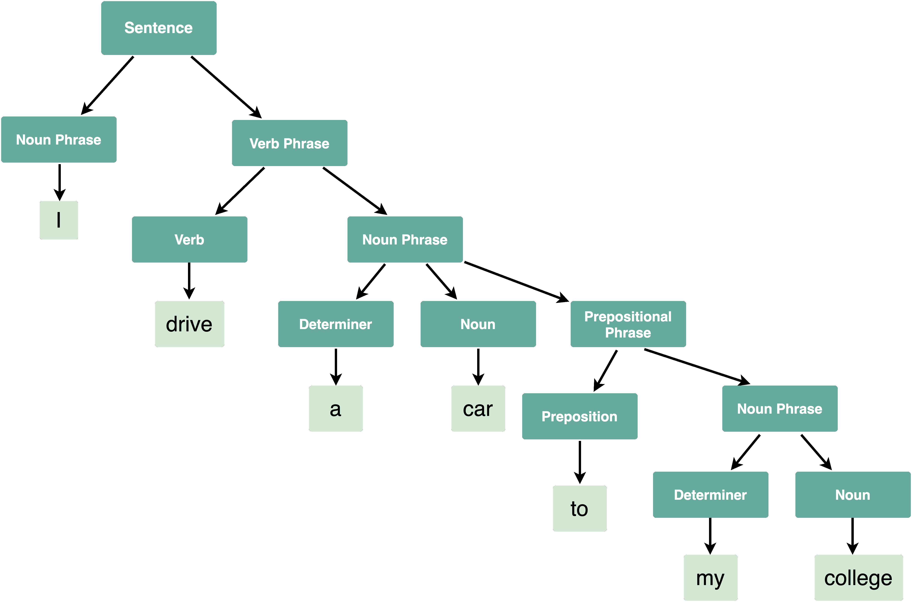
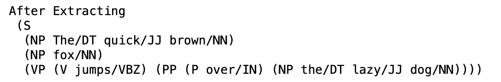

# 语法树-自然语言处理

> 原文:[https://www . geesforgeks . org/syntax-tree-natural-language-processing/](https://www.geeksforgeeks.org/syntax-tree-natural-language-processing/)

**自然语言处理(NLP)** 是一个研究领域，涉及使用计算机理解、解释和操纵人类口语。
因为大部分重要信息都是用英语、法语、德语等自然语言写下来的。因此，NLP 帮助计算机用自己的语言与人类交流，并执行其他与语言相关的任务。
综上所述，NLP 使计算机能够阅读文本、听到语音、解释和实现它、理解情感以及识别文本或语音的重要部分。
**什么是语法？**
自然语言通常遵循层次结构，包含以下组成部分:

*   句子
*   条款
*   短语
*   话

**句法**是指自然语言中支配句子结构的一套规则、原则、过程。*句法*的一个基本描述是主语、动词、名词、名词短语等不同的词。在一个句子中被排序。
自然语言的一些句法类别如下:

*   句子
*   名词短语
*   确定器（Det）
*   动词短语
*   介词短语
*   动词(五)
*   名词

**句法树:**
句法树或解析树是一个句子的不同句法类别的树表示。它帮助我们理解句子的句法结构。
**例:**
下面所给句子的句法树如下:
*我开车去我的大学。*



**代码:Python 中的语法树**

## 蟒蛇 3

```py
# Import required libraries
import nltk
nltk.download('punkt')
nltk.download('averaged_perceptron_tagger')
from nltk import pos_tag, word_tokenize, RegexpParser

# Example text
sample_text = "The quick brown fox jumps over the lazy dog"

# Find all parts of speech in above sentence
tagged = pos_tag(word_tokenize(sample_text))

#Extract all parts of speech from any text
chunker = RegexpParser("""
                       NP: {<DT>?<JJ>*<NN>}    #To extract Noun Phrases
                       P: {<IN>}               #To extract Prepositions
                       V: {<V.*>}              #To extract Verbs
                       PP: {

<p> <NP>}          #To extract Prepositional Phrases
                       VP: {<V> <NP|PP>*}      #To extract Verb Phrases
                       """)

# Print all parts of speech in above sentence
output = chunker.parse(tagged)
print("After Extracting\n", output)
```

**输出:**



**代码:为上面的句子**
绘制自由语法

## 蟒蛇 3

```py
# To draw the parse tree
output.draw()
```

**输出:**

