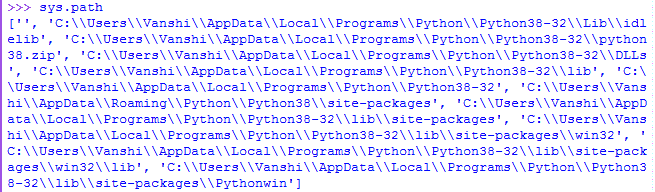
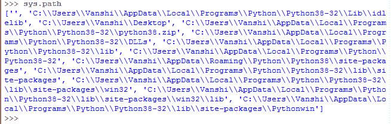
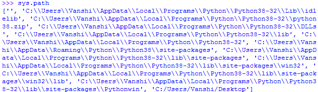

# Python 中的系统路径

> 原文:[https://www.geeksforgeeks.org/sys-path-in-python/](https://www.geeksforgeeks.org/sys-path-in-python/)

Sys 是一个内置的 Python 模块，包含特定于系统的参数，即它包含与解释器交互的变量和方法，并且也由解释器控制。

### **系统路径**

sys.path 是 sys 模块中的内置变量。它包含解释器将在其中搜索所需模块的目录列表。

当模块(模块是 python 文件)被导入到 Python 文件中时，解释器首先在其内置模块中搜索指定的模块。如果没有找到，它会查看由 **sys.path** 定义的目录列表(目录是包含相关模块的文件夹)。

### **初始化系统路径**

有三种方法可以指定路径:

*   **DEFAULT-** 默认情况下，解释器在当前目录中查找模块。要让解释器在其他目录中搜索，你只需要改变当前目录。以下示例描述了解释器采用的默认路径:

## 蟒蛇 3

```py
# importing module
import sys

# printing all directories for 
# interpreter to search
sys.path
```

**输出:**



*   **通过环境变量-** 可以使用包含解释器在寻找模块时可以采用的路径的环境变量。一旦设置好，它会提示带有目录的解释器定位一个模块。以下示例显示了如何做到这一点。

```py
PYTHONPATH=C:\Users\Vanshi\Desktop

```

## 蟒蛇 3

```py
# importing module
import sys

# printing all directories
sys.path
```

**输出:**



*   **APPENDING PATH-** append()是 sys 模块的内置函数，可以与 PATH 变量配合使用，添加特定路径供解释器搜索。以下示例显示了如何做到这一点。

## 蟒蛇 3

```py
# importing module
import sys

# appending a path
sys.path.append('C:/Users/Vanshi/Desktop')

# printing all paths
sys.path
```

**输出:**



请注意，path 返回的第一个字符串始终为空，这是为了指示解释器在当前目录中进行检查。