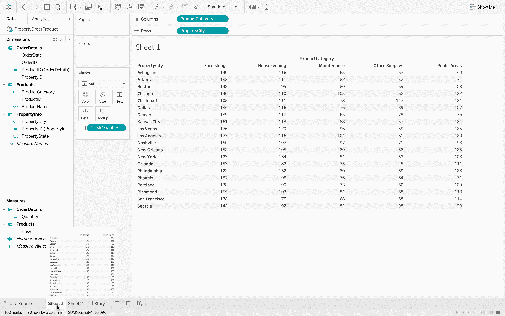
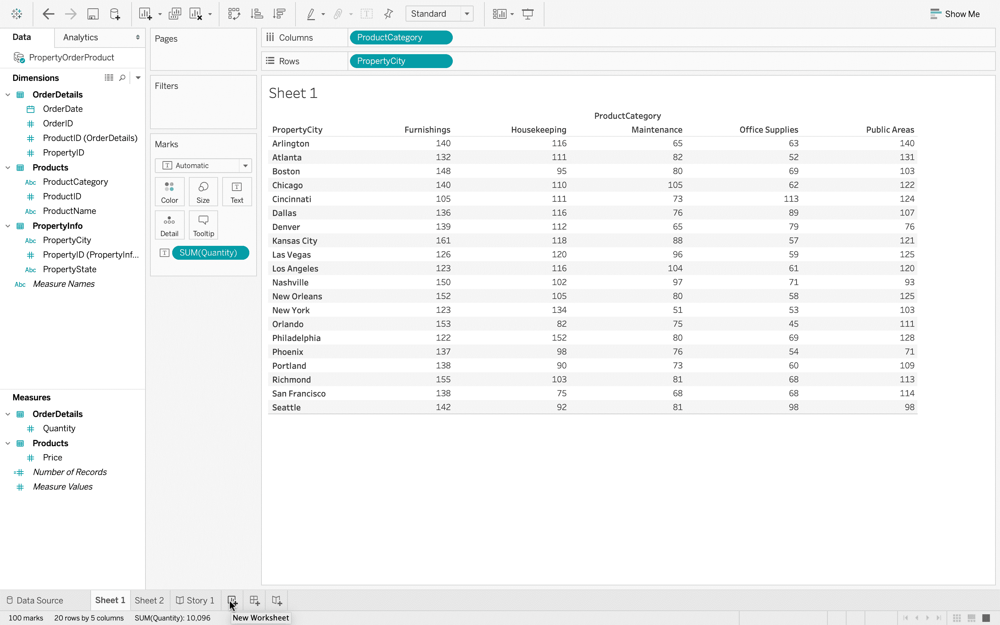
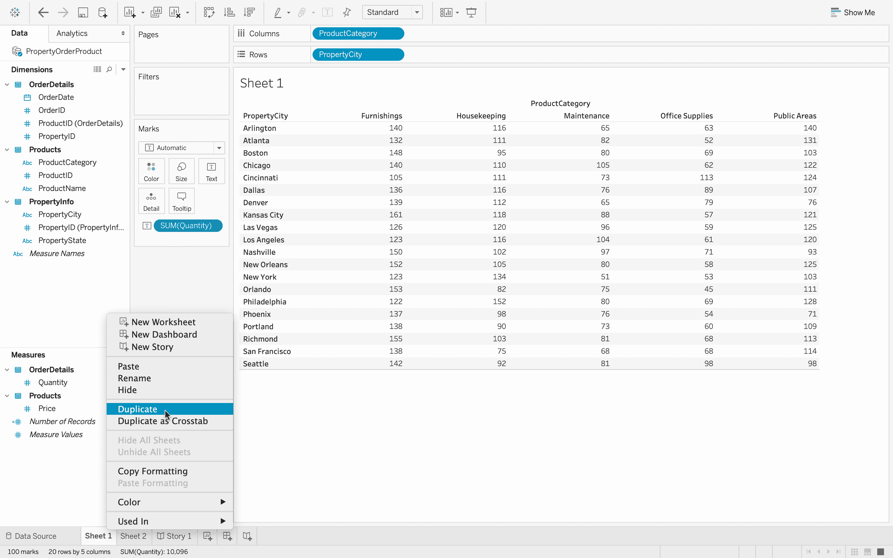
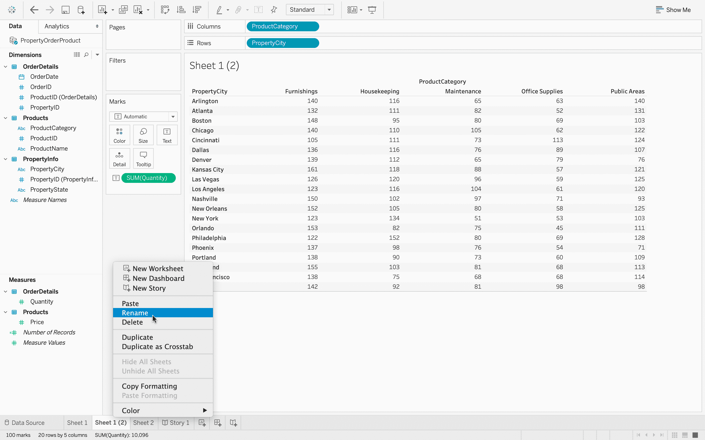
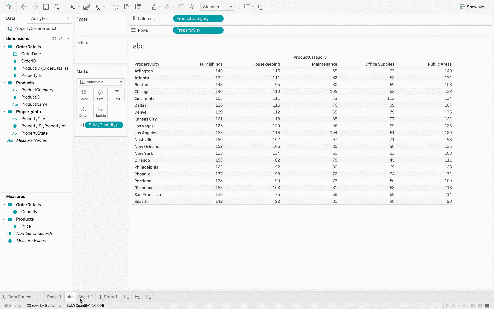

# 表格–添加、重命名和复制工作表

> 原文:[https://www . geesforgeks . org/tableau-添加-重命名-复制-工作表/](https://www.geeksforgeeks.org/tableau-adding-renaming-and-duplicating-worksheets/)

Tableau 工作簿将数据存储在工作表中。每个工作表都可以包含可视化或仪表板。本文旨在展示如何对工作表执行不同的操作，例如如何添加、复制和重命名工作表。

**执行步骤:**

*   在 Tableau 中，连接到数据库。
*   数据源有三个数据文件–*产品、订单明细、属性信息*。这是一个数据文件中存在的三个不同的 excel 表。
    T3】
*   打开*产品*数据文件。
    T3】
*   添加*订单明细*数据文件，它包含每个订单的信息。
    T3】
*   现在，您可以看到两个数据文件中有一个连接。
    
*   如果您将鼠标悬停在连接上，那么您可以看到有一个使用公共键的内部连接，即*产品标识*。内部连接只是意味着有两个文件有一个共同的字段，并且可以很容易地组合起来。
*   接下来，添加 *PropertyInfo* 文件，可以看到它也加入了。
    T3】
*   如果将鼠标指针悬停在上面，则可以清楚地看到 *OrderDetails* 和 *PropertyInfo* 使用键–*property id*进行内部连接。
    
*   现在，数据已经完全准备好进行数据可视化。
    
*   点击*数量*，然后在屏幕的右上角，工具栏的右边，有*给我看看*按钮。使用*演示*选项可以获得可视化效果。
    
*   这是你的观想。
    
*   **添加:**您可以在工作表选项附近看到添加新工作表选项，使用该选项可以添加更多工作表。
    
    
*   **To duplicate:**Go the sheet option and then select duplicate option, this will mimmic the same task of the original worksheet.

    

*   要重命名任何工作表，请再次转到选项并选择重命名选项，您可以更改选项的名称。
    